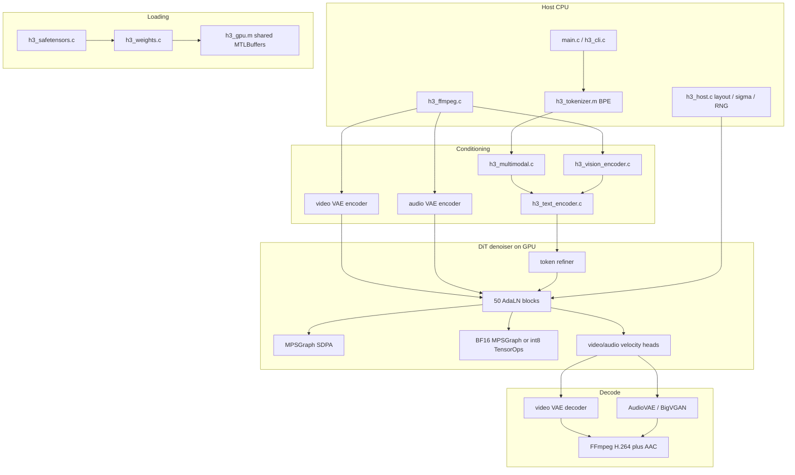

# h3.c Architecture and Theoretical Analysis

A source-grounded study of [antirez/h3.c](https://github.com/antirez/h3.c) as it exists in this repository, and a theoretical mapping toward a future native local inference runtime for **Qwen3.8-27B** on Apple Silicon.

**Companion.** Every ML/mathematical object named below is defined, with a preview-safe formula, in [Formulas and Technical Concepts](h3c_formulas_and_concepts.md). Display equations in this file are also links into that document.

**Math preview.** Cursor and GitHub render inline math with dollar signs (one for inline, two on their own line for display). They do not compile LaTeX parenthesis-backslash or bracket-backslash delimiters.

**Legend used throughout**

| Label | Meaning |
|---|---|
| **FACT** | Directly verified from source in this repository |
| **INFERENCE** | Conclusion derived from the implementation, comments, or tests |
| **THEORY** | General technical explanation; math is in [Formulas and Technical Concepts](h3c_formulas_and_concepts.md) |
| **PROPOSAL** | Recommendation for a future Qwen3.8 runtime, not a claim about h3.c |

Claims about h3.c that are not labeled are still intended as **FACT** when they cite a file and function. Qwen3.8 architecture details are **THEORY** drawn from public model-card specifications, not from this repository.

---

## 1. Executive Summary

**FACT.** `h3.c` is a native MiniMax-H3 inference engine for Apple Silicon. It generates video and synchronized audio from a text prompt, optionally conditioned on first/last frames (FL2VA) or ordered image/video/audio references (Ref2VA). The public API is in `h3.h`; generation is orchestrated by `h3_generate()` in `h3.c`.

**FACT.** This is **not** an autoregressive language-model runtime. The pipeline sketched in many LLM tutorials — tokenize, transformer decode, KV cache, logits, sample next token — is **not** the serving loop of this project. “Sampler” in h3.c means a **[diffusion Euler](h3c_formulas_and_concepts.md#diffusion-flow-matching-and-euler) / [RES](h3c_formulas_and_concepts.md#res-sampler) integrator** over noisy video and audio latents (`h3_dit_denoise_euler_preview` in `h3_dit.c`, `h3_euler_velocity_step` in `h3_host.c`).

What *is* LLM-like in h3.c is the **text conditioner**: the first 50 language layers of a Qwen3-VL tower (`h3_text_encoder.c`). That tower runs **once per prompt**, over the full token sequence, with causal grouped-query attention. It has **no [KV cache](h3c_formulas_and_concepts.md#kv-cache)**, **no [language-model head](h3c_formulas_and_concepts.md#language-model-head)**, and **no [token sampling](h3c_formulas_and_concepts.md#token-sampling)**. Its BF16 embeddings are projected into a 50-block multimodal Diffusion Transformer (DiT) that jointly attends over packed text, audio, and video tokens.

**FACT.** Compute lives on Metal. Host C code owns layout, schedules, tokenization, FFmpeg I/O, and packing. Almost every neural op is dispatched through `h3_gpu.m` onto either custom kernels in `h3_shaders.metal` or cached MPSGraph graphs (linear, MLP, conv, scaled-dot-product attention). M5-class GPUs additionally compile Metal 4 TensorOps (`H3_METAL_HAS_TENSOR`) and a runtime int8 MLP/QKV path.

**INFERENCE.** Studying h3.c is valuable for a Qwen3.8 Mac runtime because it is a complete, production-minded Apple-Silicon inference stack: safetensors loading into unified memory, BF16 numerics, RMSNorm / SwiGLU / RoPE / GQA kernels, command-buffer overlap, activation aliasing, runtime int8, profiling, and MLX-oracle correctness. It is **not** a template one can retarget by swapping weight files.

**THEORY / PROPOSAL.** Qwen3.8-27B (public specs, August 2026) is a 27B dense vision-language model with a **hybrid** 64-layer stack: 48 Gated DeltaNet linear-attention layers and 16 Gated Attention softmax layers, native 262K context, multi-token prediction, and a decode loop that *does* need KV cache plus recurrent DeltaNet state. Those pieces do not exist in h3.c. The highest-risk future work is therefore **[Gated DeltaNet](h3c_formulas_and_concepts.md#gated-deltanet) on Metal**, **hybrid cache at long context**, and **numerical parity against Transformers / vLLM / SGLang**, not DiT AdaLN or video VAEs.

---

## 2. Repository Overview

### 2.1 What the project is

**FACT.** README title: “Native MiniMax-H3 inference for Apple Silicon.” Version string `H3_VERSION` is `"0.1.0-dev"` (`h3.h`). License: MIT, Salvatore Sanfilippo, 2026 (`LICENSE`). Third-party credit: adapted Morton-order / int8 TensorOps ideas from ccv Metal FlashAttention (`THIRD_PARTY_NOTICES.md`). Interactive REPL uses vendored linenoise.

**FACT.** Two released checkpoint trees are expected under `./MiniMax-H3`:

- `FL2VA/` — text-to-video/audio and first/last-frame conditioning
- `Ref2VA/` — ordered multimodal references

`h3_load_dir()` inventories headers only; weights are mapped later per phase so the ~33B DiT, Qwen encoder, and VAEs never fully coexist in unified memory (README; `h3.c`).

### 2.2 Build and platform

**FACT.** `Makefile` compiles C11 with `-O3` and Objective-C with ARC. Linked frameworks: Foundation, Metal, MetalPerformanceShaders, MetalPerformanceShadersGraph, Accelerate. Also `-licucore -lm`. Runtime Metal compilation is intentional (`newLibraryWithSource` in `h3_gpu_create`); tests do not require Xcode’s offline metallib toolchain.

**FACT.** There is no CUDA, Vulkan, or CPU neural backend. Older Apple GPUs run a portable BF16 + MPSGraph path. M5 enables TensorOps and int8. `h3_metal_probe()` (`h3_metal.m`) fills `h3_device_info` from `MTLCreateSystemDefaultDevice()`.

### 2.3 Inventory of the tree

**FACT.** 67 tracked files in this working copy (excluding `.git`). Grouped:

| Group | Files |
|---|---|
| Public API / orchestration | `h3.h`, `h3.c`, `h3_internal.h`, `main.c` |
| GPU runtime | `h3_gpu.h`, `h3_gpu.m`, `h3_shaders.metal`, `h3_metal.h`, `h3_metal.m` |
| Loading | `h3_safetensors.h/.c`, `h3_weights.h/.c` |
| Host geometry | `h3_host.h/.c` |
| Text / tokenizer | `h3_tokenizer.h/.m`, `h3_text_encoder.h/.c`, `h3_multimodal.h/.c` |
| DiT | `h3_dit.h/.c`, `h3_dit_schedule.h/.c` |
| Vision / video / audio | `h3_vision_encoder.h/.c`, `h3_video_encoder.h/.c`, `h3_video_vae.h/.c`, `h3_audio_vae.h/.c` |
| I/O / UI | `h3_ffmpeg.h/.c`, `h3_terminal.h/.c`, `h3_cli.h/.c` |
| Vendored | `linenoise.c/.h` |
| Docs / build | `README.md`, `LICENSE`, `THIRD_PARTY_NOTICES.md`, `Makefile`, `.gitignore` |
| Tests | 21 files under `tests/` |

Ignored by git and not present in a clean clone: `MiniMax-H3/` weights, `misc/fixtures/` MLX oracles, `outputs/`.

### 2.4 CLI surface

**FACT.** `main.c` one-shot: `-d MODEL_DIR -p PROMPT -o OUT`. Without `-p`, `h3_cli_run()` starts an Iris-style REPL. `--info` probes device and inventories safetensor headers without mapping payloads. `--profile` sets `H3_PROFILE=1`. Generation knobs live in `h3_params` (`h3.h`): steps, layers, reuse, core-reuse, token-reduction, SSD streaming, int8-row-FC2, slower-* diagnostic flags, internal render canvas, first/last/ref media.

---

## 3. Complete Architecture

### 3.1 Actual execution path

The LLM-style diagram in the study brief is the **desired future Qwen pipeline**. The **actual** h3.c path is:

```text
MiniMax-H3 safetensors
        |
        v
header inventory (h3_load_dir)          [CPU, no payloads]
        |
        v
tokenizer.json  -->  token IDs          [CPU, ICU BPE]
optional PNG/MP4/WAV --> RGB / PCM      [FFmpeg subprocess]
        |
        +--> vision ViT (27 layers)     [GPU BF16]
        +--> video VAE encoder          [GPU F32 conv]
        +--> audio VAE encoder          [GPU F32 conv]
        |
        v
multimodal presentation (IDs, mRoPE, tags)
        |
        v
Qwen3-VL language layers 0..49          [GPU BF16, causal GQA, encode-once]
        |
        v
text embeddings [T, 5120] BF16
        |
        v
DiT load: refine text, precompute AdaLN, load 50 blocks
        |
        v
noise latents (video [24,T,H,W] F32, audio [32,2,T] F32)
        |
        v
for each Euler step:
    pack/patchify --> hidden [seq, 5376] BF16
    50 AdaLN-gated DiT blocks (joint bidirectional SDPA)
    final heads --> video/audio velocities
    Euler update of latents
        |
        v
video VAE decode --> RGB24 frames
audio VAE / BigVGAN decode --> 32 kHz stereo F32
        |
        v
FFmpeg mux --> H.264 + AAC MP4
```

**FACT.** Entry: `h3_generate()` in `h3.c` (starts at line 848). Device + metadata: `h3_load_dir()` (line 407). DiT serving: `h3_dit_denoise_euler_preview()` in `h3_dit.c`.

### 3.2 Architecture diagram



### 3.3 What h3.c implements vs what it delegates

| Stage | Implemented in-repo | Delegated |
|---|---|---|
| Safetensors parse | custom JSON + `pread` (`h3_safetensors.c`) | OS `open`/`mmap` |
| Tokenizer | HuggingFace JSON BPE (`h3_tokenizer.m`) | ICU Unicode (`-licucore`) |
| Weight residency | shared Metal buffers, optional mmap | Darwin page cache; `F_NOCACHE` for SSD stream |
| Linear / MLP / SDPA (portable) | graph construction in `h3_gpu.m` | **MPSGraph** |
| Custom elementwise / fused ops | `h3_shaders.metal` | Metal compiler, Apple GPU |
| M5 GEMM | TensorOps kernels | Metal 4 `matmul2d` |
| Conv1d / Conv3d | thin wrappers | **MPSGraph convolution** |
| Image resize | `h3_resize_rgb24_high_quality` | **Accelerate / vImage** |
| Media decode/encode | pipes and layout (`h3_ffmpeg.c`) | **ffmpeg / ffprobe binaries** |
| Interactive editing | command dispatch (`h3_cli.c`) | **linenoise** |
| Diffusion math | Euler/RES in host + `h3_euler_bf16` | — |
| Autoregressive decode, KV cache, logits, token sampling | **not present** | n/a |

### 3.4 Two transformers

**FACT.** There are two distinct networks:

1. **Qwen language tower** — decoder-only, causal GQA, pre-norm, ungated residuals. Used as a **text encoder**.
2. **H3 DiT** — multimodal denoiser, bidirectional full attention, AdaLN-Zero gates, 3D RoPE. Used as a **velocity network**.

**INFERENCE.** Joint self-attention over packed modalities is MMDiT-style (text tokens sit in the same sequence as video/audio patches). There is no separate cross-attention module from DiT to a frozen text encoder output tensor; text is refined (`condition_proj` + two refiner blocks) then concatenated.

---

## 4. Component Inventory

For each file: what it does, why it exists, dependents, CPU/GPU, abstractions, theory.

### 4.1 Public API and orchestration

**`h3.h` / `h3.c` / `h3_internal.h`**

- **What:** Opaque `h3_ctx`, `h3_params`, `h3_generate`, session cache for embeddings / prepared DiT / video decoder.
- **Why:** Stable C API over a multi-phase Metal pipeline.
- **Dependents:** `main.c`, `h3_cli.c`, tests that call generation.
- **CPU/GPU:** Orchestration on CPU; calls into GPU modules.
- **Abstractions:** Context, generation parameters, frame/progress callbacks, cache.
- **Theory:** Phase-separated residency; interactive memoization of expensive conditioning.

**`main.c`**

- CLI parser, `--info`, one-shot generate, REPL dispatch.
- CPU only.

**`h3_cli.c` / `h3_cli.h`**

- Interactive session: `!seed`, `!first`, `!ref-image`, `!ssd-streaming`, `!cache`, etc.
- Enables `h3_cache_set_enabled` so repeated prompts skip reload/encode.
- CPU; calls `h3_generate`.

### 4.2 GPU runtime

**`h3_metal.h` / `h3_metal.m`**

- **What:** `h3_metal_probe()` only.
- **Why:** `--info` and tests can inspect the GPU without compiling shaders.
- **CPU/GPU:** Metal device query.
- **Theory:** Apple GPU family, unified memory, working-set hints.

**`h3_gpu.h` / `h3_gpu.m`**

- **What:** The backend. Tensor allocation (`h3_gpu_tensor`), command begin/continue/submit, every `h3_gpu_*` op, MPSGraph caches, TensorOps feature flags, stats.
- **Why:** Single place that maps neural ops onto Metal.
- **Dependents:** Every neural module.
- **CPU/GPU:** Both — encode on CPU, execute on GPU, shared buffers.
- **Abstractions:** Device, tensor/buffer, dtype (`F32`, `BF16`, `I8`, `U32`), command stream, stats.
- **Theory:** Unified memory, command buffers, graph capture, GEMM tiling.

**`h3_shaders.metal`**

- **What:** 83 `kernel void` functions (plus `host_name` template specializations).
- **Why:** Ops MPSGraph does not fuse the way H3 needs (AdaLN+gate, QKV+RoPE, GQA causal, int8 NAX, VAE/audio extras).
- **GPU only** (compiled at runtime).
- **Theory:** SIMT, threadgroups, SIMD-group TensorOps, BF16 rounding.

### 4.3 Loading

**`h3_safetensors.h/.c`**

- Header-only parse: 8-byte LE length + JSON, max 256 MiB header (`H3_ST_MAX_HEADER`).
- `h3_st_read_data` `pread`s payloads in 1 GiB chunks. **No mmap here.**
- Dtypes include BOOL through F64; production loads use BF16/F32 via weights layer.
- **Theory:** HuggingFace safetensors layout.

**`h3_weights.h/.c`**

- `h3_weight_store_open` lists `*.safetensors`, keeps headers.
- `h3_weight_load_bf16` / `_f32` validate exact shape and load into Metal.
- **Why:** Sharded checkpoints (Qwen text encoder is 14 shards).

### 4.4 Host geometry (CPU)

**`h3_host.h/.c`**

- Canvas multiples of 32, max `768*1344` pixels, 24 fps, audio latent 40 fps.
- Temporal alignment to `5+17*n` frames. Sigma schedules with video shift 12 and audio shift 3.
- Packed sequence layout: TEXT, COND, REF_IMAGE, REF_AUDIO, AUDIO, VIDEO.
- PCG-style RNG, Euler/RES steps, vImage resize.
- **No Metal.** DiT and CLI depend on it.
- **Theory:** [Latent diffusion schedules](h3c_formulas_and_concepts.md#diffusion-flow-matching-and-euler); [VAE](h3c_formulas_and_concepts.md#vae-and-latents) spatial ratio 16; causal video compression `ceil(T/4)`.

### 4.5 Tokenizer and text

**`h3_tokenizer.h/.m`**

- Loads `tokenizer.json`. Requires BPE, NFC normalizer, no unk token.
- Byte-level BPE + ICU pretok. Pad id `151643`.
- CPU. Used by generate, multimodal, tokenizer tests.

**`h3_text_encoder.h/.c`**

- 50 Qwen3-VL language layers. Constants in the enum at lines 12–24 of `h3_text_encoder.c`.
- `encode_layer()` (line 409): [RMSNorm](h3c_formulas_and_concepts.md#rmsnorm) → Q/K/V → [head RMSNorm](h3c_formulas_and_concepts.md#head-rmsnorm) → [RoPE](h3c_formulas_and_concepts.md#rotary-position-embeddings) → causal [GQA](h3c_formulas_and_concepts.md#grouped-query-attention) → O proj → residual → RMSNorm → [SwiGLU](h3c_formulas_and_concepts.md#swiglu) MLP → residual. Equations: [Qwen layer](h3c_formulas_and_concepts.md#eq-qwen-layer).
- Prefetch ring: 8 I/O workers, depth 2 (M3) or 3 (M5).
- GPU compute, CPU orchestration.

**`h3_multimodal.h/.c`**

- Builds Qwen3-VL presentation: `<Picture n>`, `<Video n>`, `<Audio n>`, vision/video pad token ids `151652–151656`.
- mRoPE `position_ids` axis-major `[3, tokens]`.
- CPU assembly; calls vision + text encoder.

### 4.6 DiT

**`h3_dit_schedule.h/.c`**

- Precompute AdaLN tables: unique timestep rows → sinusoidal embed → MLP → per-block `adaln_proj` → `[time_rows, 3*6*5376]`.
- Gate scores for layer thinning. Row maps from segment tags.
- GPU for the projection; host for σ and maps.

**`h3_dit.h/.c`**

- Load, forward, Euler/RES denoise, patchify/pack, SSD streaming, token reduction, core reuse, int8 setup.
- Core math: `run_block` (line 1876), `encode_forward` (line 2050), `h3_dit_forward` (line 2442).
- GPU-heavy; host packing/sampler.

### 4.7 Vision, VAEs, media

**`h3_vision_encoder.c`**

- Qwen ViT-style: hidden 1152, 27 layers, 16 heads × 72, patch 16, temporal patch 2, merge 2, output 5120 + 3 deepstacks.
- GPU BF16; CPU patchify/RoPE tables.

**`h3_video_vae.c` / `h3_video_encoder.c`**

- 3D conv encoder/decoder, channels-last `[B,T,H,W,C]`, tiled spatially (auto 256–320 px tiles).
- GPU via MPSGraph conv + custom pad/GN+SiLU.

**`h3_audio_vae.c`**

- 32 kHz stereo, latent `[32,2,T]`, hop 800. Conv1d, Snake/SnakeBeta, causal SDPA pieces, BigVGAN-style decode.
- GPU F32.

**`h3_ffmpeg.c`**

- `posix_spawn` ffmpeg/ffprobe. RGB24 + F32 PCM pipes. No uncompressed temp files.
- CPU / OS processes.

**`h3_terminal.c`**

- Kitty/iTerm image protocol for `--show`. CPU.

### 4.8 Tests

21 files: host unit (`test_h3.c`), toy MLX Metal (`test_metal.c`, `test_bf16.c`, `test_text_metal.c`), tokenizer, audio GPU primitives, mux, real MiniMax oracles, semantic suites, `bench_dit.c`. See §14.

---

## 5. Model Representation

### 5.1 Checkpoint layout

**FACT.** Components are directories of `*.safetensors`. `h3_st_read_header` (`h3_safetensors.c`) reads:

```text
uint64 little-endian header_size
JSON object { tensor_name: { dtype, shape, data_offsets: [begin, end] }, __metadata__? }
payload bytes at file offset 8 + header_size + begin
```

`h3_weight_store_open` / `h3_weight_find` search shards by tensor name. Loads fail on dtype/rank/shape mismatch (`h3_weights.c`).

**FACT.** mmap/zero-copy is **not** in the safetensors parser. `h3_gpu_tensor_load_file` in `h3_gpu.m` optionally `mmap`s page-aligned ranges and wraps them with `newBufferWithBytesNoCopy` when `H3_ZERO_COPY_WEIGHTS` is set or, by default on M5, for paths containing `/transformer/`. Otherwise: shared buffer + `pread` into `buffer.contents`.

### 5.2 Dtypes and layout

**FACT.** Runtime dtypes (`h3_gpu_dtype` in `h3_gpu.h`): F32, BF16 (stored as `uint16` / `ushort` bit patterns), I8, U32. **No FP16 path.** Comments state arithmetic accumulates in F32 and rounds at operation boundaries to match the released compute dtype. See [bfloat16](h3c_formulas_and_concepts.md#bfloat16).

**FACT.** DiT QKV rows in the checkpoint are `[head, q/k/v, dimension]`, not `[q/k/v, head, dimension]` (`h3_gpu.h` comment on `h3_gpu_grouped_qkv_rope_bf16`). Native kernels consume that layout directly (README: earlier identity interpretation produced noisy diagnostics).

### 5.3 Important tensors

#### Qwen language tower

| Tensor | Shape | Dtype | Layout | Producer | Consumer |
|---|---|---|---|---|---|
| `embed_tokens` | `[151936, 5120]` | BF16 | row-major | checkpoint | `h3_gpu_embedding_bf16` |
| hidden | `[tokens, 5120]` | BF16 | row-major | embedding / residuals | each layer |
| Q | `[tokens, 64, 128]` | BF16 | heads packed in row | `q_proj` | GQA |
| K, V | `[tokens, 8, 128]` | BF16 | GQA | `k_proj`/`v_proj` | GQA |
| gate/up | `[tokens, 25600]` | BF16 | | MLP | SwiGLU |
| output embedding | `[tokens, 5120]` BF16 host copy | BF16 | | final hidden readback | DiT `condition_proj` |
| tags | `[tokens]` U8 | | | multimodal builder | DiT AdaLN row map |

Constants: `h3_text_encoder.c` lines 12–27. Vocab 151936, θ = 5e6, ε = 1e-6.

#### DiT hidden stream

| Tensor | Shape | Dtype | Producer | Consumer |
|---|---|---|---|---|
| refined text | `[text_len, 5376]` | BF16 | `condition_proj` + 2 refiner blocks | packed `hidden` |
| video patches | `[T*(H/2)*(W/2), 96]` F32 host → BF16 5376 | F32 then BF16 | `h3_dit_patchify_video` + `video_patch_proj` | `hidden` |
| audio rows | `[2*T, 32]` → 5376 | F32 then BF16 | `h3_dit_pack_audio` + `audio_patch_proj` | `hidden` |
| hidden | `[seq, 5376]` | BF16 | pack | every block |
| Q,K,V | `[seq, 56, 128]` (`INNER=7168`) | BF16 | grouped QKV | SDPA |
| fc1 | `[seq, 28672]` (`2*14336`) | BF16 or fused away | FC1 | SwiGLU |
| video velocity | `[24,T,H,W]` F32 | F32 | unpatchify final 96-wide rows | Euler |
| audio velocity | `[32,2,T]` F32 | F32 | unpack | Euler |

DiT constants: `h3_dit.c` lines 15–29. `H3_DIT_BLOCKS = 50` in `h3_dit_schedule.h`.

#### AdaLN modulation

| Tensor | Shape | Dtype | Producer | Consumer |
|---|---|---|---|---|
| per-block modulation | `[time_rows, 3, 6, 5376]` conceptually | BF16 | `h3_dit_schedule_precompute` | `run_block` via `h3_dit_schedule_block` |
| row_map | `[seq]` U32 | U32 | `h3_dit_schedule_row_map` | AdaLN/gate kernels |
| rope cos/sin | `[seq, 48]` BF16 | BF16 | `prepare_rope` | Q/K RoPE |

**THEORY.** [AdaLN-Zero](h3c_formulas_and_concepts.md#adaln-zero) stores six channels per modality (visual/text/audio): attention shift, scale, gate; MLP shift, scale, gate. Index = `time_row * 3 + tag`.

### 5.4 Serialization vs runtime quantization

**FACT.** Checkpoints consumed here are BF16 (and small F32 patch/head weights). Int8 matrices are created at load by `h3_gpu_quantize_weight_int8` (`quantize_block_*` in `h3_dit.c`). SSD streaming **disables** int8 and keeps original BF16.

**INFERENCE.** A Qwen3.8 engine can reuse the safetensors + shared-buffer loader; it cannot assume H3 shard names, shapes, or DiT-specific QKV interleaving.

---

## 6. Transformer Theory

This section explains the two networks h3.c actually runs. Equations are **THEORY**; wiring is **FACT**. Every formula is defined in [Formulas and Technical Concepts](h3c_formulas_and_concepts.md).

### 6.1 Embeddings (Qwen)

**FACT.** `text_encode_bf16_impl` looks up `model.language_model.embed_tokens.weight` with `h3_gpu_embedding_bf16`. Optional vision spans **overwrite** those rows, then layers 0–2 add deepstack residuals (`h3_gpu_add_bf16`).


[Eq. embedding lookup](h3c_formulas_and_concepts.md#eq-embedding)

$$
h_0[t] = E[\mathrm{id}_t] \quad\text{or}\quad \mathrm{vision}[t]
$$


**THEORY.** An embedding table is a gather: each token id selects one row of width $d_{\mathrm{model}}=5120$. See [embeddings](h3c_formulas_and_concepts.md#embeddings).

### 6.2 RMSNorm

**FACT.** Shader `h3_rms_norm_bf16` / `h3_rms_norm_f32`. Qwen ε = 1e-6; DiT/refiner ε = 1e-5.


[Eq. RMSNorm](h3c_formulas_and_concepts.md#eq-rmsnorm)

$$
\mathrm{RMSNorm}(x)_i = \frac{x_i}{\sqrt{\frac{1}{d}\sum_j x_j^2 + \varepsilon}}\, w_i
$$


**THEORY.** [RMSNorm](h3c_formulas_and_concepts.md#rmsnorm) omits mean subtraction (unlike [LayerNorm](h3c_formulas_and_concepts.md#layernorm)). Scale vector $w$ is learned per channel. Qwen also applies **per-head** RMSNorm on Q and K (`h3_gpu_head_rms_norm_bf16`) over `head_dim` only — see [head RMSNorm](h3c_formulas_and_concepts.md#head-rmsnorm).

Vision uses [LayerNorm](h3c_formulas_and_concepts.md#layernorm) (`h3_gpu_layer_norm_bf16`) with weight and bias.

### 6.3 Qwen layer (exact order)

**FACT.** `encode_layer` in `h3_text_encoder.c` lines 422–462:


[Eq. Qwen layer](h3c_formulas_and_concepts.md#eq-qwen-layer)

$$
\begin{aligned}
n &\leftarrow \mathrm{RMSNorm}(h, W_{\mathrm{in}}) \\
Q &\leftarrow n W_Q,\quad K \leftarrow n W_K,\quad V \leftarrow n W_V \\
Q &\leftarrow \mathrm{HeadRMS}(Q),\quad K \leftarrow \mathrm{HeadRMS}(K) \\
Q,K &\leftarrow \mathrm{RoPE}(Q,K) \\
a &\leftarrow \mathrm{GQA}_{\mathrm{causal}}(Q,K,V)\, W_O \\
h &\leftarrow h + a \\
n &\leftarrow \mathrm{RMSNorm}(h, W_{\mathrm{post}}) \\
h &\leftarrow h + W_D\bigl(\sigma(n W_G)\odot (n W_U)\bigr)
\end{aligned}
$$


[SiLU](h3c_formulas_and_concepts.md#silu) $\sigma(z)=z/(1+e^{-z})$. This is a [pre-norm](h3c_formulas_and_concepts.md#residual-connections-and-pre-norm) Transformer with **ungated** residuals.

### 6.4 SwiGLU MLP

**FACT.** Qwen uses separate `gate_proj` / `up_proj` / `down_proj` then `h3_gpu_silu_mul_bf16`. DiT fuses gate and up into `fc1` of width `2*FFN` then `h3_gpu_swiglu_bf16` or a fused MPSGraph/int8 MLP.


[Eq. SwiGLU](h3c_formulas_and_concepts.md#eq-swiglu)

$$
\mathrm{SwiGLU}(x)=\sigma(xW_G)\odot (xW_U)
$$


**THEORY.** [SwiGLU](h3c_formulas_and_concepts.md#swiglu) gated linear units increase MLP expressivity without a much larger output projection. Intermediate sizes: Qwen 25600; DiT 14336; Qwen3.8-27B public spec 17408.

### 6.5 DiT AdaLN-Zero block

**FACT.** `run_block` (`h3_dit.c` ~1876–2047). Modulation from precomputed schedule, slots:

| Slot | Role |
|---|---|
| 0 | attention shift |
| 1 | attention scale |
| 2 | attention gate |
| 3 | MLP shift |
| 4 | MLP scale |
| 5 | MLP gate |


[Eq. DiT block](h3c_formulas_and_concepts.md#eq-dit-block)

$$
\begin{aligned}
\tilde{x} &= \mathrm{RMSNorm}(x)\,(1+\mathrm{scale}) + \mathrm{shift} \\
y &= W_O\,\mathrm{SDPA}(\mathrm{RoPE}(W_{QKV}\tilde{x})) \\
x &\leftarrow x + y \odot \mathrm{gate}_{\mathrm{attn}} \\
\tilde{x} &= \mathrm{AdaLN}_{\mathrm{MLP}}(x) \\
z &= W_2\,\mathrm{SwiGLU}(W_1\tilde{x}) \\
x &\leftarrow x + z \odot \mathrm{gate}_{\mathrm{MLP}}
\end{aligned}
$$


**FACT.** Production fuses attention gate with the following MLP AdaLN (`h3_gpu_gate_adaln_bf16`) and, across blocks, MLP gate with the next attention AdaLN (`H3_DISABLE_FUSED_GATE_ADALN`, `H3_DISABLE_FUSED_CROSS_BLOCK_ADALN`).

**THEORY.** [AdaLN-Zero](h3c_formulas_and_concepts.md#adaln-zero) (Peebles & Xie, DiT) injects timestep (and here modality) into every block via scale/shift/gate, so the same weights denoise at every $\sigma$. Gates start near zero in training; at inference they are ordinary learned tensors looked up by timestep row. Block equations: [DiT block](h3c_formulas_and_concepts.md#dit-block).

### 6.6 DiT token refiner

**FACT.** `refine_text` / `run_refiner_block`: project 5120 → 5376, two DiT-like blocks with **full [SDPA](h3c_formulas_and_concepts.md#scaled-dot-product-attention), no [RoPE](h3c_formulas_and_concepts.md#rotary-position-embeddings)** (`rope_half=0`), [pre-norm residuals](h3c_formulas_and_concepts.md#residual-connections-and-pre-norm) **without** [AdaLN](h3c_formulas_and_concepts.md#adaln-zero), final [RMSNorm](h3c_formulas_and_concepts.md#rmsnorm). Text is refined once at load, not every denoise step.

### 6.7 Timestep embedding

**FACT.** `h3_dit_schedule.c` `prepare_rows` / `time_embeddings`: $t = 1-\sigma$; sinusoidal dim 256; Linear 256→5376 → SiLU → Linear 5376→2688 F32; cast BF16 → SiLU; then per-block `adaln_proj`. Visual conditions use timestep 0.999; audio conditions 1.0 when not near-terminal (README / schedule row map). Derivation: [timestep embedding](h3c_formulas_and_concepts.md#timestep-embedding).

### 6.8 Final head and logits

**FACT.** DiT slices audio/video target rows, applies 2-slot AdaLN, projects to 32 and 96 channels. These are **velocities**, not vocabulary logits. There is **no LM head** in this repository.

**THEORY.** A causal [LM head](h3c_formulas_and_concepts.md#language-model-head) is $\mathrm{logits} = h W_E^\top$ (often tied embeddings) of size `[batch, vocab]`. That is a Qwen3.8 requirement, not an H3 component. DiT heads emit [velocity](h3c_formulas_and_concepts.md#diffusion-flow-matching-and-euler), not logits.

### 6.9 Residual connections

| Network | Residual |
|---|---|
| Qwen / refiner / vision | $x \leftarrow x + F(x)$ ([eq](h3c_formulas_and_concepts.md#eq-ungated-residual)) |
| DiT | $x \leftarrow x + F(x)\odot g(t,\mathrm{modality})$ ([eq](h3c_formulas_and_concepts.md#eq-gated-residual)) |

---

## 7. Attention

### 7.1 Qwen causal GQA

**FACT.** `h3_gpu_gqa_causal_bf16` → kernel `h3_gqa_causal_bf16` (`h3_shaders.metal` line 3958).

- Query heads 64, KV heads 8, head_dim 128, group size 8.
- `kv_head = query_head / (query_heads / kv_heads)`
- `key_count = query_row + 1` (causal)
- Scale $1/\sqrt{128}$ applied to **Q before dots** (comment: MLX fused SDPA order). See [attention scale](h3c_formulas_and_concepts.md#attention-scale).
- Softmax in FP32; I/O BF16.
- Threadgroup: one TG per `(query_row, query_head)`; `shared_query[128]`, `reductions[128]`, dynamic `scores` buffer.

**THEORY.** [Grouped-query attention](h3c_formulas_and_concepts.md#grouped-query-attention) shares K/V across groups of query heads, cutting KV size by $n_q/n_{\mathrm{kv}}=8$ versus MHA, with a modest quality tradeoff. [Causal mask](h3c_formulas_and_concepts.md#causal-masking): position $t$ may attend only to $0..t$. [Complexity](h3c_formulas_and_concepts.md#complexity-notation) for full sequence length $T$: scores $\Theta(T^2 n_q d)$ if naively implemented; this kernel is $\Theta(T^2)$ per head with no [KV cache](h3c_formulas_and_concepts.md#kv-cache), because every encode is a full forward.

**FACT.** Optional `H3_MPS_GQA` routes GQA to MPSGraph instead of the custom kernel (`h3_gpu.m`). Default is the custom kernel.

### 7.2 DiT bidirectional SDPA

**FACT.** `h3_gpu_sdpa_bf16` / `_head_major_output` use **MPSGraph** `scaledDotProductAttentionWithQueryTensor` — **no custom DiT softmax kernel**. 56 heads, Q=K=V, scale $1/\sqrt{128}$, **no [causal mask](h3c_formulas_and_concepts.md#causal-masking), no [GQA](h3c_formulas_and_concepts.md#grouped-query-attention)**.

**THEORY.** Full attention over packed sequence length $S$ (text + conditions + audio + video):


[Eq. scaled dot-product attention](h3c_formulas_and_concepts.md#eq-sdpa)

$$
\mathrm{Attn}(Q,K,V)=\mathrm{softmax}\!\left(\frac{QK^\top}{\sqrt{d}}\right)V
$$


Memory for scores is $\Theta(n_{\mathrm{heads}} S^2)$ inside the library implementation (Flash-style tiling may reduce materialization). [Token-reduction](h3c_formulas_and_concepts.md#token-reduction) (`--token-reduction`) halves horizontal video tokens in middle blocks to cut $S$.

**FACT.** Head-major SDPA output `[head,row,dim]` can skip a BF16 transpose before int8 attention-output projection (`h3_gpu_linear_int8_head_major_bf16`).

### 7.3 RoPE

**Qwen 1D / [mRoPE](h3c_formulas_and_concepts.md#multimodal-rope) (FACT).** $\mathrm{inv\_freq}_i = \theta^{-2i/d}$, $\theta = 5\times 10^6$. Text-only: position = token index. Multimodal: `position_ids` `[3, tokens]`; for index < 60, axes cycle `index % 3` (comment in text encoder). Applied by `h3_gpu_rope_text_bf16` with **F32** cos/sin tables. Formula: [RoPE frequencies](h3c_formulas_and_concepts.md#eq-rope-freq).

**DiT [3D RoPE](h3c_formulas_and_concepts.md#dit-3d-rope) (FACT).** `prepare_rope` (`h3_dit.c` line 883): `rope.inv_freq` length 16; axes $(t, h\cdot s, w\cdot s)$; `ROPE_HALF=48` so first 48 of 128 head dims rotate, last 80 do not ([partial rotary](h3c_formulas_and_concepts.md#partial-rotary)). At native 256×256, spatial coordinates are halved unless `--use-reference-rope`.

**Vision RoPE (FACT).** `h3_gpu_vision_qkv_rope_bf16`: 2D/temporal positions, no Q/K RMS in that kernel.

**THEORY.** [Rotary embeddings](h3c_formulas_and_concepts.md#rotary-position-embeddings) rotate pairs of dimensions by $\theta = p\cdot \omega_i$, encoding relative positions in dot products. [Partial rotary](h3c_formulas_and_concepts.md#partial-rotary) (only a prefix of `head_dim`) is used in both H3 DiT and, publicly, Qwen3.8 Gated Attention (`partial_rotary_factor` 0.25).

### 7.4 Audio / vision attention

**FACT.** Audio encoder uses `h3_gpu_sdpa_causal_f32` and `h3_gpu_audio_qkv_split_f32` / `h3_gpu_audio_attention_pool_f32`. Vision uses LayerNorm + QKV RoPE + SDPA (via gpu wrappers) inside 27 blocks.

### 7.5 Mapping math to code

| Math | Qwen path | DiT path |
|---|---|---|
| $W_Q,W_K,W_V$ | three linears | fused `qkv_proj` grouped layout |
| [scale](h3c_formulas_and_concepts.md#attention-scale) | baked into Q in GQA kernel | MPSGraph scale arg |
| [mask](h3c_formulas_and_concepts.md#causal-masking) | causal by `key_count` | none |
| [softmax](h3c_formulas_and_concepts.md#softmax) | custom TG reductions | MPSGraph |
| $W_O$ | `o_proj` | `out_proj` (BF16 or int8) |

---

## 8. KV Cache

### 8.1 What h3.c stores (FACT)

**There is no transformer KV cache.** Neither `encode_layer` nor `run_block` appends K/V for later tokens. Text encoding is a full-sequence forward. DiT attention is full bidirectional SDPA every denoiser evaluation.

Related caches that **do** exist:

| Cache | Contents | Why |
|---|---|---|
| Interactive `h3_ctx` | BF16 prompt embeddings, prepared `h3_dit`, video decoder | skip reload when prompt/geometry unchanged (`h3_cache_*` in `h3.c` / `h3_internal.h`) |
| AdaLN schedule | per-step modulation tensors | timestep MLP is independent of latents |
| Core residual | `hidden_after_blocks - hidden_before` | `--core-reuse`: skip transformer core |
| Euler velocities | last/previous BF16 velocity buffers | `--reuse`: extrapolate skipped DiT evals |
| Qwen prefetch ring | next layer weights | hide SSD/IO behind GPU |
| SSD stream slots | two BF16 matrix arenas | keep ~2 DiT blocks resident |
| MPSGraph caches | compiled graphs, optional `graphData` | avoid rebuild |

### 8.2 Why a KV cache exists in LLMs (THEORY)

Autoregressive decoding of token $t+1$ needs $K_{0:t}, V_{0:t}$. Recomputing them from scratch is $\Theta(t)$ per layer per new token for the $QK^\top$ with past keys, but recomputing K/V projections from all past hidden states is even worse. Storing K/V makes each new token $\Theta(n_{\mathrm{layers}} n_{\mathrm{kv}} d)$ extra memory and $\Theta(t)$ attention against the cache. Full explanation: [KV cache](h3c_formulas_and_concepts.md#kv-cache).

For GQA, cache size ≈


[Eq. KV cache size](h3c_formulas_and_concepts.md#eq-kv-cache-size)

$$
2 \times n_{\mathrm{layers}} \times n_{\mathrm{kv}} \times d_{\mathrm{head}} \times T \times \mathrm{sizeof(dtype)}
$$


(plus any extra recurrent state).

### 8.3 Concrete non-example in h3.c

Prompt `"Hello"` encoded with 2 tokens (illustrative count): Qwen builds Q,K,V of shape `[2, 64/8, 128]`, runs causal attention for both positions, **discards K/V**, returns `[2, 5120]`. Generating a third text token is impossible in this API; the embeddings condition a video denoise.

If H3 *were* an LLM and had already produced tokens `[Hello, world]` (ids hypothetical), a KV cache after two tokens at one Qwen layer would look like:

```text
K: [2, 8, 128] BF16   V: [2, 8, 128] BF16
next token: compute Q_3 [1, 64, 128], attend to K[:,0:2], append K_3,V_3
```

**FACT.** That append path is not in the repo.

**PROPOSAL.** Qwen3.8 needs (1) GQA KV cache for 16 Gated Attention layers (24Q / 4KV, head_dim 256) and (2) a **[DeltaNet](h3c_formulas_and_concepts.md#gated-deltanet) recurrent state** for 48 linear layers (not a growing KV tensor). See §17.

### 8.4 Prompt vs decode (H3 vs LLM)

| | H3 Qwen encode | H3 DiT step | LLM prompt | LLM decode |
|---|---|---|---|---|
| Sequence | full prompt | full packed S | full prompt | 1 new token |
| Attention | causal full | bidirectional full | causal, fill cache | causal vs cache |
| Repeat | once | once per Euler eval | once | once per token |

---

## 9. Quantization

### 9.1 Weight quantization (FACT)

`h3_gpu_quantize_weight_int8`: [symmetric int8](h3c_formulas_and_concepts.md#symmetric-int8-quantization) in $[-127,127]$, **one F32 scale per output row** (output channel). Applied at DiT load to FC1, FC2, QKV, attention-out when `h3_gpu_has_int8_mlp` and not SSD streaming.

Dequant of a matmul accumulation (comment / kernels):


[Eq. int8 dequant](h3c_formulas_and_concepts.md#eq-int8-dequant)

$$
y_{r,c} = \mathrm{i32\_acc}_{r,c} \cdot s^{\mathrm{in}}_r \cdot s^{W}_c
$$


For grouped FC2, $s^{\mathrm{in}}$ is per (row, K-group of 1024) rather than per row. See [grouped activation scales](h3c_formulas_and_concepts.md#grouped-activation-scales).

### 9.2 Activation quantization (FACT)

Dynamic, each forward:

- Default FC2: grouped scales, `group_size == 1024` (`hidden_dim/1024` groups).
- `--use-int8-row-fc2`: one scale per FC2 row, full-K TensorOps product (faster, less conservative).
- QKV / attention-out: per-row or fused into AdaLN (`h3_gpu_gate_adaln_quantize_int8`).
- Head-major gather-quant: `h3_quantize_bf16_int8_head_major_to_rows_cached` (width 7168 hardcoded = 56×128).

Kernels: `h3_quantize_bf16_int8_rows*`, `*_groups*`.

### 9.3 KV-cache quantization

**FACT.** Not applicable; no KV cache. **PROPOSAL.** For Qwen3.8, KV and DeltaNet state quantization would be a separate design (often more fragile than weight int8).

### 9.4 Tradeoffs

**FACT (README measurements on M5 Max, 512×512, 50-layer, 19-transition):** BF16 MPS denoise ~36.30 s; int8 MLP ~25.80 s; plus int8 QKV ~19.32 s; plus int8 attention-out ~19.18 s. Peak tensor storage ~36.4 GiB BF16 vs ~25.9 GiB int8 after releasing BF16 FC/QKV copies. Outputs are **not** always byte-identical; fox/surfer subjects stayed coherent; framing/fine detail can change.

**THEORY.** Quantization helps local inference because 27B–33B weights are [memory-bandwidth bound](h3c_formulas_and_concepts.md#roofline-and-memory-bandwidth): int8 halves bytes moved per MAC for those [GEMMs](h3c_formulas_and_concepts.md#gemm). Activation quant adds a reduce-max + scale + round pass; fusion into AdaLN removes extra global reads.

**Numerical:** [symmetric absmax](h3c_formulas_and_concepts.md#eq-absmax) scaling has no zero-point. [Grouped 1024 scales](h3c_formulas_and_concepts.md#grouped-activation-scales) reduce error on FC2’s 14336-wide intermediate versus one scale for the whole row.

---

## 10. Metal Architecture

### 10.1 Initialization

**FACT.** `h3_gpu_create` (`h3_gpu.m`):

1. Default device + command queue
2. Load `h3_shaders.metal` source → `newLibraryWithSource`
3. `MTLCompileOptions.mathMode = MTLMathModeSafe`
4. If device name contains `"M5"` and `H3_NAX ≠ "0"`, define `H3_METAL_HAS_TENSOR=1`
5. On compile failure, retry without TensorOps
6. Build `MTLComputePipelineState` for every registered name
7. Init MPSGraph caches: SDPA, GQA, linear, MLP, conv

`H3_NAX` modes: default `qkv-attn`; also `attn`, `qkv`, `mlp`, generic linear.

### 10.2 Command model

| API | Behavior |
|---|---|
| `h3_gpu_begin` | new `MTLCommandBuffer` |
| `h3_gpu_continue` | commit without wait; start next CB (overlap encode vs GPU) |
| `h3_gpu_submit` | wait all inflight; collect timestamps |

DiT splits the 50-block loop across two command buffers (`H3_DIT_COMMAND_BLOCKS`; default ~60% split on M5). MPSGraph may create **child** buffers; comments say `command_wait_seconds` is the complete turnaround, while root GPU timestamps can undercount.

### 10.3 Mapping neural op → hardware

```text
AdaLN-gated attention (math)
    → tensors hidden, W_qkv, rope, ...
    → h3_gpu_grouped_qkv_linear_rope_int8 + h3_gpu_sdpa_bf16
    → Metal compute encoder / MPSGraph
    → threadgroups (e.g. 128-wide Morton tiles, or MPS internal)
    → Apple GPU: SIMD groups, TensorOps units on M5, unified DRAM
```

**THEORY.** Apple GPUs share DRAM with the CPU ([unified memory](h3c_formulas_and_concepts.md#unified-memory)). `MTLResourceStorageModeShared` makes `buffer.contents` CPU-visible. Bandwidth, not FLOPs, usually limits large GEMMs. TensorOps (`matmul2d`) map cooperative SIMD-group MMA onto native BF16/int8 units; [Morton](h3c_formulas_and_concepts.md#morton-order) tile walks improve cache locality (comments credit Draw Things / ccv).

### 10.4 MPSGraph vs custom kernels

**FACT.** Used for: portable linear, fused BF16 MLP (`fc1 → split → silu×up → fc2`), conv1d/3d/transpose, DiT SDPA. Custom kernels for everything that needs H3-specific fusion, GQA causality matching MLX, int8 NAX, AdaLN, RoPE, embedding, token pool, Euler.

---

## 11. GPU Kernels

Catalog of all **83** `kernel void` entries in `h3_shaders.metal`. Host wrappers live in `h3_gpu.h`.

### 11.1 FP32 portable

| Kernel | Purpose | Grid / TG | Shared mem | Precision |
|---|---|---|---|---|
| `h3_linear_f32` | naive GEMM | 2D | none | F32 |
| `h3_linear_f32_tiled` | 16×16 tiled GEMM | TG 16×16 | `float[16][16]` tiles | F32 |
| `h3_linear_f32_tiled_bf16` | same, BF16 store | 16×16 | same | F32 acc, BF16 out |
| `h3_linear_f32_tiled_bf16_map` | scatter via `row_map` | 16×16 | + `output_rows[16]` | same |
| `h3_silu_f32` | SiLU | 1D | none | F32 |
| `h3_cast_f32_to_bf16` / `_bf16_to_f32` | dtype | 1D | none | bitcast round |
| `h3_rms_norm_f32` / `h3_layer_norm_f32` | row reductions | 1 TG/row, ≤256 | `reductions[256]` | F32 |
| `h3_scale_add_f32` | residual + scale | 2D | none | F32 |
| `h3_video_qkv_rope_f32` | split + RMS + RoPE | 3D dim,head,row | none | F32 |
| `h3_adaln_f32` / `h3_gate_f32` | AdaLN / gated add | 2D | none | F32 |
| `h3_qkv_rope_f32` | grouped QKV+RoPE | 3D | none | F32 |
| `h3_swiglu_f32` | silu(gate)*up | 2D | none | F32 |
| `h3_vae_encoder_pad_f32` | reflect/zero pad | 5D-ish | none | F32 |
| `h3_vae_encoder_group_norm_silu_f32` | GN+SiLU | TG per group | `reductions[256]` | F32 |
| `h3_weight_norm_f32` | L2 × magnitude | 1D | none | F32 |
| `h3_add_scaled_f32` | ax+by | 1D | none | F32 |
| `h3_alias_free_snake_f32` | fused up-Snake-down | 3D ch,t,b | none | F32 |
| `h3_snake1d_f32` | Snake activation | 3D | none | F32 |
| `h3_audio_qkv_split_f32` | split+bias | 3D | none | F32 |
| `h3_audio_attention_pool_f32` | pool heads | 2D | none | F32 |
| `h3_geglu_f32` / `h3_clip_f32` | GeGLU / clamp | 1D | none | F32 |

**Why GPU:** reductions, conv-like filters, and GEMMs are data-parallel over tokens/channels.

### 11.2 BF16 always-on

| Kernel | Notes |
|---|---|
| `h3_linear_bf16` | Iris 16×16 tile; short-seq Qwen path |
| `h3_silu_bf16`, `h3_rms_norm_bf16`, `h3_layer_norm_bf16`, `h3_gelu_bf16` | GELU erf or tanh; NaN-safe |
| `h3_vision_qkv_rope_bf16` | vision RoPE split |
| `h3_adaln_bf16`, `h3_rms_inverse_bf16`, `h3_adaln_linear_bf16` | row TG RMS; fused AdaLN+linear 16×16 |
| `h3_gate_bf16` | gated residual |
| `h3_gate_adaln_bf16`, `_exact_simd` | cache `ushort[5376]` in TG; SIMD shuffle finish |
| `h3_gate_adaln_quantize_int8_scalar`, `h3_gate_adaln_quantize_int8` | fuse + row int8; pipelines only if TensorOps |
| `h3_qkv_rope_bf16` | naive per-lane RMS |
| `h3_qkv_rope_bf16_coop_uncached`, `_coop` | 128 threads, 4 SIMD groups, one SIMD per head |
| `h3_swiglu_bf16`, `h3_embedding_bf16` | |
| `h3_text_qk_rope_bf16`, `h3_head_rms_norm_bf16`, `h3_rope_text_bf16` | GQA-aware |
| `h3_gqa_causal_bf16` | **only custom softmax attention** |
| `h3_add_bf16`, `h3_sub_bf16` | |
| `h3_token_pool_bf16`, `_adaln_bf16` | pair-average video tokens |
| `h3_token_expand_delta_bf16`, `_adaln_bf16` | restore full grid |
| `h3_euler_bf16` | diffusion step on F32 sample from BF16 velocities |
| `h3_silu_mul_bf16` | Qwen SwiGLU |

### 11.3 Metal 4 TensorOps (`#ifdef H3_METAL_HAS_TENSOR`)

Common: `tensor<..., dextents<2>, tensor_inline>`, `matmul2d`, RHS transposed, Morton launch, tiles 128×64 (BF16) or 128×128 (int8).

| Kernel | Role |
|---|---|
| `h3_linear_bf16_nax_r128` / `_morton` / `_morton4` | BF16 GEMM |
| `h3_qkv_project_split_bf16_nax_r128_morton4` | Q/K/V split, optional head-major |
| `h3_qk_rope_bf16_nax_inplace` | in-place RMS+RoPE |
| `h3_fc1_swiglu_bf16_nax_r128` + morton variants | paired GEMM + SwiGLU in TG |
| `h3_quantize_bf16_int8_*` (7 variants) | row / grouped / head-major |
| `h3_qkv_project_split_int8_nax_r128_morton4` | int8 QKV |
| `h3_qkv_project_split_int8_rope_*_impl` | fused RMS/RoPE; K=5376 specializations |
| `h3_fc1_swiglu_int8_nax_r128_impl` / `_local_nax` | int8 FC1+SwiGLU; private fragments avoid 32 KiB TG |
| `h3_linear_int8_nax_r128` | generic |
| `h3_linear_int8_nax_r128_full_k14336` / `_r128x256_` | FC2 K=14336, out=5376 |
| `h3_linear_int8_local_scales_*` | cache scales in TG |
| `h3_linear_int8_grouped_nax_r128x64` / `_local_` / `_r128x128` | grouped FC2 |

**FACT.** Host names specialize compile-time K (5376, 7168, 14336). `H3_NAX=0` disables TensorOps for A/B.

**Why GPU / why TensorOps:** these GEMMs dominate DiT time; TensorOps use MMA hardware; Morton reduces cache thrash; fusion avoids writing 2×FFN intermediates.

### 11.4 Representative kernel anatomy: `h3_gqa_causal_bf16`

1. **Purpose:** causal GQA softmax attention for Qwen layers.
2. **Inputs:** BF16 Q,K,V; `gqa_args` (sequence, heads, head_dim, scale).
3. **Output:** BF16 `[seq, query_heads, head_dim]`.
4. **Threads:** `uint3` group = (query_row, query_head); threads cooperate on one query.
5. **TG memory:** query vector, score slice, reduction scratch.
6. **Sync:** `threadgroup_barrier` after publishing scaled Q.
7. **Precision:** FP32 softmax; BF16 store.
8. **Why GPU:** $O(T^2 d)$ per head, independent queries.

---

## 12. Memory Management

### 12.1 Conceptual map

```text
Unified DRAM (Apple Silicon)
├── OS + FFmpeg processes
├── Phase A: Qwen weights (streamed layer-by-layer) + activations [T, 5120]
│     released after embedding readback
├── Phase B: DiT
│     ├── persistent: active block weights (or 2 streamed BF16 slots)
│     ├── persistent: AdaLN tables, rope, row maps, refined text
│     ├── activations (aliased):
│     │     QKV arena → attention heads → MLP input
│     │     attention_output → mlp_output
│     └── int8 weights + scales (M5); BF16 copies freed after quant
├── Phase C: VAEs (loaded after DiT free, unless --show keeps preview VAE)
└── Host: RGB/PCM, tokenizer, layout, optional session cache
```

**FACT.** README: model phases loaded and released separately. `--show` adds ~10 GiB preview VAE. SSD streaming: tracked DiT storage ~2.0 GiB vs ~36.5 GiB full BF16 at 512². Interactive cache keeps embeddings + DiT + decoder.

### 12.2 Ownership and lifetime

| Object | Owner | Lifetime |
|---|---|---|
| `h3_gpu_tensor` | caller; `h3_gpu_tensor_free` | explicit |
| Deferred Qwen weights | `load_context.deferred[]` | until `retire_deferred` after each layer |
| DiT blocks | `h3_dit` | until `h3_dit_free` or SSD slot reuse |
| Shared mmap weights | Metal deallocator `munmap` | with tensor |
| Command buffers | `h3_gpu` inflight list | until `h3_gpu_submit` |

No general pooling allocator: tensors are allocated per use, with **intentional aliasing** of DiT activation arenas (`H3_DISABLE_DIT_ACTIVATION_ALIAS`).

### 12.3 CPU vs GPU vs unified

**FACT.** All neural tensors use `MTLResourceStorageModeShared`. CPU packing writes F32 latents into shared buffers (or uses GPU sampler on M5: `H3_GPU_SAMPLER`). Readback of Qwen embeddings and final velocities uses `h3_gpu_tensor_read_*` (memcpy from `contents` after submit).

**INFERENCE.** There is little PCIe-style transfer; the cost is DRAM bandwidth and CPU/GPU cache coherence. Bottlenecks: DiT GEMM/SDPA (weights + activations), Qwen layer streaming (I/O vs compute), VAE convs, SSD `pread` (~13–14.6 GiB/s measured).

### 12.4 Bandwidth vs compute

**INFERENCE from README + kernel design:**

- **Bandwidth-bound:** large GEMMs (QKV 5376→21504, FC1 5376→28672, FC2 14336→5376), SDPA at long S, weight streaming.
- **More compute-like:** softmax reductions, RMS trees, Snake filters — still cheap next to GEMM.
- Int8 and fusion exist primarily to **cut bytes moved** and kernel launches, not to increase arithmetic intensity in the theoretical-FLOP sense. See [roofline](h3c_formulas_and_concepts.md#roofline-and-memory-bandwidth).

Activation aliasing saves 61.25 MiB at 512-class and 99.63 MiB at 864-class (README). Fused final AdaLN+head saves tens of MiB of scratch.

---

## 13. Performance Engineering

### 13.1 What is measured

**FACT.** `h3_gpu_stats` (`h3_gpu.h`): allocated/live/peak bytes, tensor allocations, direct/MPS linear/conv/SDPA dispatches, blit copies, submissions, `command_encode_seconds`, `command_wait_seconds`, root `gpu_seconds`.

`--profile` / `H3_PROFILE`: per-phase wall time, encode vs wait, peak live tensor storage, cumulative allocation, dispatch counts (`h3_gpu_profile_mark`, teardown `"total"`). SSD path reports bytes, read throughput, unhidden wait.

**FACT.** There is **no tokens/sec** metric. Throughput is seconds per DiT forward, per denoise, or per video. `tests/bench_dit.c` times 7 synthetic forwards and AB ratios.

### 13.2 Methodology

- Warm-up: microbenches discard 8–16 encodes; dit_bench AdaLN warm path must keep bytes stable.
- AB: disable fusion via env (`H3_DISABLE_*`), `memcmp` candidate vs oracle, report time ratio.
- Thermal: README warns M5/M3 results are throttle-sensitive; compare repeated runs.
- Granularity: phase marks, not per-op traces (except dispatch counters).

Prompt processing vs generation (H3 sense): **Qwen encode once** (prompt processing analog) vs **repeated DiT forwards** (the expensive loop). Not LLM prefill vs decode.

### 13.3 Optimization inventory

| Optimization | Class | Principle |
|---|---|---|
| `--reuse` velocity extrapolation | algorithmic | skip denoiser evals; interpolate |
| `--core-reuse` | algorithmic | timestep head cheap; core residual held |
| `--layers` gate-ranked thinning | algorithmic / memory | drop low-gate blocks; free weights |
| `--token-reduction` | algorithmic | cut sequence length S in middle blocks |
| Internal `--render-width` | algorithmic | fewer spatial tokens; vImage upsample |
| 256² spatial RoPE half-scale | numerical / algorithmic | avoid lattice artifacts without more tokens |
| Fused gate+AdaLN, cross-block AdaLN | GPU-kernel | one dispatch; TG keeps residual row |
| Fused MLP graph / NAX SwiGLU | GPU-kernel | no persistent intermediate |
| Fused AdaLN+linear heads | GPU-kernel / memory | no extra normalized activation |
| Fused patch proj cast+pack | GPU-kernel / memory | no F32 scratch / staging blit |
| Activation aliasing | memory | lifetime-aware buffer reuse |
| Two command buffers | scheduling | overlap CPU encode vs GPU |
| MPS `graphData` cache | software-architecture | skip wrapper rebuild |
| Reuse MPSCommandBuffer (M3) | scheduling | less wrapper overhead |
| Zero-copy mmap weights (M5) | I/O / memory | file-backed, reclaimable |
| Qwen prefetch ring | I/O / scheduling | IO workers vs current layer GPU |
| SSD streaming | I/O / memory | 2-block residency; `F_NOCACHE` |
| Morton TensorOps | GPU-kernel | cache-friendly tile order |
| Head-major QKV/SDPA | GPU-kernel | skip transposes |
| Int8 MLP/QKV/out | numerical / memory | half traffic; TensorOps MMA |
| Grouped vs row FC2 scales | numerical | accuracy vs one full-K GEMM |
| TG-cached int8 scales | GPU-kernel | avoid re-reading scales |
| Vectorized BF16x4 RMS/quant | GPU-kernel | fewer loads, same rounding order |
| GPU Euler sampler (M5) | scheduling / memory | no latent readback |
| Layer-wise Qwen load | memory | never resident 50 layers at once |
| Diagnostic `H3_DISABLE_*` / `--use-slower-*` | software-architecture | oracles for A/B |

---

## 14. Correctness and Testing

### 14.1 Layers of evidence (FACT)

1. **Host exact** — `tests/test_h3.c`: canvas, σ, layout checksums, pack/unpack, RNG. Tolerance `close_enough` 1e-7…1e-12.
2. **Toy MLX fixtures** — `test_metal.c` (F32 block rel-max < 5e-3), `test_bf16.c` (< 1e-2 plus many `memcmp` fusions), `test_text_metal.c` (one Qwen layer < 1e-2).
3. **Released MiniMax vs MLX safetensor oracles** — real_* tests; bounds widen with depth (0.02 → 0.25 → 1.0 on full denoise).
4. **Structural asserts** — dispatch/submission counts must match expected graphs.
5. **Byte-identical ABs** — `bench_dit.c` for fused vs unfused production paths.

**FACT.** Oracles are labeled **MLX**, not PyTorch. `make test` **skips** missing fixtures/weights. Full DiT (`test_real_dit.c`), schedule, semantic, benches are **outside** default `make test`.

Tokenizer: exact ID lists vs released `tokenizer.json`.

Audio primitives: in-file host C references, abs 1e-7…2e-5 (`test_audio_gpu.c`).

### 14.2 How would I know my implementation is wrong?

**PROPOSAL (method used by h3.c, applied to any engine):**

1. **Shape/layout bugs** fail host tests and packing roundtrips first.
2. **Single op bugs** (RMS, RoPE, SiLU, GEMM rounding) fail toy fixtures with tight rel-max.
3. **Wrong residual/gate wiring** fails `test_metal` / `test_real_dit_block` early tensors (0.01–0.05).
4. **Wrong fusion rounding** fails `memcmp` even if MLX-ish.
5. **Wrong weight names/layout** fail real loaders or explode rel-L2 immediately.
6. **Accumulation over 50 layers** needs looser bounds; passing 1.0 denoise rel-L2 is a **weak** oracle — visual/semantic tests catch remaining drift.
7. **Dispatch-count mismatches** catch accidental portable-vs-fast path switches.

Compare against a trusted reference:

| Quantity | H3 reference | Qwen3.8 proposal |
|---|---|---|
| Tokenizer IDs | golden lists | HuggingFace tokenizer |
| Hidden after layer k | MLX fixture | Transformers / MLX hidden states |
| Attention probs optional | not generally stored | dump one layer vs reference |
| Logits | **n/a in H3** | greedy next-token vs HF |
| Video/audio latents | MLX safetensors | n/a |
| Fused vs unfused | `memcmp` | same: disable fusions until bit-exact, then fuse |

**INFERENCE.** Bounds widen because BF16 + attention are not associative; late DiT checkpoints at 0.15 and velocities at 0.25 are expected, not a sign that early ops were untested.

### 14.3 Debugging facilities

Env kill-switches restore two-kernel oracles. `H3_PROFILE`, `H3_DEBUG_GPU_MEMORY`, `H3_NAX_DIAGNOSTIC`. CLI `--use-slower-*` flags. Progress callbacks. `--frames-dir` PPM dumps. `--show` visual inspection.

---

## 15. End-to-End Token Walkthrough

Two walks: what h3.c **actually** does with `"Hello"`, then a labeled **PROPOSAL** of LLM decode (not implemented).

### 15.1 FACT: `"Hello"` in MiniMax-H3

Assume text-only T2VA, 512×512, 22 frames, 20 steps, no references.

**1. Text → tokenizer (CPU)**

- Data: UTF-8 string.
- `h3_tokenizer_encode` (`h3_tokenizer.m`): NFC, pretok, byte-level BPE.
- Output: `uint32_t` ids, length $T$ (small; exact ids depend on `tokenizer.json`).
- Location: heap on CPU.

**2. Token IDs → embedding (GPU)**

- `h3_gpu_embedding_bf16`: gather `[T, 5120]` BF16 from `[151936, 5120]`.
- Location: shared Metal buffer `hidden`.

**3. Qwen layers 0..49 (GPU)**

For each layer, tensors stay `[T, 5120]` BF16 (Q is `[T, 8192]` packed 64×128, etc.). Causal GQA; no cache. After layer 49, `h3_gpu_tensor_read_bf16` copies to host `h3_text_embedding.values`.

**4. DiT refine (GPU, at load)**

- Linear 5120→5376 + 2 refiner blocks → `[T, 5376]` BF16 persistent.

**5. Noise (CPU/GPU)**

- Video latent `[24, 7, 32, 32]` F32 for 22 frames at 512² / 16 VAE ratio / patch 2 (latent spatial 32×32, temporal 7 — **FACT** of `h3_temporal` / `h3_latent_canvas` helpers; exact T/H/W from `h3_host.c`).
- Audio `[32, 2, 37]` F32 analogously.
- Packed sequence S = T_text + audio_rows + video_rows.

**6. Each Euler step (GPU)**

- Patch proj → `hidden [S, 5376]`.
- 50 (or thinned) `run_block`: AdaLN, QKV+RoPE, SDPA, gated MLP.
- Final heads → velocities; Euler updates latents (`h3_gpu_euler_bf16` or CPU `h3_euler_velocity_step`).

**7. Decode**

- Video VAE → RGB24 `[22, 512, 512, 3]` uint8.
- Audio VAE → PCM F32 32 kHz stereo.
- FFmpeg mux. **No next text token.**

### 15.2 PROPOSAL: if `"Hello"` were Qwen3.8 decode

```text
"Hello"
  → tokenizer (new vocab 248320) → ids
  → embed [1, 5120] or prefill [T, 5120]
  → 64 hybrid layers (DeltaNet state + GQA KV cache)
  → RMSNorm → LM head → logits [248320]
  → sample (thinking-mode defaults T=1.0, top_p=0.95, top_k=20)
  → next token id → decode bytes
```

h3.c implements none of the last four bullets.

---

## 16. Core Abstractions

### 16.1 Names that exist (FACT)

| H3 type / concept | Role |
|---|---|
| `h3_ctx` | session: model dir, device, optional cached conditioning/DiT/decoder |
| `h3_gpu` | compiled library, queue, pipelines, graph caches, stats |
| `h3_gpu_tensor` | typed shared buffer + accounting |
| `h3_weight_store` / `h3_st_header` | shard index |
| `h3_tokenizer` | BPE |
| `h3_text_embedding` | host BF16 rows + tags |
| `h3_dit` | loaded denoiser + activations + schedule |
| `h3_layout` / `h3_segment` | packed multimodal sequence |
| `h3_sigma_schedule` | video/audio σ grids |
| `h3_params` | generation policy |
| Command begin/continue/submit | explicit graph-free eager stream |
| Kernel name string → PSO | no IR graph object |

**FACT.** There is **no** general `Graph`, `Operation`, `Backend` plug-in, or autograd. The “graph” is C call order plus cached MPSGraph snippets.

### 16.2 Normalized model (PROPOSAL)

Independent of H3 names, a future engine wants:

```text
Device          = Metal GPU + command queue
Buffer          = unified MTLBuffer
Tensor          = {buffer, dtype, shape, strides, offset}
Module weights  = named tensors from safetensors
Tokenizer       = text <-> ids
EncoderPass     = full-sequence forward (H3 Qwen; Qwen3.8 prefill)
DecodeState     = KV cache + DeltaNet state  (Qwen3.8 only)
Sampler         = token sampler (Qwen3.8) vs Euler (H3)
Kernel          = Metal PSO or MPSGraph
Profiler        = phase stats
```

H3 is an **eager encoder + diffusion stepper**. Qwen3.8 serving is an **eager prefill + decode stepper**. Same Device/Buffer/Tensor/Kernel ideas; different State and Sampler.

---

## 17. Mapping to Qwen3.8

**THEORY (public Qwen3.8-27B specs, not this repo):** 27B dense VLM; 64 layers as 16×`(3× [Gated DeltaNet](h3c_formulas_and_concepts.md#gated-deltanet)→FFN + 1× Gated Attention→FFN)`; hidden 5120; FFN 17408 [SwiGLU](h3c_formulas_and_concepts.md#swiglu); vocab 248320; DeltaNet 48 V / 16 QK heads dim 128, conv kernel 4; Gated Attention 24Q / 4KV dim 256, RoPE dim 64, $\theta=10^7$, [partial rotary](h3c_formulas_and_concepts.md#partial-rotary) 0.25; context 262144 ([YaRN](h3c_formulas_and_concepts.md#yarn) to 1M); [MTP](h3c_formulas_and_concepts.md#multi-token-prediction); thinking mode; vision encoder.

### 17.1 Component mapping

| h3.c component | Qwen3.8 equivalent | Action |
|---|---|---|
| `h3_safetensors` / `h3_weights` | HF shards | **adapt** names/shapes/dtypes (may include FP8) |
| `h3_gpu` tensors, begin/submit, stats | same | **reuse concept**; extend dtypes |
| BF16 RMSNorm / SiLU / SwiGLU kernels | FFN + norms | **reuse / retile** for 5120 / 17408 |
| `h3_gqa_causal_bf16` | Gated Attention softmax (16 layers) | **adapt**: 24/4 heads, d=256, extra gates; still need **KV cache** |
| `h3_gpu_rope_text_bf16` | partial RoPE | **adapt** θ, dims, `partial_rotary_factor` |
| Qwen `encode_layer` | one Gated Attention block **without** cache | **replace** loop with prefill+decode |
| Embedding kernel | embed + **LM head** | **new** head; maybe tied |
| DiT AdaLN / 3D RoPE / patchify | none | **do not reuse** as architecture |
| MPSGraph SDPA full | maybe Gated Attention prefill | **adapt**; decode needs cache-aware kernel |
| Int8 NAX GEMM | 27B FFN/attn proj | **adapt** K/N specializations; new shapes |
| Tokenizer BPE | Qwen3.8 tokenizer.json | **replace** vocab/merges; keep algorithm |
| Vision 27-layer 1152 | Qwen3.8 vision encoder | **replace** (likely different config) |
| Video/audio VAE, FFmpeg mux, Euler | none for LLM | **omit** for text runtime |
| Prefetch ring / SSD stream | 27B weight residency | **reuse concept** |
| Tests vs MLX | tests vs HF/vLLM | **reuse methodology** |
| Gated DeltaNet | 48 layers | **new research** |
| KV + recurrent state | decode | **new** |
| Sampling / thinking / MTP | serving | **new** |
| YaRN 1M | long context | **new** |

### 17.2 Qwen3-VL inside H3 vs Qwen3.8

**FACT.** H3 text tower: 50 layers, GQA 64/8 d=128, intermediate 25600, vocab 151936, θ=5e6, encode-only.

**THEORY.** Qwen3.8: 64 hybrid layers, different heads, vocab 248320, θ=10M, decode + vision + 262K.

**INFERENCE.** Sharing “Qwen” in the name does **not** make H3’s `encode_layer` a drop-in Qwen3.8 block.

---

## 18. What Is Reusable vs Model-Specific

### Reusable concepts (model-agnostic)

Unified Metal buffers; eager command streams; safetensors I/O; BF16 round-to-nearest helpers; RMSNorm/SiLU GEMM building blocks; profiling counters; fusion-vs-oracle env switches; IO/compute overlap; activation lifetime aliasing; MLX/HF parity testing.

### Architecture-specific (H3)

AdaLN-Zero 6 slots; 3D RoPE; packed TEXT/AUDIO/VIDEO layout; DiT token reduction; Euler/RES; VAE tiling; FL2VA vs Ref2VA; gate-ranked layer thinning; QKV `[head,qkv,dim]` checkpoint layout; hidden 5376 / 56 heads.

### Architecture-specific (Qwen3.8)

Gated DeltaNet; gated full attention; hybrid 3:1 schedule; MTP head; thinking delimiters; 262K/YaRN; GQA 24/4 d=256; DeltaNet conv-4; decode loop.

### Hardware-specific (Apple Silicon)

Metal runtime compile; MPSGraph SDPA; M5 TensorOps; unified shared storage; mmap zero-copy; vImage; ICU on Darwin.

### Format-specific

Safetensors JSON header; MiniMax shard layout vs Qwen3.8 `model-000xx-of-00018`; BF16 vs official FP8 checkpoint; tokenizer.json schema.

---

## 19. Gaps and New Challenges

### 19.1 Assumptions h3.c makes

- macOS + Metal default device
- MiniMax-H3 directory layout (`FL2VA/`, `Ref2VA/`)
- ffmpeg on `PATH` for media
- Sequence lengths for TensorOps fast paths ≤ 2048 (else MPSGraph)
- Denoising, not token decode
- Correctness defined vs **MLX** dumps of H3, not vs a general LM harness

### 19.2 What it does not implement

Autoregressive generation; KV cache; logits; temperature/top-p/top-k token sampling; LM head; paged attention; speculative/MTP decode; Gated DeltaNet; YaRN; chat templates / thinking; batching multiple users; CUDA.

### 19.3 Qwen3.8 differences (hard)

| Topic | H3 | Qwen3.8 |
|---|---|---|
| Time axis | ~20 DiT evals | thousands of decode steps |
| Attention mix | 100% softmax (DiT) or GQA encode | 75% linear + 25% softmax |
| State | none (plus diffusion latents) | KV + recurrent DeltaNet |
| Context | packed S ~ 2e3–3e3 tokens | 262K native |
| Weights | ~33B DiT phased with encoder/VAE | ~27B must stay for decode |
| Multimodal | video **generation** | image/video **understanding** |

**PROPOSAL.** Treat H3 VAEs, DiT AdaLN, token-reduction, and Euler as **out of scope** for a Qwen3.8 text/VLM runtime. Steal the Metal engineering, not the network.

### 19.4 New research required

1. Correct, fast **Gated DeltaNet** in Metal (recurrence, conv-4, gates, state layout).
2. **Cache-aware** Gated Attention (not full-sequence GQA kernel).
3. Memory plan for 262K on unified memory (impossible at naive BF16 KV; must quantize/window/linear-state).
4. Numerical match to official kernels (linear attention is sensitive).
5. MTP and thinking-mode serving policy.
6. Vision encoder parity with the 3.8 tower (not H3’s 27×1152 ViT unless proven identical — **unknown without 3.8 config.json in this repo**).

---

## 20. Complexity Assessment

Scores are for building a **Qwen3.8 Mac runtime**, informed by what h3.c shows is hard on this hardware. 1 = trivial, 10 = extremely difficult.

| Component | Score | Why |
|---|---|---|
| Model loading | 4 | Safetensors pattern exists (`h3_safetensors.c`); new keys/shapes/FP8. |
| Tokenizer | 3 | BPE machinery exists; new JSON/vocab. Chat template extra. |
| Tensor abstraction | 5 | H3’s tensor is enough to start; strided views/paging come later. |
| CPU kernels | 6 | Correct prefill/decode in C is doable; slow; still needs DeltaNet math. |
| Metal kernels | 9 | H3 shows years of fusion/TensorOps work; new ops too. |
| Attention (softmax GQA) | 7 | Custom GQA exists but **without cache**; decode kernel is new. |
| KV cache | 8 | Not in H3; GQA 4 KV heads helps; 262K still brutal. |
| Gated DeltaNet (new) | 10 | No code here; research + Metal recurrence. |
| Quantization | 8 | H3 int8 is DiT-shaped; 27B decode needs weight+KV strategy. |
| Memory management | 8 | Phase tricks help load; decode must keep weights+state hot. |
| Scheduling | 7 | Command overlap transfers; decode is latency-sensitive. |
| Sampling | 4 | Standard token sampling; thinking-mode policy extra. |
| Benchmarking | 4 | Steal `h3_gpu_stats`; add tok/s, TTFT, prefill vs decode. |
| Debugging / parity | 8 | H3’s oracle culture is the model; hybrid layers harder to bisect. |
| Multimodal (VLM) | 8 | H3 vision is a different tower; video understanding ≠ VAE encode for DiT. |
| Long-context | 10 | 262K–1M on Mac unified memory + correctness of YaRN. |
| DiT/VAE/Euler | n/a | Not required for Qwen3.8 LLM. |

---

## 21. Learning Path

Tied to problems **this repository actually exposes**, not a generic ML syllabus.

### Fundamentals

1. **Tensor layouts and [BF16](h3c_formulas_and_concepts.md#bfloat16)** — `h3_bf16_to_f32` helpers; why [GEMM](h3c_formulas_and_concepts.md#gemm) accumulates F32. Prerequisite: IEEE floats, row-major indexing.
2. **[Safetensors](h3c_formulas_and_concepts.md#safetensors)** — `h3_st_read_header`. Prerequisite: binary files, endianness.
3. **[RMSNorm](h3c_formulas_and_concepts.md#rmsnorm), [SiLU](h3c_formulas_and_concepts.md#silu), [SwiGLU](h3c_formulas_and_concepts.md#swiglu)** — shaders + `encode_layer`. Prerequisite: vector norms, elementwise ops.
4. **C memory ownership** — explicit `h3_gpu_tensor_free`, no RAII.

### Intermediate

5. **Transformer layer dataflow** — `encode_layer` vs `run_block`. Prerequisite: residual nets, why [pre-norm](h3c_formulas_and_concepts.md#residual-connections-and-pre-norm).
6. **Attention math** — [GQA](h3c_formulas_and_concepts.md#grouped-query-attention) kernel vs MPSGraph [SDPA](h3c_formulas_and_concepts.md#scaled-dot-product-attention). Prerequisite: [softmax](h3c_formulas_and_concepts.md#softmax), [causal masks](h3c_formulas_and_concepts.md#causal-masking), $\sqrt{d}$ [scale](h3c_formulas_and_concepts.md#attention-scale).
7. **[RoPE](h3c_formulas_and_concepts.md#rotary-position-embeddings)** — `prepare_rope` vs `h3_gpu_rope_text_bf16`. Prerequisite: 2D rotations, complex multiply as pairwise rotate.
8. **[Unified memory](h3c_formulas_and_concepts.md#unified-memory)** — shared MTLBuffer, mmap weights, why “upload” is often a no-op.

### Advanced

9. **[AdaLN-Zero](h3c_formulas_and_concepts.md#adaln-zero) and [diffusion](h3c_formulas_and_concepts.md#diffusion-flow-matching-and-euler)** — only if you care about H3 media; skip for Qwen3.8. Prerequisite: flow/score matching at a high level.
10. **[Quantization](h3c_formulas_and_concepts.md#symmetric-int8-quantization)** — absmax int8, [grouped scales](h3c_formulas_and_concepts.md#grouped-activation-scales), fused AdaLN quant. Prerequisite: rounding error, [bandwidth roofline](h3c_formulas_and_concepts.md#roofline-and-memory-bandwidth).
11. **Correctness oracles** — rel-max vs `memcmp`. Prerequisite: non-associativity of fp.

### GPU optimization

12. **Metal execution model** — threadgroup vs SIMD group, barriers, `MTLMathModeSafe`.
13. **Tiling** — 16×16 Iris linear vs 128 TensorOps tiles; [Morton](h3c_formulas_and_concepts.md#morton-order).
14. **Fusion** — gate+AdaLN keeping 5376-wide row in TG (10.5 KiB). Principle: don’t reread DRAM.
15. **Graph vs eager** — MPSGraph caches vs custom PSO.
16. **Profiling** — encode vs wait vs root GPU time; thermal.

### Full inference runtime (Qwen3.8)

17. **Prefill vs decode** — H3 never decode-steps tokens; study GQA kernel then add cache.
18. **Linear attention / [DeltaNet](h3c_formulas_and_concepts.md#gated-deltanet)** — external papers + official Qwen kernels; no H3 file teaches this.
19. **Serving** — [sampling](h3c_formulas_and_concepts.md#token-sampling), thinking tags, [MTP](h3c_formulas_and_concepts.md#multi-token-prediction) speculative heads.
20. **Long context** — paging, state compression, [YaRN](h3c_formulas_and_concepts.md#yarn).

Minimum theory before each H3 subsystem:

| Subsystem | Before touching it, understand |
|---|---|
| Tokenizer | Unicode NFC, [BPE](h3c_formulas_and_concepts.md#byte-pair-encoding) merges |
| Text encoder | [GQA](h3c_formulas_and_concepts.md#grouped-query-attention), [RoPE](h3c_formulas_and_concepts.md#rotary-position-embeddings), [SwiGLU](h3c_formulas_and_concepts.md#swiglu) |
| DiT block | [AdaLN](h3c_formulas_and_concepts.md#adaln-zero), full [SDPA](h3c_formulas_and_concepts.md#scaled-dot-product-attention), [3D RoPE](h3c_formulas_and_concepts.md#dit-3d-rope) |
| `h3_gpu.m` | Metal buffers, command buffers, MPSGraph |
| Int8 NAX | [GEMM](h3c_formulas_and_concepts.md#gemm) as $Y=XW^\top$, [scale broadcast](h3c_formulas_and_concepts.md#eq-int8-dequant) |
| VAE | conv, group norm (not needed for LLM) |

---

## 22. Proposed Future Implementation Roadmap

**PROPOSAL only.** Do not implement in this phase.

### Phase 0 — Understanding

- **Objective:** this document; read `encode_layer`, `run_block`, `h3_gpu_create`, GQA kernel.
- **Prerequisites:** none beyond the report.
- **Tests:** none.
- **Risks:** mistaking DiT for an LLM.
- **Do not:** write kernels, download 27B and “just run it” inside this repo.

### Phase 1 — Minimal CPU runtime

- **Objective:** Qwen3.8 **text** prefill of a short prompt on CPU: load BF16 (or dequant FP8→F32), embeddings, **only Gated Attention layers first** *or* a sliced dense GQA prototype if DeltaNet is not ready — **prefer implementing one official block type correctly**.
- **Prerequisites:** tokenizer JSON, `config.json`, HF reference hidden states.
- **Components:** safetensors, tensors, RMSNorm, RoPE, GQA **full sequence**, SwiGLU, LM head, greedy argmax.
- **Tests:** token IDs exact; layer-0 hidden rel-L2 tight; greedy token vs HF for 8 tokens.
- **Risks:** skipping DeltaNet yields a **wrong model**; if the hybrid mix is mandatory, Phase 1 must include a **slow Python/C DeltaNet**.
- **Do not:** Metal, int8, 262K, vision, thinking traces, DiT code copy.

### Phase 2 — Correctness

- **Objective:** all 64 layers CPU, matching HF/vLLM within agreed rel-L2; greedy and sampling vs reference.
- **Prerequisites:** Phase 1 oracles.
- **Components:** DeltaNet reference, gates, conv-4, full hybrid schedule, chat template.
- **Tests:** per-layer dumps; KL on logits; disable fusions (none yet).
- **Risks:** silent layout bugs in DeltaNet state.
- **Do not:** fuse kernels or quantize.

### Phase 3 — Quantization

- **Objective:** weight int8/FP8 that matches a documented scheme; optional activation quant on FFN.
- **Prerequisites:** byte-stable F32/BF16 oracles.
- **Tests:** same generations at looser tolerance; perplexity/KL.
- **Risks:** destroying DeltaNet stability.
- **Do not:** KV quant until decode exists and is correct.

### Phase 4 — Metal backend

- **Objective:** prefill on GPU using H3-like `h3_gpu` patterns: RMSNorm, GEMM (MPSGraph or NAX), GQA, SwiGLU.
- **Prerequisites:** CPU match.
- **Tests:** `memcmp` or tight rel-max vs CPU for small T; dispatch counts.
- **Risks:** MPSGraph SDPA vs custom GQA mismatch (H3 already saw MLX scale-order issues).
- **Do not:** 262K, production int8 NAX specializations copied from 5376/14336.

### Phase 5 — Optimization

- **Objective:** fused RMSNorm+quant, TensorOps FFN for 5120/17408, command overlap, weight streaming.
- **Tests:** AB `memcmp` vs unfused GPU; tok/s on M-series.
- **Risks:** H3’s lesson — NAX wins microbenches and loses full forwards; measure end-to-end.
- **Do not:** quality hacks analogous to `--layers 40 --reuse 3 --token-reduction` (those are H3-specific and already shown to ghost limbs).

### Phase 6 — Advanced decoding

- **Objective:** KV cache + DeltaNet state; streaming decode; MTP if weights include the head; thinking-mode stop rules.
- **Tests:** match HF greedy at T=128+; cache vs full-prefill identity; memory vs T.
- **Risks:** cache layout vs GQA groups; state reset bugs.
- **Do not:** 1M YaRN as default.

### Phase 7 — Multimodal

- **Objective:** official Qwen3.8 vision/video inputs, not H3 ViT/VAE.
- **Tests:** HF processor + hidden match; VQA smoke.
- **Risks:** assuming `h3_vision_encoder.c` is the same tower.
- **Do not:** MiniMax DiT generation path.

---

## 23. Open Questions

1. **FACT gap:** this clone does not include `MiniMax-H3` weights or `misc/fixtures`; numerical claims in README were not re-measured here.
2. **Unknown:** exact Qwen3.8 vision config versus H3’s 27×1152 ViT — requires `config.json` from `Qwen/Qwen3.8-27B`.
3. **Unknown:** whether Qwen3.8 official Metal/Apple kernels exist (vLLM/SGLang/TokenSpeed are cited publicly; llama.cpp support may lag hybrid attention).
4. **Unknown:** FP8 checkpoint layout and whether H3-style runtime int8 is appropriate versus native FP8 on later GPUs.
5. **INFERENCE:** H3 “first 50 Qwen3-VL language layers” — which exact Qwen3-VL checkpoint revision is not pinned in source beyond weight key prefixes.
6. **Unknown:** legal/size constraints of copying H3 Metal 4 kernels into a separate Qwen engine (MIT license allows reuse with notice; still a **design** choice not to copy DiT-shaped tiles).
7. **Product:** target Mac SKU (unified memory 36 vs 64 vs 128 GiB) changes whether BF16 27B is feasible at all (~54 GiB weights before cache).

---

## 24. Glossary

| Term | Meaning in this document |
|---|---|
| **[AdaLN / AdaLN-Zero](h3c_formulas_and_concepts.md#adaln-zero)** | Adaptive RMSNorm scale/shift plus residual gates from timestep/modality |
| **[BF16](h3c_formulas_and_concepts.md#bfloat16)** | bfloat16; 8-bit exponent, 7-bit mantissa |
| **DiT** | Diffusion Transformer; H3’s 50-block denoiser |
| **FL2VA / Ref2VA** | MiniMax-H3 checkpoint modes (first-last vs ordered refs) |
| **[GQA](h3c_formulas_and_concepts.md#grouped-query-attention)** | Grouped-query attention |
| **[Gated DeltaNet](h3c_formulas_and_concepts.md#gated-deltanet)** | Qwen3.8 linear/recurrent attention block (not in h3.c) |
| **MPSGraph** | Apple framework for operator graphs on Metal |
| **NAX / TensorOps** | Metal 4 SIMD-group `matmul2d` path, gated on M5 |
| **[RoPE](h3c_formulas_and_concepts.md#rotary-position-embeddings) / [mRoPE](h3c_formulas_and_concepts.md#multimodal-rope)** | Rotary position embeddings; multimodal variant uses 3 axes |
| **[SDPA](h3c_formulas_and_concepts.md#scaled-dot-product-attention)** | Scaled dot-product attention |
| **SSD streaming** | H3 residency mode: two BF16 DiT blocks, overlap read with compute |
| **[SwiGLU](h3c_formulas_and_concepts.md#swiglu)** | [SiLU](h3c_formulas_and_concepts.md#silu)-gated linear unit MLP |
| **[Unified memory](h3c_formulas_and_concepts.md#unified-memory)** | CPU and GPU share DRAM on Apple Silicon |
| **[Velocity](h3c_formulas_and_concepts.md#diffusion-flow-matching-and-euler)** | DiT output used by [Euler](h3c_formulas_and_concepts.md#eq-euler) to update latents (not LM logits) |

---

## Appendix A — File-to-theory index

| Theory | Architecture | Implementation | Formulas |
|---|---|---|---|
| Safetensors | weight files | `h3_safetensors.c` `h3_st_read_header` | [def](h3c_formulas_and_concepts.md#safetensors) |
| BPE | tokenizer | `h3_tokenizer.m` `h3_tokenizer_encode` | [def](h3c_formulas_and_concepts.md#byte-pair-encoding) |
| Embedding gather | input | `h3_gpu_embedding_bf16` / `h3_embedding_bf16` | [eq](h3c_formulas_and_concepts.md#eq-embedding) |
| RMSNorm | Qwen/DiT | `h3_rms_norm_bf16`, `encode_layer` | [eq](h3c_formulas_and_concepts.md#eq-rmsnorm) |
| Causal GQA | Qwen | `h3_gqa_causal_bf16` | [eq](h3c_formulas_and_concepts.md#eq-gqa-index) |
| Full SDPA | DiT | `h3_gpu_sdpa_bf16` → MPSGraph | [eq](h3c_formulas_and_concepts.md#eq-sdpa) |
| RoPE | both | `prepare_rope`, `h3_gpu_rope_text_bf16` | [eq](h3c_formulas_and_concepts.md#eq-rope-rotate) |
| AdaLN-Zero | DiT | `h3_adaln_bf16`, `h3_dit_schedule_precompute` | [eq](h3c_formulas_and_concepts.md#eq-adaln) |
| SwiGLU | both | `h3_swiglu_bf16`, `h3_gpu_silu_mul_bf16` | [eq](h3c_formulas_and_concepts.md#eq-swiglu) |
| Int8 GEMM | DiT M5 | `h3_linear_int8_*`, `h3_gpu_mlp_int8_bf16` | [eq](h3c_formulas_and_concepts.md#eq-int8-dequant) |
| Euler | diffusion | `h3_euler_bf16`, `h3_dit_denoise_euler_preview` | [eq](h3c_formulas_and_concepts.md#eq-euler) |
| Unified buffers | runtime | `h3_gpu_tensor_new_*` in `h3_gpu.m` | [def](h3c_formulas_and_concepts.md#unified-memory) |

## Appendix B — Kernel count list (83)

`h3_linear_f32`, `h3_linear_f32_tiled`, `h3_linear_f32_tiled_bf16`, `h3_linear_f32_tiled_bf16_map`, `h3_silu_f32`, `h3_cast_f32_to_bf16`, `h3_cast_bf16_to_f32`, `h3_rms_norm_f32`, `h3_scale_add_f32`, `h3_layer_norm_f32`, `h3_video_qkv_rope_f32`, `h3_adaln_f32`, `h3_gate_f32`, `h3_qkv_rope_f32`, `h3_swiglu_f32`, `h3_vae_encoder_pad_f32`, `h3_vae_encoder_group_norm_silu_f32`, `h3_weight_norm_f32`, `h3_add_scaled_f32`, `h3_alias_free_snake_f32`, `h3_snake1d_f32`, `h3_audio_qkv_split_f32`, `h3_audio_attention_pool_f32`, `h3_geglu_f32`, `h3_clip_f32`, `h3_linear_bf16`, `h3_linear_bf16_nax_r128`, `h3_linear_bf16_nax_r128_morton`, `h3_linear_bf16_nax_r128_morton4`, `h3_qkv_project_split_bf16_nax_r128_morton4`, `h3_qk_rope_bf16_nax_inplace`, `h3_fc1_swiglu_bf16_nax_r128`, `h3_fc1_swiglu_bf16_nax_r128_morton`, `h3_fc1_swiglu_bf16_nax_r128_morton4`, `h3_quantize_bf16_int8_rows`, `h3_quantize_bf16_int8_rows_scalar`, `h3_quantize_bf16_int8_head_major_to_rows_cached`, `h3_quantize_bf16_int8_groups`, `h3_quantize_bf16_int8_groups_scalar`, `h3_quantize_bf16_int8_groups_scalar128`, `h3_quantize_bf16_int8_groups_scalar128_cached`, `h3_qkv_project_split_int8_nax_r128_morton4`, `h3_qkv_project_split_int8_rope_nax_r128_morton4_impl`, `h3_qkv_project_split_int8_rope_local_scales_nax_r128_morton4_impl`, `h3_fc1_swiglu_int8_nax_r128_impl`, `h3_fc1_swiglu_int8_local_nax_r128`, `h3_linear_int8_nax_r128`, `h3_linear_int8_nax_r128_full_k14336`, `h3_linear_int8_nax_r128x256_full_k14336`, `h3_linear_int8_local_scales_nax_r128_impl`, `h3_linear_int8_grouped_nax_r128x64`, `h3_linear_int8_grouped_local_nax_r128x64`, `h3_linear_int8_grouped_local_nax_r128x128`, `h3_silu_bf16`, `h3_rms_norm_bf16`, `h3_layer_norm_bf16`, `h3_gelu_bf16`, `h3_vision_qkv_rope_bf16`, `h3_adaln_bf16`, `h3_rms_inverse_bf16`, `h3_adaln_linear_bf16`, `h3_gate_bf16`, `h3_gate_adaln_bf16`, `h3_gate_adaln_bf16_exact_simd`, `h3_gate_adaln_quantize_int8_scalar`, `h3_gate_adaln_quantize_int8`, `h3_qkv_rope_bf16`, `h3_qkv_rope_bf16_coop_uncached`, `h3_qkv_rope_bf16_coop`, `h3_swiglu_bf16`, `h3_embedding_bf16`, `h3_text_qk_rope_bf16`, `h3_head_rms_norm_bf16`, `h3_rope_text_bf16`, `h3_gqa_causal_bf16`, `h3_add_bf16`, `h3_sub_bf16`, `h3_token_pool_bf16`, `h3_token_pool_adaln_bf16`, `h3_token_expand_delta_bf16`, `h3_token_expand_adaln_bf16`, `h3_euler_bf16`, `h3_silu_mul_bf16`.

---

*End of report. No implementation was performed. No h3.c source was modified. Mathematical definitions: [Formulas and Technical Concepts](h3c_formulas_and_concepts.md).*
