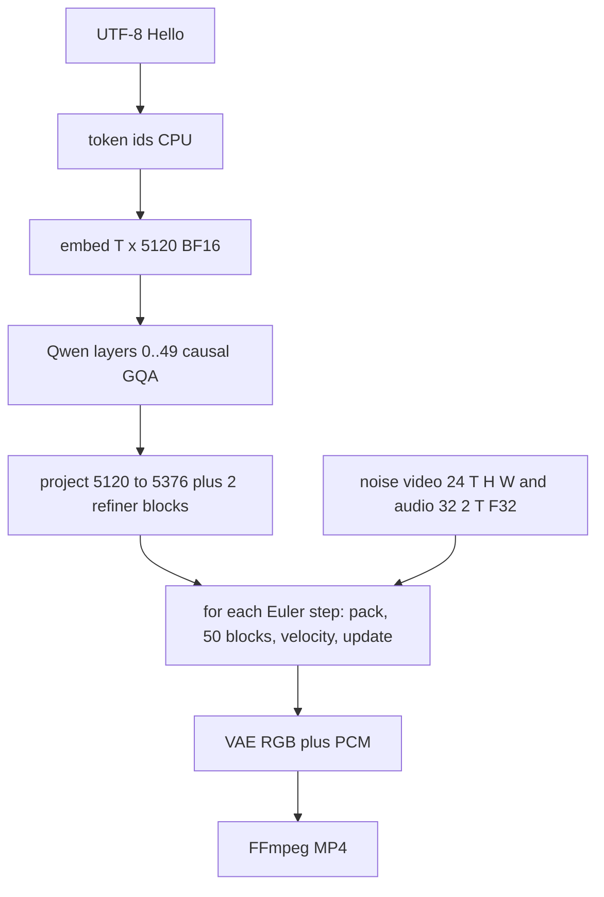
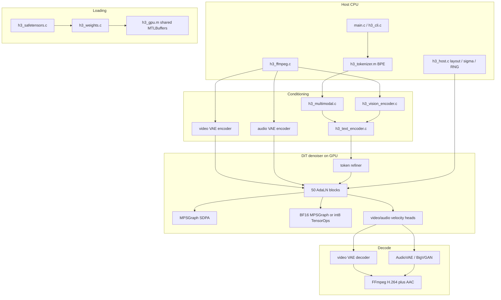

# h3.c Architecture and Theoretical Analysis

A source-grounded study of [antirez/h3.c](https://github.com/antirez/h3.c) as it exists in this repository, and (in [Part II](#part-ii--mapping-toward-qwen38) only) a theoretical mapping toward a future native local inference runtime for **Qwen3.8-27B** on Apple Silicon.

Implementation lives under `h3c_repo/`. Filenames such as `h3_dit.c` mean that tree.

---

## How to read these documents

1. **[Concept primer](h3c_concepts_primer.md)** — first principles (tensors, attention, RoPE, latents, Euler, DiT). Start there if the architecture still feels like a glossary of names.
2. **This file, Part I** — what h3.c actually does, in pipeline order.
3. **[Formulas](h3c_formulas_and_concepts.md)** — exact equations (`#eq-…` anchors), tiny examples, mix-up warnings. This file links out instead of reprinting TeX, except for one hero equation per major block.
4. **This file, Part II** — optional. Qwen3.8 is a different product. Skip it unless you care about a future LLM runtime.

Landing page: [docs/README.md](README.md).

**Math preview.** Cursor and GitHub render math with dollar signs (one pair inline, two on their own lines for display). They do **not** compile LaTeX `\(...\)` or `\[...\]` delimiters.

### Legend

| Label | Meaning |
|---|---|
| **FACT** | Directly verified from source in this repository (used when a claim is easy to misread) |
| **INFERENCE** | Conclusion derived from the implementation, comments, or tests |
| **THEORY** | General technical explanation; math lives in [Formulas](h3c_formulas_and_concepts.md) |
| **PROPOSAL** | Recommendation for a future Qwen3.8 runtime, not a claim about h3.c |

Unlabeled claims that cite a file and function are still intended as **FACT**. Qwen3.8 architecture details in Part II are **THEORY** from public model-card specifications, not from this repository.

### Contents

**Part I**

- [1. What h3.c is](#1-what-h3c-is)
- [2. End-to-end: generating from `"Hello"`](#2-end-to-end-generating-from-hello)
- [3. Pipeline](#3-pipeline)
- [4. Repository and public API](#4-repository-and-public-api)
- [5. The Qwen text tower](#5-the-qwen-text-tower)
- [6. The DiT](#6-the-dit)
- [7. Vision, VAEs, and media I/O](#7-vision-vaes-and-media-io)
- [8. Model representation](#8-model-representation)
- [9. GPU runtime](#9-gpu-runtime)
- [10. Quantization](#10-quantization)
- [11. Memory management](#11-memory-management)
- [12. Performance engineering](#12-performance-engineering)
- [13. Correctness and testing](#13-correctness-and-testing)
- [14. Core abstractions](#14-core-abstractions)
- [15. What is reusable vs model-specific](#15-what-is-reusable-vs-model-specific)

**Part II (optional)**

- [16. If `"Hello"` were Qwen3.8 decode](#16-if-hello-were-qwen38-decode)
- [17. Why a KV cache exists in LLMs](#17-why-a-kv-cache-exists-in-llms)
- [18. Component mapping](#18-component-mapping)
- [19. Gaps and new challenges](#19-gaps-and-new-challenges)
- [20. Complexity assessment](#20-complexity-assessment)
- [21. Learning path](#21-learning-path)
- [22. Proposed future implementation roadmap](#22-proposed-future-implementation-roadmap)
- [23. Open questions](#23-open-questions)

**Appendices:** [A files](#appendix-a--file-to-module-inventory) · [B kernels](#appendix-b--kernel-catalog-83) · [C index](#appendix-c--file-to-theory-index) · [D glossary](#appendix-d--glossary)

---

# Part I — MiniMax-H3 as implemented

<a id="part-i"></a>

Part I never requires Part II.

---

## 1. What h3.c is

<a id="1-what-h3c-is"></a>

`h3.c` is a native MiniMax-H3 **inference** engine for Apple Silicon. It generates **video and synchronized audio** from a text prompt, optionally conditioned on first/last frames (**FL2VA**) or ordered image/video/audio references (**Ref2VA**). The public API is `h3.h`; orchestration is `h3_generate()` in `h3.c` (starts at line 848). Version: `H3_VERSION` `"0.1.0-dev"`. License: MIT, Salvatore Sanfilippo, 2026.

This is **not** an autoregressive language-model runtime. The tutorial loop — tokenize, transformer decode, KV cache, logits, sample the next token — is **not** the serving loop. “Sampler” here means a **[diffusion Euler](h3c_formulas_and_concepts.md#diffusion-flow-matching-and-euler)** (production) or **[RES](h3c_formulas_and_concepts.md#res-sampler)** integrator over noisy video and audio latents (`h3_dit_denoise_euler_preview` in `h3_dit.c`, `h3_euler_velocity_step` in `h3_host.c`). Primer: [§7](h3c_concepts_primer.md#7-this-is-not-an-autoregressive-language-model) and [§9](h3c_concepts_primer.md#9-diffusion-flow-matching-and-euler).

What *is* LLM-like is the **text conditioner**: the first 50 language layers of a Qwen3-VL tower (`h3_text_encoder.c`). That tower runs **once per prompt**, over the full token sequence, with causal grouped-query attention. It has **no [KV cache](h3c_formulas_and_concepts.md#kv-cache)**, **no [language-model head](h3c_formulas_and_concepts.md#language-model-head)**, and **no [token sampling](h3c_formulas_and_concepts.md#token-sampling)**. Its BF16 embeddings are projected into a 50-block multimodal **Diffusion Transformer (DiT)** that jointly attends over packed text, audio, and video tokens.

Compute lives on **Metal**. Host C owns layout, schedules, tokenization, FFmpeg I/O, and packing. Almost every neural op is dispatched through `h3_gpu.m` onto custom kernels in `h3_shaders.metal` or cached **MPSGraph** graphs (linear, MLP, conv, scaled-dot-product attention). M5-class GPUs additionally compile Metal 4 TensorOps (`H3_METAL_HAS_TENSOR`) and a runtime int8 MLP/QKV path.

**INFERENCE.** Studying h3.c is valuable for a Qwen3.8 Mac runtime (Part II) because it is a complete Apple-Silicon inference stack: safetensors into unified memory, BF16 numerics, RMSNorm / SwiGLU / RoPE / GQA kernels, command-buffer overlap, activation aliasing, runtime int8, profiling, and MLX-oracle correctness. It is **not** a template one can retarget by swapping weight files.

---

## 2. End-to-end: generating from `"Hello"`

<a id="2-end-to-end-generating-from-hello"></a>

Walk the **actual** path first. Assume text-only T2VA, $512\times 512$, 22 frames, 20 Euler steps, no references. Shapes below follow `h3_host.c` / `h3_dit.h`; exact token ids depend on `tokenizer.json`.



### 2.1 Text → token ids

<a id="21-text-to-token-ids"></a>

`h3_tokenizer_encode` (`h3_tokenizer.m`): NFC, ICU pretok, byte-level BPE. Output: `uint32_t` ids, length $T$ (small for `"Hello"`). Heap on CPU. Pad id `151643`. Primer: [§3](h3c_concepts_primer.md#3-tokens-and-embeddings). Formula: [BPE](h3c_formulas_and_concepts.md#byte-pair-encoding).

### 2.2 Token ids → embedding

`h3_gpu_embedding_bf16` gathers `[T, 5120]` BF16 from `embed_tokens` of shape `[151936, 5120]`. Shared Metal buffer `hidden`. [eq-embedding](h3c_formulas_and_concepts.md#eq-embedding).

### 2.3 Qwen layers 0..49

<a id="23-qwen-layers"></a>

For each layer, activations stay `[T, 5120]` BF16 (Q packed `[T, 64, 128]`, K/V `[T, 8, 128]`). Causal GQA; **K/V discarded** after the layer. After layer 49, `h3_gpu_tensor_read_bf16` copies to host `h3_text_embedding.values`. Details: [§5](#5-the-qwen-text-tower).

### 2.4 DiT refine (once, at load)

Linear $5120\to 5376$ plus two refiner blocks → `[T, 5376]` BF16, kept for the whole denoise. Not rerun every Euler step. [§6.7](#67-text-refiner).

### 2.5 Noise latents

<a id="25-noise-latents"></a>

**FACT** of `h3_temporal` / `h3_latent_canvas` helpers: for 22 frames at $512^2$, VAE spatial ratio 16, patch $2$ — video latent about `[24, 7, 32, 32]` F32; audio `[32, 2, T]` analogously (audio latent fps 40). Packed sequence length $S$ = text rows + audio rows + video rows (+ cond/refs if any). Primer: [§8](h3c_concepts_primer.md#8-latents-vaes-and-patchify).

### 2.6 Each Euler step

<a id="26-each-euler-step"></a>

1. Patch/pack → `hidden [S, 5376]` BF16.
2. 50 (or thinned) `run_block`: AdaLN, QKV+RoPE, bidirectional SDPA, gated SwiGLU.
3. Final heads → video/audio **velocities** (not logits).
4. Euler: $x \leftarrow x + (\sigma-\sigma_{\mathrm{next}}) v$ via `h3_gpu_euler_bf16` or CPU `h3_euler_velocity_step`.

Hero equation ([eq-euler](h3c_formulas_and_concepts.md#eq-euler)):

$$
x_{\sigma_{\mathrm{next}}} = x_{\sigma} + (\sigma - \sigma_{\mathrm{next}}) \, v_\theta(x_{\sigma}, \sigma)
$$

Primer: [§9](h3c_concepts_primer.md#9-diffusion-flow-matching-and-euler).

### 2.7 Decode

Video VAE → RGB24 `[22, 512, 512, 3]` uint8. Audio VAE / BigVGAN-style decode → PCM F32 32 kHz stereo. FFmpeg mux H.264 + AAC. **No next text token.**

---

## 3. Pipeline

<a id="3-pipeline"></a>

### 3.1 Actual execution path

<a id="31-actual-execution-path"></a>

Entry: `h3_generate()` in `h3.c` (line 848). Metadata: `h3_load_dir()` (line 407) inventories safetensor **headers** without mapping payloads. DiT serving: `h3_dit_denoise_euler_preview()` in `h3_dit.c`.

```text
MiniMax-H3 safetensors
        |
        v
header inventory (h3_load_dir)          [CPU, no payloads]
        |
        v
tokenizer.json  -->  token IDs          [CPU, ICU BPE]
optional PNG/MP4/WAV --> RGB / PCM      [FFmpeg subprocess]
        |
        +--> vision ViT (27 layers)     [GPU BF16]
        +--> video VAE encoder          [GPU F32 conv]
        +--> audio VAE encoder          [GPU F32 conv]
        |
        v
multimodal presentation (IDs, mRoPE, tags)
        |
        v
Qwen3-VL language layers 0..49          [GPU BF16, causal GQA, encode-once]
        |
        v
text embeddings [T, 5120] BF16
        |
        v
DiT load: refine text, precompute AdaLN, load 50 blocks
        |
        v
noise latents (video [24,T,H,W] F32, audio [32,2,T] F32)
        |
        v
for each Euler step:
    pack/patchify --> hidden [seq, 5376] BF16
    50 AdaLN-gated DiT blocks (joint bidirectional SDPA)
    final heads --> video/audio velocities
    Euler update of latents
        |
        v
video VAE decode --> RGB24 frames
audio VAE / BigVGAN decode --> 32 kHz stereo F32
        |
        v
FFmpeg mux --> H.264 + AAC MP4
```

Weights for the ~33B DiT, the Qwen encoder, and the VAEs are loaded and released **by phase** so they never fully coexist in unified memory (README; `h3.c`).

### 3.2 Architecture diagram

<a id="32-architecture-diagram"></a>



### 3.3 What h3.c implements vs what it delegates

<a id="33-implements-vs-delegates"></a>

| Stage | Implemented in-repo | Delegated |
|---|---|---|
| Safetensors parse | custom JSON + `pread` (`h3_safetensors.c`) | OS `open`/`mmap` |
| Tokenizer | HuggingFace JSON BPE (`h3_tokenizer.m`) | ICU Unicode (`-licucore`) |
| Weight residency | shared Metal buffers, optional mmap | Darwin page cache; `F_NOCACHE` for SSD stream |
| Linear / MLP / SDPA (portable) | graph construction in `h3_gpu.m` | **MPSGraph** |
| Custom elementwise / fused ops | `h3_shaders.metal` | Metal compiler, Apple GPU |
| M5 GEMM | TensorOps kernels | Metal 4 `matmul2d` |
| Conv1d / Conv3d | thin wrappers | **MPSGraph convolution** |
| Image resize | `h3_resize_rgb24_high_quality` | **Accelerate / vImage** |
| Media decode/encode | pipes and layout (`h3_ffmpeg.c`) | **ffmpeg / ffprobe binaries** |
| Interactive editing | command dispatch (`h3_cli.c`) | **linenoise** |
| Diffusion math | Euler/RES in host + `h3_euler_bf16` | — |
| Autoregressive decode, KV cache, logits, token sampling | **not present** | n/a |

### 3.4 Two transformers

<a id="34-two-transformers"></a>

There are two distinct networks. Primer: [§7](h3c_concepts_primer.md#7-this-is-not-an-autoregressive-language-model) and [§10](h3c_concepts_primer.md#10-dit-adaln-zero-and-the-packed-sequence).

1. **Qwen language tower** — decoder-only, causal GQA, pre-norm, ungated residuals. Used as a **text encoder**.
2. **H3 DiT** — multimodal denoiser, bidirectional full attention, AdaLN-Zero gates, 3D RoPE. Used as a **velocity network**.

**INFERENCE.** Joint self-attention over packed modalities is MMDiT-style (text tokens sit in the same sequence as video/audio patches). There is no separate cross-attention module from DiT to a frozen text encoder output tensor; text is refined (`condition_proj` + two refiner blocks) then concatenated.

---

## 4. Repository and public API

<a id="4-repository-and-public-api"></a>

README title: “Native MiniMax-H3 inference for Apple Silicon.” Interactive REPL uses vendored linenoise. Third-party credit: adapted Morton-order / int8 TensorOps ideas from ccv Metal FlashAttention (`THIRD_PARTY_NOTICES.md`).

Two released checkpoint trees are expected under `./MiniMax-H3`: `FL2VA/` and `Ref2VA/`. File-by-file inventory: [Appendix A](#appendix-a--file-to-module-inventory).

**Build.** `Makefile` compiles C11 with `-O3` and Objective-C with ARC. Linked frameworks: Foundation, Metal, MetalPerformanceShaders, MetalPerformanceShadersGraph, Accelerate. Also `-licucore -lm`. Runtime Metal compilation is intentional (`newLibraryWithSource` in `h3_gpu_create`); tests do not require Xcode’s offline metallib toolchain.

There is no CUDA, Vulkan, or CPU neural backend. Older Apple GPUs run a portable BF16 + MPSGraph path. M5 enables TensorOps and int8. `h3_metal_probe()` (`h3_metal.m`) fills `h3_device_info` from `MTLCreateSystemDefaultDevice()`.

**CLI.** `main.c` one-shot: `-d MODEL_DIR -p PROMPT -o OUT`. Without `-p`, `h3_cli_run()` starts an Iris-style REPL. `--info` probes device and inventories safetensor headers without mapping payloads. `--profile` sets `H3_PROFILE=1`. Generation knobs live in `h3_params` (`h3.h`): steps, layers, reuse, core-reuse, token-reduction, SSD streaming, int8-row-FC2, slower-* diagnostic flags, internal render canvas, first/last/ref media.

Defaults in `h3.h`: width/height $864\times 480$, frames $56$, steps $20$, DiT layers $50$, min layers $35$.

---

## 5. The Qwen text tower

<a id="5-the-qwen-text-tower"></a>

**What it is for.** Turn the prompt (and optional vision spans) into a sequence of $5120$-wide BF16 vectors that the DiT can attend to. It is **not** a chat model.

Constants (`h3_text_encoder.c` lines 12–27; `H3_TEXT_HIDDEN_SIZE` in the header): 50 layers, vocab $151936$, hidden $5120$, SwiGLU intermediate $25600$, $64$ query heads / $8$ KV heads, head dim $128$, RoPE $\theta = 5\times 10^6$, RMS $\varepsilon = 10^{-6}$. Comment on the header: “released first 50 Qwen3-VL language layers.”

Prefetch ring: 8 I/O workers, depth 2 (M3) or 3 (M5). Layers are streamed; all 50 weight sets are not kept resident.

### 5.1 Embeddings

<a id="51-embeddings"></a>

`text_encode_bf16_impl` looks up `model.language_model.embed_tokens.weight` with `h3_gpu_embedding_bf16`. Optional vision spans **overwrite** those rows; layers $0$–$2$ then add deepstack residuals (`h3_gpu_add_bf16`). [eq-embedding](h3c_formulas_and_concepts.md#eq-embedding). Primer: [§3](h3c_concepts_primer.md#3-tokens-and-embeddings).

### 5.2 RMSNorm and head RMSNorm

<a id="52-rmsnorm-and-head-rmsnorm"></a>

Shaders `h3_rms_norm_bf16` / `h3_rms_norm_f32`. Qwen $\varepsilon = 10^{-6}$; DiT/refiner $\varepsilon = 10^{-5}$. RMSNorm omits mean subtraction ([eq-rmsnorm](h3c_formulas_and_concepts.md#eq-rmsnorm)). Qwen also applies **per-head** RMSNorm on $Q$ and $K$ (`h3_gpu_head_rms_norm_bf16`) over `head_dim` only — after the projections, before RoPE ([eq-head-rmsnorm](h3c_formulas_and_concepts.md#eq-head-rmsnorm)).

Vision uses [LayerNorm](h3c_formulas_and_concepts.md#layernorm) (`h3_gpu_layer_norm_bf16`) with weight and bias. Primer: [§4](h3c_concepts_primer.md#4-the-residual-stream).

### 5.3 Qwen layer (exact order)

<a id="53-qwen-layer-exact-order"></a>

`encode_layer` in `h3_text_encoder.c` (lines 409–465):

1. RMSNorm (input)
2. Q, K, V linears
3. Head RMSNorm on Q and K
4. RoPE
5. Causal GQA, scale $1/\sqrt{128}$
6. Output projection + **ungated** residual
7. RMSNorm (post-attention)
8. gate / up linears, `h3_gpu_silu_mul_bf16`, down projection + residual

Hero equation: [eq-qwen-layer](h3c_formulas_and_concepts.md#eq-qwen-layer). This is a [pre-norm](h3c_formulas_and_concepts.md#residual-connections-and-pre-norm) Transformer with **ungated** residuals and **no KV cache**.

### 5.4 SwiGLU MLP

<a id="54-swiglu-mlp"></a>

Qwen uses separate `gate_proj` / `up_proj` / `down_proj` then `h3_gpu_silu_mul_bf16`. DiT fuses gate and up into `fc1` of width `2*FFN` then `h3_gpu_swiglu_bf16` or a fused MPSGraph/int8 MLP. [eq-swiglu](h3c_formulas_and_concepts.md#eq-swiglu).

| Network | $d_{\mathrm{model}}$ | intermediate (up/gate) |
|---|---|---|
| H3 Qwen | $5120$ | $25600$ |
| H3 DiT | $5376$ | $14336$ |
| Qwen3.8-27B (public spec) | $5120$ | $17408$ |

### 5.5 Causal GQA

<a id="55-causal-gqa"></a>

`h3_gpu_gqa_causal_bf16` → kernel `h3_gqa_causal_bf16` (`h3_shaders.metal` line 3958).

- Query heads 64, KV heads 8, head_dim 128, group size 8.
- `kv_head = query_head / (query_heads / kv_heads)` — [eq-gqa-index](h3c_formulas_and_concepts.md#eq-gqa-index).
- `key_count = query_row + 1` (causal; no $-\infty$ mask matrix) — [eq-causal](h3c_formulas_and_concepts.md#eq-causal).
- Scale $1/\sqrt{128}$ applied to **Q before dots** (comment: MLX fused SDPA order). [eq-attention-scale](h3c_formulas_and_concepts.md#eq-attention-scale).
- Softmax in FP32; I/O BF16.
- Threadgroup: one TG per `(query_row, query_head)`.

Optional `H3_MPS_GQA` routes GQA to MPSGraph. Default is the custom kernel.

**THEORY.** GQA cuts KV size by $n_q/n_{\mathrm{kv}}=8$ versus full MHA. Complexity for full sequence $T$: this kernel is $\Theta(T^2)$ per query head with no KV cache, because every encode is a full forward. [eq-complexity-attn](h3c_formulas_and_concepts.md#eq-complexity-attn). Primer: [§5](h3c_concepts_primer.md#5-attention).

### 5.6 Text RoPE and mRoPE

<a id="56-text-rope-and-mrope"></a>

$\mathrm{inv\_freq}_i = \theta^{-2i/d}$, $\theta = 5\times 10^6$. Text-only: position = token index. Multimodal: `position_ids` `[3, tokens]`; for index $< 60$, axes cycle `index % 3` (comment in the text encoder). Applied by `h3_gpu_rope_text_bf16` with **F32** cos/sin tables. [eq-rope-freq](h3c_formulas_and_concepts.md#eq-rope-freq), [eq-mrope](h3c_formulas_and_concepts.md#eq-mrope).

`h3_multimodal.c` builds the Qwen3-VL presentation: `<Picture n>`, `<Video n>`, `<Audio n>`, vision/video pad token ids `151652–151656`, and mRoPE tables. Primer: [§6](h3c_concepts_primer.md#6-rotary-position-embeddings).

### 5.7 Caches that exist (none of them are transformer KV)

<a id="57-caches-that-exist"></a>

**There is no transformer KV cache.** Neither `encode_layer` nor `run_block` appends K/V for later tokens.

Related caches that **do** exist:

| Cache | Contents | Why |
|---|---|---|
| Interactive `h3_ctx` | BF16 prompt embeddings, prepared `h3_dit`, video decoder | skip reload when prompt/geometry unchanged (`h3_cache_*`) |
| AdaLN schedule | per-step modulation tensors | timestep MLP is independent of latents |
| Core residual | `hidden_after_blocks - hidden_before` | `--core-reuse`: skip transformer core |
| Euler velocities | last/previous BF16 velocity buffers | `--reuse`: extrapolate skipped DiT evals |
| Qwen prefetch ring | next layer weights | hide SSD/IO behind GPU |
| SSD stream slots | two BF16 matrix arenas | keep ~2 DiT blocks resident |
| MPSGraph caches | compiled graphs, optional `graphData` | avoid rebuild |

Why an LLM *would* want a KV cache is [Part II §17](#17-why-a-kv-cache-exists-in-llms) and the [primer §12](h3c_concepts_primer.md#12-vocabulary-that-appears-only-in-architecture-part-ii).

---

## 6. The DiT

<a id="6-the-dit"></a>

**What it is for.** Predict **velocity** of video and audio latents at the current $\sigma$, so Euler can take a step. Primer: [§10](h3c_concepts_primer.md#10-dit-adaln-zero-and-the-packed-sequence).

Constants (`h3_dit.c` lines 14–32; `h3_dit_schedule.h`): `H3_DIT_BLOCKS = 50`, hidden $5376$, $56$ heads $\times 128$ (`INNER=7168`), FFN $14336$, video channels $24$, video patch width $96$, audio channels $32$ $\times$ 2 streams, `ROPE_HALF=48`, AdaLN slots $6$, final-head slots $2$. RMS $\varepsilon = 10^{-5}$.

Core functions: `run_block` (line 1876), `encode_forward` (line 2050), `h3_dit_forward` (line 2442), serving `h3_dit_denoise_euler_preview`.

### 6.1 Packed sequence

<a id="61-packed-sequence"></a>

`h3_layout_build` (`h3_host.c`) emits segments in order: **TEXT** → optional **COND** (keyframes) / Ref2VA refs → **AUDIO** → **VIDEO** (target ends the layout). Kinds in `h3_host.h`: `H3_SEG_TEXT`, `H3_SEG_COND`, `H3_SEG_REF_IMAGE`, `H3_SEG_REF_AUDIO`, `H3_SEG_AUDIO`, `H3_SEG_VIDEO`.

AdaLN modality tags (`h3_dit_schedule.c`): visual **0** (video, cond, ref image, vision spans), text **1** (default text rows), audio **2**. Index = `time_row * 3 + tag`.

`--token-reduction` averages neighboring **horizontal** video tokens in middle blocks (default range **4:30**; early noisy steps can deepen to end 40 for the first 10 steps when `end < 40`), then expands the residual back (`h3_token_pool_bf16`, `h3_token_expand_*`). Quadratic attention then sees fewer video tokens. README: aggressive settings can ghost limbs.

### 6.2 AdaLN-Zero and the schedule

<a id="62-adaln-zero-and-the-schedule"></a>

The **same** block weights denoise at every $\sigma$ because a timestep MLP produces per-channel shift, scale, and gate. [eq-adaln](h3c_formulas_and_concepts.md#eq-adaln).

| Slot | Role |
|---|---|
| 0 | attention shift |
| 1 | attention scale |
| 2 | attention gate |
| 3 | MLP shift |
| 4 | MLP scale |
| 5 | MLP gate |

`h3_dit_schedule.c` `prepare_rows` / `time_embeddings`: $t = 1-\sigma$; sinusoidal dim 256 ([eq-sinusoidal](h3c_formulas_and_concepts.md#eq-sinusoidal)); Linear $256\to 5376$ → SiLU → Linear $5376\to 2688$ F32; cast BF16 → SiLU; then per-block `adaln_proj` into `[time_rows, 3, 6, 5376]` conceptually. Visual conditions use timestep $0.999$; audio conditions $1.0$ when not near-terminal (README / schedule row map).

Precompute happens at load (`h3_dit_schedule_precompute`) so the timestep MLP is **not** rerun inside `run_block`. Gate scores also drive **layer thinning** (`--layers`).

“Zero” is a training-init story; at inference gates are ordinary learned tensors. Primer: [§10](h3c_concepts_primer.md#10-dit-adaln-zero-and-the-packed-sequence).

### 6.3 One DiT block (`run_block`)

<a id="63-run_block"></a>
<a id="63-run-block"></a>

`run_block` (`h3_dit.c` ~1876–2048):

1. Attention AdaLN (`h3_gpu_adaln_bf16`)
2. QKV + Q/K RMS + RoPE (int8 fused or BF16)
3. Full attention via `h3_gpu_sdpa_bf16` (or head-major variant)
4. Attention output proj
5. Fused attention gate + MLP AdaLN (optionally + int8 quant)
6. MLP (int8 / NAX / fused BF16 / or linear→SwiGLU→linear)
7. MLP gate (or fused with next block’s AdaLN)

Hero equation: [eq-dit-block](h3c_formulas_and_concepts.md#eq-dit-block). Residuals are **gated**: $x \leftarrow x + F(x)\odot g(t,\mathrm{modality})$ ([eq-gated-residual](h3c_formulas_and_concepts.md#eq-gated-residual)).

Kill-switches: `H3_DISABLE_FUSED_GATE_ADALN`, `H3_DISABLE_FUSED_CROSS_BLOCK_ADALN`.

### 6.4 Final heads are velocities

<a id="64-final-heads-are-velocities"></a>

DiT slices audio/video target rows, applies 2-slot AdaLN, projects to 32 and 96 channels, then unpack/unpatchify. Outputs are **velocities**: video `[24,T,H,W]` F32, audio `[32,2,T]` F32. There is **no LM head** in this repository. [eq-euler](h3c_formulas_and_concepts.md#eq-euler). A causal LM head would be [eq-lm-head](h3c_formulas_and_concepts.md#eq-lm-head) — that is a Qwen3.8 requirement, not an H3 component.

### 6.5 Bidirectional SDPA

<a id="65-bidirectional-sdpa"></a>

`h3_gpu_sdpa_bf16` / `_head_major_output` use **MPSGraph** `scaledDotProductAttentionWithQueryTensor` — **no custom DiT softmax kernel**. 56 heads, $Q=K=V$, scale $1/\sqrt{128}$, **no causal mask, no GQA**. [eq-sdpa](h3c_formulas_and_concepts.md#eq-sdpa).

Memory for scores is $\Theta(n_{\mathrm{heads}} S^2)$ inside the library (Flash-style tiling may reduce materialization). Head-major SDPA output `[head,row,dim]` can skip a BF16 transpose before int8 attention-output projection (`h3_gpu_linear_int8_head_major_bf16`).

| Math | Qwen path | DiT path |
|---|---|---|
| $W_Q,W_K,W_V$ | three linears | fused `qkv_proj` grouped layout |
| scale | baked into Q in GQA kernel | MPSGraph scale arg |
| mask | causal by `key_count` | none |
| softmax | custom TG reductions | MPSGraph |
| $W_O$ | `o_proj` | `out_proj` (BF16 or int8) |

### 6.6 DiT 3D RoPE

<a id="66-dit-3d-rope"></a>

`prepare_rope` (`h3_dit.c` line 883): `rope.inv_freq` length 16; axes $(t, h\cdot s, w\cdot s)$; `ROPE_HALF=48` so first 48 of 128 head dims rotate, last 80 do not ([eq-partial-rotary](h3c_formulas_and_concepts.md#eq-partial-rotary), [eq-rope-3d](h3c_formulas_and_concepts.md#eq-rope-3d)). At native $256\times 256$, spatial coordinates are halved unless `--use-reference-rope` (avoid a lattice artifact without adding tokens).

**FACT.** DiT QKV rows in the checkpoint are `[head, q/k/v, dimension]`, not `[q/k/v, head, dimension]` (`h3_gpu.h` comment on `h3_gpu_grouped_qkv_rope_bf16`). Native kernels consume that layout directly (README: earlier identity interpretation produced noisy diagnostics).

### 6.7 Text refiner

<a id="67-text-refiner"></a>

`refine_text` / `run_refiner_block`: project $5120 \to 5376$, two DiT-like blocks with **full SDPA, no RoPE** (`rope_half=0`), pre-norm residuals **without AdaLN**, final RMSNorm. Text is refined once at load, not every denoise step.

---

## 7. Vision, VAEs, and media I/O

<a id="7-vision-vaes-and-media-io"></a>

**What this is for.** Optional visual/audio *conditions* into the Qwen presentation and DiT pack; after denoise, latents back to pixels and waveform.

**Vision** (`h3_vision_encoder.c`): Qwen ViT-style hidden 1152, 27 layers, 16 heads $\times$ 72, patch 16, temporal patch 2, merge 2, output 5120 + 3 deepstacks. GPU BF16; CPU patchify/RoPE tables. Vision RoPE: `h3_gpu_vision_qkv_rope_bf16` (2D/temporal positions, no Q/K RMS in that kernel). Vision attention uses LayerNorm + QKV RoPE + SDPA.

**Video VAE** (`h3_video_vae.c` / `h3_video_encoder.c`): 3D conv encoder/decoder, channels-last `[B,T,H,W,C]`, tiled spatially (auto 256–320 px tiles). GPU via MPSGraph conv + custom pad / GroupNorm+SiLU (`h3_vae_encoder_group_norm_silu_f32`). Spatial ratio **16**. [eq-groupnorm](h3c_formulas_and_concepts.md#eq-groupnorm).

**Audio VAE** (`h3_audio_vae.c`): 32 kHz stereo, latent `[32,2,T]`, hop 800. Conv1d, Snake/SnakeBeta ([eq-snake](h3c_formulas_and_concepts.md#eq-snake)), causal SDPA pieces (`h3_gpu_sdpa_causal_f32`, `h3_gpu_audio_qkv_split_f32`, `h3_gpu_audio_attention_pool_f32`), GeGLU ([eq-geglu](h3c_formulas_and_concepts.md#eq-geglu)), BigVGAN-style decode. GPU F32.

**Host geometry** (`h3_host.c`): canvas multiples of 32, max $768\times 1344$ pixels, 24 fps, audio latent 40 fps. Temporal alignment to $5+17n$ frames. Video latent $T = ((frames-5)/17)*5+2$ (if frames$>5$ else 2). Audio latent $T = \mathrm{round}(frames \cdot 40/24)$. Sigma schedules with video shift **12** and audio shift **3**. PCG-style RNG. vImage resize. **No Metal** in this file.

**FFmpeg** (`h3_ffmpeg.c`): `posix_spawn` ffmpeg/ffprobe. RGB24 + F32 PCM pipes. No uncompressed temp files.

**Terminal** (`h3_terminal.c`): Kitty/iTerm image protocol for `--show`.

Primer: [§8](h3c_concepts_primer.md#8-latents-vaes-and-patchify). Formulas: [VAE](h3c_formulas_and_concepts.md#vae-and-latents), [patchify](h3c_formulas_and_concepts.md#patchify).

---

## 8. Model representation

<a id="8-model-representation"></a>

### 8.1 Checkpoint layout

<a id="81-checkpoint-layout"></a>

Components are directories of `*.safetensors`. `h3_st_read_header` (`h3_safetensors.c`) reads:

```text
uint64 little-endian header_size
JSON object { tensor_name: { dtype, shape, data_offsets: [begin, end] }, __metadata__? }
payload bytes at file offset 8 + header_size + begin
```

Max header 256 MiB (`H3_ST_MAX_HEADER`). `h3_st_read_data` `pread`s payloads in 1 GiB chunks. **No mmap in the parser.** `h3_weight_store_open` / `h3_weight_find` search shards by tensor name (Qwen text encoder is 14 shards). Loads fail on dtype/rank/shape mismatch (`h3_weights.c`).

`h3_gpu_tensor_load_file` in `h3_gpu.m` optionally `mmap`s page-aligned ranges and wraps them with `newBufferWithBytesNoCopy` when `H3_ZERO_COPY_WEIGHTS` is set or, by default on M5, for paths containing `/transformer/`. Otherwise: shared buffer + `pread` into `buffer.contents`. Formula notes: [safetensors](h3c_formulas_and_concepts.md#safetensors).

`h3_load_dir` (line 407) inventories required FL2VA (`transformer`, `tokenizer`, `text_encoder`, `video_vae/source`, `audio_vae`) and optional Ref2VA; it does **not** map payloads.

### 8.2 Dtypes and layout

<a id="82-dtypes-and-layout"></a>

Runtime dtypes (`h3_gpu_dtype` in `h3_gpu.h`): F32, BF16 (stored as `uint16` / `ushort` bit patterns), I8, U32. **No FP16 path.** Arithmetic accumulates in F32 and rounds at operation boundaries to match the released compute dtype. [eq-bf16](h3c_formulas_and_concepts.md#eq-bf16). Primer: [§2](h3c_concepts_primer.md#2-tensors-and-linear-layers), [§11](h3c_concepts_primer.md#11-inference-engineering).

Checkpoints consumed here are BF16 (and small F32 patch/head weights). Int8 matrices are created **at load** by `h3_gpu_quantize_weight_int8` (`quantize_block_*` in `h3_dit.c`). SSD streaming **disables** int8 and keeps original BF16.

**INFERENCE.** A Qwen3.8 engine can reuse the safetensors + shared-buffer loader; it cannot assume H3 shard names, shapes, or DiT-specific QKV interleaving.

### 8.3 Important tensors

<a id="83-important-tensors"></a>

#### Qwen language tower

| Tensor | Shape | Dtype | Producer | Consumer |
|---|---|---|---|---|
| `embed_tokens` | `[151936, 5120]` | BF16 | checkpoint | `h3_gpu_embedding_bf16` |
| hidden | `[tokens, 5120]` | BF16 | embedding / residuals | each layer |
| Q | `[tokens, 64, 128]` | BF16 | `q_proj` | GQA |
| K, V | `[tokens, 8, 128]` | BF16 | `k_proj`/`v_proj` | GQA |
| gate/up | `[tokens, 25600]` | BF16 | MLP | SwiGLU |
| output embedding | `[tokens, 5120]` host copy | BF16 | final hidden readback | DiT `condition_proj` |
| tags | `[tokens]` | U8 | multimodal builder | DiT AdaLN row map |

#### DiT hidden stream

| Tensor | Shape | Dtype | Producer | Consumer |
|---|---|---|---|---|
| refined text | `[text_len, 5376]` | BF16 | `condition_proj` + 2 refiner blocks | packed `hidden` |
| video patches | `[T*(H/2)*(W/2), 96]` → 5376 | F32 then BF16 | `h3_dit_patchify_video` + `video_patch_proj` | `hidden` |
| audio rows | `[2*T, 32]` → 5376 | F32 then BF16 | `h3_dit_pack_audio` + `audio_patch_proj` | `hidden` |
| hidden | `[seq, 5376]` | BF16 | pack | every block |
| Q,K,V | `[seq, 56, 128]` | BF16 | grouped QKV | SDPA |
| fc1 | `[seq, 28672]` (`2*14336`) | BF16 or fused away | FC1 | SwiGLU |
| video velocity | `[24,T,H,W]` | F32 | unpatchify final 96-wide rows | Euler |
| audio velocity | `[32,2,T]` | F32 | unpack | Euler |

Contract comment in `h3_dit.h`: host boundary video `[24,T,H,W]`, audio `[32,2,T]`, all F32; sequence activations `[seq, 5376]` BF16. [eq-patchify](h3c_formulas_and_concepts.md#eq-patchify).

#### AdaLN modulation

| Tensor | Shape | Dtype | Producer | Consumer |
|---|---|---|---|---|
| per-block modulation | `[time_rows, 3, 6, 5376]` conceptually | BF16 | `h3_dit_schedule_precompute` | `run_block` via `h3_dit_schedule_block` |
| row_map | `[seq]` | U32 | `h3_dit_schedule_row_map` | AdaLN/gate kernels |
| rope cos/sin | `[seq, 48]` | BF16 | `prepare_rope` | Q/K RoPE |

---

## 9. GPU runtime

<a id="9-gpu-runtime"></a>

**What it is for.** One place (`h3_gpu.m`) that maps neural ops onto Metal: tensors, command streams, MPSGraph caches, TensorOps flags, stats. Every neural module depends on it. Kernel catalog: [Appendix B](#appendix-b--kernel-catalog-83).

### 9.1 Initialization

`h3_gpu_create` (`h3_gpu.m`):

1. Default device + command queue
2. Load `h3_shaders.metal` source → `newLibraryWithSource`
3. `MTLCompileOptions.mathMode = MTLMathModeSafe`
4. If device name contains `"M5"` and `H3_NAX ≠ "0"`, define `H3_METAL_HAS_TENSOR=1`
5. On compile failure, retry without TensorOps
6. Build `MTLComputePipelineState` for every registered name
7. Init MPSGraph caches: SDPA, GQA, linear, MLP, conv

`H3_NAX` modes: default `qkv-attn`; also `attn`, `qkv`, `mlp`, generic linear. `H3_NAX=0` disables TensorOps for A/B. TensorOps host names specialize compile-time K (5376, 7168, 14336). Sequence lengths for TensorOps fast paths $\le 2048$ (else MPSGraph).

`h3_metal.m` is **probe only** (`h3_metal_probe`) so `--info` and tests can inspect the GPU without compiling shaders.

### 9.2 Command model

| API | Behavior |
|---|---|
| `h3_gpu_begin` | new `MTLCommandBuffer` |
| `h3_gpu_continue` | commit without wait; start next CB (overlap encode vs GPU) |
| `h3_gpu_submit` | wait all inflight; collect timestamps |

DiT splits the 50-block loop across two command buffers (`H3_DIT_COMMAND_BLOCKS`; default ~60% split on M5). MPSGraph may create **child** buffers; comments say `command_wait_seconds` is the complete turnaround, while root GPU timestamps can undercount.

### 9.3 Mapping a neural op onto hardware

<a id="93-mapping-a-neural-op-onto-hardware"></a>

```text
AdaLN-gated attention (math)
    → tensors hidden, W_qkv, rope, ...
    → h3_gpu_grouped_qkv_linear_rope_int8 + h3_gpu_sdpa_bf16
    → Metal compute encoder / MPSGraph
    → threadgroups (e.g. 128-wide Morton tiles, or MPS internal)
    → Apple GPU: SIMD groups, TensorOps units on M5, unified DRAM
```

Apple GPUs share DRAM with the CPU ([unified memory](h3c_formulas_and_concepts.md#unified-memory)). Bandwidth, not FLOPs, usually limits large GEMMs ([roofline](h3c_formulas_and_concepts.md#roofline-and-memory-bandwidth)). TensorOps (`matmul2d`) map cooperative SIMD-group MMA onto native BF16/int8 units; [Morton](h3c_formulas_and_concepts.md#morton-order) tile walks improve cache locality (comments credit Draw Things / ccv). Primer: [§11](h3c_concepts_primer.md#11-inference-engineering).

**MPSGraph** is used for: portable linear, fused BF16 MLP (`fc1 → split → silu×up → fc2`), conv1d/3d/transpose, DiT SDPA. **Custom kernels** for everything that needs H3-specific fusion, GQA causality matching MLX, int8 NAX, AdaLN, RoPE, embedding, token pool, Euler.

### 9.4 Kernel families (not the 83-row list)

| Family | Why GPU | Examples |
|---|---|---|
| FP32 portable GEMM / norm / VAE extras | data-parallel over tokens/channels | `h3_linear_f32_tiled`, `h3_rms_norm_f32`, Snake, GN+SiLU |
| BF16 always-on | production Qwen + DiT elementwise and GQA | `h3_rms_norm_bf16`, `h3_gqa_causal_bf16`, `h3_gate_adaln_bf16`, `h3_euler_bf16` |
| Metal 4 TensorOps | GEMMs dominate DiT time; MMA + Morton | `h3_linear_bf16_nax_*`, int8 FC1/FC2/QKV |

Representative anatomy of `h3_gqa_causal_bf16`: one threadgroup per `(query_row, query_head)`; TG memory holds the query vector, a score slice, and reduction scratch; `threadgroup_barrier` after publishing scaled Q; FP32 softmax, BF16 store. $O(T^2 d)$ per head, independent queries.

---

## 10. Quantization

<a id="10-quantization"></a>

**What it is for.** Cut bytes moved on bandwidth-bound GEMMs. Primer: [§11](h3c_concepts_primer.md#11-inference-engineering).

**Weights.** `h3_gpu_quantize_weight_int8`: [symmetric int8](h3c_formulas_and_concepts.md#symmetric-int8-quantization) in $[-127,127]$, **one F32 scale per output row**. Applied at DiT load to FC1, FC2, QKV, attention-out when `h3_gpu_has_int8_mlp` and not SSD streaming. [eq-absmax](h3c_formulas_and_concepts.md#eq-absmax), [eq-int8-dequant](h3c_formulas_and_concepts.md#eq-int8-dequant).

**Activations.** Dynamic, each forward:

- Default FC2: grouped scales, `group_size == 1024` (`hidden_dim/1024` groups) — [eq-grouped-scale](h3c_formulas_and_concepts.md#eq-grouped-scale).
- `--use-int8-row-fc2`: one scale per FC2 row, full-K TensorOps product (faster, less conservative).
- QKV / attention-out: per-row or fused into AdaLN (`h3_gpu_gate_adaln_quantize_int8`).
- Head-major gather-quant: `h3_quantize_bf16_int8_head_major_to_rows_cached` (width 7168 hardcoded = $56\times 128$).

KV-cache quantization is **not applicable**; there is no KV cache.

**FACT (README measurements on M5 Max, $512\times 512$, 50-layer, 19-transition):** BF16 MPS denoise ~36.30 s; int8 MLP ~25.80 s; plus int8 QKV ~19.32 s; plus int8 attention-out ~19.18 s. Peak tensor storage ~36.4 GiB BF16 vs ~25.9 GiB int8 after releasing BF16 FC/QKV copies. Outputs are **not** always byte-identical; fox/surfer subjects stayed coherent; framing/fine detail can change. `--use-int8-row-fc2`: ~2.6% faster forwards; example SSIM 0.919 / 0.828.

Activation quant adds a reduce-max + scale + round pass; fusion into AdaLN removes extra global reads. Grouped 1024 scales reduce error on FC2’s 14336-wide intermediate versus one scale for the whole row.

---

## 11. Memory management

<a id="11-memory-management"></a>

```text
Unified DRAM (Apple Silicon)
├── OS + FFmpeg processes
├── Phase A: Qwen weights (streamed layer-by-layer) + activations [T, 5120]
│     released after embedding readback
├── Phase B: DiT
│     ├── persistent: active block weights (or 2 streamed BF16 slots)
│     ├── persistent: AdaLN tables, rope, row maps, refined text
│     ├── activations (aliased):
│     │     QKV arena → attention heads → MLP input
│     │     attention_output → mlp_output
│     └── int8 weights + scales (M5); BF16 copies freed after quant
├── Phase C: VAEs (loaded after DiT free, unless --show keeps preview VAE)
└── Host: RGB/PCM, tokenizer, layout, optional session cache
```

README: `--show` adds ~10 GiB preview VAE. SSD streaming: tracked DiT storage ~2.0 GiB vs ~36.5 GiB full BF16 at 512². Interactive cache keeps embeddings + DiT + decoder.

| Object | Owner | Lifetime |
|---|---|---|
| `h3_gpu_tensor` | caller; `h3_gpu_tensor_free` | explicit |
| Deferred Qwen weights | `load_context.deferred[]` | until `retire_deferred` after each layer |
| DiT blocks | `h3_dit` | until `h3_dit_free` or SSD slot reuse |
| Shared mmap weights | Metal deallocator `munmap` | with tensor |
| Command buffers | `h3_gpu` inflight list | until `h3_gpu_submit` |

No general pooling allocator: tensors are allocated per use, with **intentional aliasing** of DiT activation arenas (`H3_DISABLE_DIT_ACTIVATION_ALIAS`). Aliasing saves 61.25 MiB at 512-class and 99.63 MiB at 864-class (README). Fused final AdaLN+head saves tens of MiB of scratch.

All neural tensors use `MTLResourceStorageModeShared`. CPU packing writes F32 latents into shared buffers (or uses GPU sampler on M5: `H3_GPU_SAMPLER`). Readback of Qwen embeddings and final velocities uses `h3_gpu_tensor_read_*` (memcpy from `contents` after submit).

**INFERENCE.** There is little PCIe-style transfer; the cost is DRAM bandwidth and CPU/GPU cache coherence. Bottlenecks: DiT GEMM/SDPA, Qwen layer streaming, VAE convs, SSD `pread` (~13–14.6 GiB/s measured).

**INFERENCE from README + kernel design:**

- **Bandwidth-bound:** large GEMMs (QKV $5376\to 21504$, FC1 $5376\to 28672$, FC2 $14336\to 5376$), SDPA at long $S$, weight streaming.
- **More compute-like:** softmax reductions, RMS trees, Snake filters — still cheap next to GEMM.
- Int8 and fusion exist primarily to **cut bytes moved** and kernel launches. [eq-roofline](h3c_formulas_and_concepts.md#eq-roofline).

---

## 12. Performance engineering

<a id="12-performance-engineering"></a>

There is **no tokens/sec** metric. Throughput is seconds per DiT forward, per denoise, or per video. `tests/bench_dit.c` times 7 synthetic forwards and AB ratios.

`h3_gpu_stats` (`h3_gpu.h`): allocated/live/peak bytes, tensor allocations, direct/MPS linear/conv/SDPA dispatches, blit copies, submissions, `command_encode_seconds`, `command_wait_seconds`, root `gpu_seconds`. `--profile` / `H3_PROFILE`: per-phase wall time, encode vs wait, peak live tensor storage, cumulative allocation, dispatch counts. SSD path reports bytes, read throughput, unhidden wait.

Methodology: microbenches discard 8–16 encodes; dit_bench AdaLN warm path must keep bytes stable. AB: disable fusion via env (`H3_DISABLE_*`), `memcmp` candidate vs oracle, report time ratio. README warns M5/M3 results are throttle-sensitive. Granularity: phase marks, not per-op traces (except dispatch counters).

Prompt processing vs generation (H3 sense): **Qwen encode once** (prompt-processing analog) vs **repeated DiT forwards** (the expensive loop). Not LLM prefill vs decode.

### 12.1 Optimization inventory

<a id="121-optimization-inventory"></a>

| Optimization | Class | Principle |
|---|---|---|
| `--reuse` velocity extrapolation | algorithmic | skip denoiser evals; interpolate ([eq-velocity-reuse](h3c_formulas_and_concepts.md#eq-velocity-reuse)) |
| `--core-reuse` | algorithmic | timestep head cheap; core residual held |
| `--layers` gate-ranked thinning | algorithmic / memory | drop low-gate blocks; free weights |
| `--token-reduction` | algorithmic | cut sequence length $S$ in middle blocks |
| Internal `--render-width` | algorithmic | fewer spatial tokens; vImage upsample |
| 256² spatial RoPE half-scale | numerical / algorithmic | avoid lattice artifacts without more tokens |
| Fused gate+AdaLN, cross-block AdaLN | GPU-kernel | one dispatch; TG keeps residual row |
| Fused MLP graph / NAX SwiGLU | GPU-kernel | no persistent intermediate |
| Fused AdaLN+linear heads | GPU-kernel / memory | no extra normalized activation |
| Fused patch proj cast+pack | GPU-kernel / memory | no F32 scratch / staging blit |
| Activation aliasing | memory | lifetime-aware buffer reuse |
| Two command buffers | scheduling | overlap CPU encode vs GPU |
| MPS `graphData` cache | software-architecture | skip wrapper rebuild |
| Reuse MPSCommandBuffer (M3) | scheduling | less wrapper overhead |
| Zero-copy mmap weights (M5) | I/O / memory | file-backed, reclaimable |
| Qwen prefetch ring | I/O / scheduling | IO workers vs current layer GPU |
| SSD streaming | I/O / memory | 2-block residency; `F_NOCACHE` |
| Morton TensorOps | GPU-kernel | cache-friendly tile order |
| Head-major QKV/SDPA | GPU-kernel | skip transposes |
| Int8 MLP/QKV/out | numerical / memory | half traffic; TensorOps MMA |
| Grouped vs row FC2 scales | numerical | accuracy vs one full-K GEMM |
| TG-cached int8 scales | GPU-kernel | avoid re-reading scales |
| Vectorized BF16x4 RMS/quant | GPU-kernel | fewer loads, same rounding order |
| GPU Euler sampler (M5) | scheduling / memory | no latent readback |
| Layer-wise Qwen load | memory | never resident 50 layers at once |
| Diagnostic `H3_DISABLE_*` / `--use-slower-*` | software-architecture | oracles for A/B |

README highlights: SSD streaming warm 50-block forward 1.35 vs 2.49 s (512) / 2.14 vs 2.68 s ($864\times 480$), byte-identical, mutually exclusive with int8-row-fc2. Token reduction: `45 layers + reuse 2` denoise 16.69 → 12.60 s (IT M5 Max, 512²). `--core-reuse 4` validated; `6` aggressive; exclusive with `--reuse`. Presets: layers 50/45/40; reuse 1/2/3. Ref2VA: $\le 12$ refs; limits 9 images / 3 videos / 3 audio.

`--core-reuse` caches $\Delta = h_{\mathrm{after}} - h_{\mathrm{before}}$ and skips the trunk. `--reuse` blends last two BF16 velocities in the Euler kernel. Neither is a learned sampler. [core/velocity reuse](h3c_formulas_and_concepts.md#core-reuse-and-velocity-reuse).

---

## 13. Correctness and testing

<a id="13-correctness-and-testing"></a>

21 test files under `tests/`. Oracles are labeled **MLX**, not PyTorch. `make test` **skips** missing fixtures/weights. Full DiT (`test_real_dit.c`), schedule, semantic, benches are **outside** default `make test`.

1. **Host exact** — `tests/test_h3.c`: canvas, $\sigma$, layout checksums, pack/unpack, RNG. Tolerance `close_enough` $10^{-7}\ldots 10^{-12}$.
2. **Toy MLX fixtures** — `test_metal.c` (F32 block rel-max $< 5\cdot 10^{-3}$), `test_bf16.c` ($< 10^{-2}$ plus many `memcmp` fusions), `test_text_metal.c` (one Qwen layer $< 10^{-2}$).
3. **Released MiniMax vs MLX safetensor oracles** — real_* tests; bounds widen with depth (0.02 → 0.25 → 1.0 on full denoise).
4. **Structural asserts** — dispatch/submission counts must match expected graphs.
5. **Byte-identical ABs** — `bench_dit.c` for fused vs unfused production paths.

Tokenizer: exact ID lists vs released `tokenizer.json`. Audio primitives: in-file host C references, abs $10^{-7}\ldots 2\cdot 10^{-5}$ (`test_audio_gpu.c`).

**How you would know an implementation is wrong** (method used by h3.c):

1. Shape/layout bugs fail host tests and packing roundtrips first.
2. Single-op bugs (RMS, RoPE, SiLU, GEMM rounding) fail toy fixtures with tight rel-max.
3. Wrong residual/gate wiring fails `test_metal` / `test_real_dit_block` early tensors (0.01–0.05).
4. Wrong fusion rounding fails `memcmp` even if MLX-ish.
5. Wrong weight names/layout fail real loaders or explode rel-L2 immediately.
6. Accumulation over 50 layers needs looser bounds; passing 1.0 denoise rel-L2 is a **weak** oracle — visual/semantic tests catch remaining drift.
7. Dispatch-count mismatches catch accidental portable-vs-fast path switches.

**INFERENCE.** Bounds widen because BF16 + attention are not associative; late DiT checkpoints at 0.15 and velocities at 0.25 are expected, not a sign that early ops were untested.

Debugging: env kill-switches restore two-kernel oracles. `H3_PROFILE`, `H3_DEBUG_GPU_MEMORY`, `H3_NAX_DIAGNOSTIC`. CLI `--use-slower-*`. Progress callbacks. `--frames-dir` PPM dumps. `--show` visual inspection.

Ignored by git and not present in a clean clone: `MiniMax-H3/` weights, `misc/fixtures/` MLX oracles, `outputs/`.

---

## 14. Core abstractions

<a id="14-core-abstractions"></a>

| H3 type / concept | Role |
|---|---|
| `h3_ctx` | session: model dir, device, optional cached conditioning/DiT/decoder |
| `h3_gpu` | compiled library, queue, pipelines, graph caches, stats |
| `h3_gpu_tensor` | typed shared buffer + accounting |
| `h3_weight_store` / `h3_st_header` | shard index |
| `h3_tokenizer` | BPE |
| `h3_text_embedding` | host BF16 rows + tags |
| `h3_dit` | loaded denoiser + activations + schedule |
| `h3_layout` / `h3_segment` | packed multimodal sequence |
| `h3_sigma_schedule` | video/audio $\sigma$ grids |
| `h3_params` | generation policy |
| Command begin/continue/submit | explicit graph-free eager stream |
| Kernel name string → PSO | no IR graph object |

There is **no** general `Graph`, `Operation`, `Backend` plug-in, or autograd. The “graph” is C call order plus cached MPSGraph snippets. H3 is an **eager encoder + diffusion stepper**.

---

## 15. What is reusable vs model-specific

<a id="15-what-is-reusable-vs-model-specific"></a>

**Reusable (model-agnostic).** Unified Metal buffers; eager command streams; safetensors I/O; BF16 round-to-nearest helpers; RMSNorm/SiLU GEMM building blocks; profiling counters; fusion-vs-oracle env switches; IO/compute overlap; activation lifetime aliasing; MLX/HF parity testing.

**Architecture-specific (H3).** AdaLN-Zero 6 slots; 3D RoPE; packed TEXT/AUDIO/VIDEO layout; DiT token reduction; Euler/RES; VAE tiling; FL2VA vs Ref2VA; gate-ranked layer thinning; QKV `[head,qkv,dim]` checkpoint layout; hidden 5376 / 56 heads.

**Hardware-specific (Apple Silicon).** Metal runtime compile; MPSGraph SDPA; M5 TensorOps; unified shared storage; mmap zero-copy; vImage; ICU on Darwin.

**Format-specific.** Safetensors JSON header; MiniMax shard layout vs Qwen3.8 `model-000xx-of-00018`; BF16 vs official FP8 checkpoint; tokenizer.json schema.

Qwen3.8-specific pieces (Gated DeltaNet, decode loop, …) are listed in [Part II](#part-ii--mapping-toward-qwen38).

---

# Part II — Mapping toward Qwen3.8

<a id="part-ii--mapping-toward-qwen38"></a>
<a id="part-ii"></a>

**Skippable.** Nothing below is required to understand MiniMax-H3. Primer vocabulary: [§12](h3c_concepts_primer.md#12-vocabulary-that-appears-only-in-architecture-part-ii).

**THEORY (public Qwen3.8-27B specs, August 2026, not this repo):** 27B dense vision-language model; 64 layers as $16\times$(3$\times$ [Gated DeltaNet](h3c_formulas_and_concepts.md#gated-deltanet)→FFN + 1$\times$ Gated Attention→FFN); hidden 5120; FFN 17408 SwiGLU; vocab 248320; DeltaNet 48 V / 16 QK heads dim 128, conv kernel 4; Gated Attention 24Q / 4KV dim 256, RoPE dim 64, $\theta=10^7$, partial rotary 0.25; context 262144 ([YaRN](h3c_formulas_and_concepts.md#yarn) to 1M); [MTP](h3c_formulas_and_concepts.md#multi-token-prediction); thinking mode; vision encoder.

Sharing “Qwen” in the name does **not** make H3’s `encode_layer` a drop-in Qwen3.8 block.

H3 Qwen: 50 layers, GQA 64/8 $d=128$, intermediate 25600, vocab 151936, $\theta=5\cdot 10^6$, encode-only.

---

## 16. If `"Hello"` were Qwen3.8 decode

<a id="16-if-hello-were-qwen38-decode"></a>

```text
"Hello"
  → tokenizer (new vocab 248320) → ids
  → embed [1, 5120] or prefill [T, 5120]
  → 64 hybrid layers (DeltaNet state + GQA KV cache)
  → RMSNorm → LM head → logits [248320]
  → sample (thinking-mode defaults T=1.0, top_p=0.95, top_k=20)
  → next token id → decode bytes
```

h3.c implements none of the last four bullets. [eq-lm-head](h3c_formulas_and_concepts.md#eq-lm-head), [eq-temperature](h3c_formulas_and_concepts.md#eq-temperature).

A normalized engine, independent of H3 names, wants:

```text
Device          = Metal GPU + command queue
Buffer          = unified MTLBuffer
Tensor          = {buffer, dtype, shape, strides, offset}
Module weights  = named tensors from safetensors
Tokenizer       = text <-> ids
EncoderPass     = full-sequence forward (H3 Qwen; Qwen3.8 prefill)
DecodeState     = KV cache + DeltaNet state  (Qwen3.8 only)
Sampler         = token sampler (Qwen3.8) vs Euler (H3)
Kernel          = Metal PSO or MPSGraph
Profiler        = phase stats
```

H3 is an **eager encoder + diffusion stepper**. Qwen3.8 serving is an **eager prefill + decode stepper**. Same Device/Buffer/Tensor/Kernel ideas; different State and Sampler.

---

## 17. Why a KV cache exists in LLMs

<a id="17-why-a-kv-cache-exists-in-llms"></a>
<a id="17-kv-cache"></a>

Autoregressive decoding of token $t+1$ needs $K_{0:t}, V_{0:t}$. Recomputing them from scratch is $\Theta(t)$ per layer per new token for the $QK^\top$ with past keys, but recomputing K/V projections from all past hidden states is even worse. Storing K/V makes each new token $\Theta(n_{\mathrm{layers}} n_{\mathrm{kv}} d)$ extra memory and $\Theta(t)$ attention against the cache. [eq-kv-cache-size](h3c_formulas_and_concepts.md#eq-kv-cache-size). Full explanation: [KV cache](h3c_formulas_and_concepts.md#kv-cache).

Concrete **non-example** in h3.c: prompt `"Hello"` encoded with 2 tokens (illustrative). Qwen builds Q,K,V of shape `[2, 64/8, 128]`, runs causal attention for both positions, **discards K/V**, returns `[2, 5120]`. Generating a third text token is impossible in this API; the embeddings condition a video denoise.

If H3 *were* an LLM and had already produced tokens `[Hello, world]`, a KV cache after two tokens at one Qwen layer would look like:

```text
K: [2, 8, 128] BF16   V: [2, 8, 128] BF16
next token: compute Q_3 [1, 64, 128], attend to K[:,0:2], append K_3,V_3
```

**FACT.** That append path is not in the repo.

**PROPOSAL.** Qwen3.8 needs (1) GQA KV cache for 16 Gated Attention layers (24Q / 4KV, head_dim 256) and (2) a **[DeltaNet](h3c_formulas_and_concepts.md#gated-deltanet) recurrent state** for 48 linear layers (not a growing KV tensor).

| | H3 Qwen encode | H3 DiT step | LLM prompt | LLM decode |
|---|---|---|---|---|
| Sequence | full prompt | full packed $S$ | full prompt | 1 new token |
| Attention | causal full | bidirectional full | causal, fill cache | causal vs cache |
| Repeat | once | once per Euler eval | once | once per token |

Worked numbers (BF16, GQA only, ignoring DeltaNet): $16$ layers $\times$ $4$ KV heads $\times$ $256$ $\times$ $T$ $\times$ $2$ (K and V) $\times$ $2$ bytes $= 65536\, T$ bytes. At $T=262144$ that is $16$ GiB **just** for softmax-attention KV, before activations and weights.

---

## 18. Component mapping

<a id="18-component-mapping"></a>

| h3.c component | Qwen3.8 equivalent | Action |
|---|---|---|
| `h3_safetensors` / `h3_weights` | HF shards | **adapt** names/shapes/dtypes (may include FP8) |
| `h3_gpu` tensors, begin/submit, stats | same | **reuse concept**; extend dtypes |
| BF16 RMSNorm / SiLU / SwiGLU kernels | FFN + norms | **reuse / retile** for 5120 / 17408 |
| `h3_gqa_causal_bf16` | Gated Attention softmax (16 layers) | **adapt**: 24/4 heads, d=256, extra gates; still need **KV cache** |
| `h3_gpu_rope_text_bf16` | partial RoPE | **adapt** $\theta$, dims, `partial_rotary_factor` |
| Qwen `encode_layer` | one Gated Attention block **without** cache | **replace** loop with prefill+decode |
| Embedding kernel | embed + **LM head** | **new** head; maybe tied |
| DiT AdaLN / 3D RoPE / patchify | none | **do not reuse** as architecture |
| MPSGraph SDPA full | maybe Gated Attention prefill | **adapt**; decode needs cache-aware kernel |
| Int8 NAX GEMM | 27B FFN/attn proj | **adapt** K/N specializations; new shapes |
| Tokenizer BPE | Qwen3.8 tokenizer.json | **replace** vocab/merges; keep algorithm |
| Vision 27-layer 1152 | Qwen3.8 vision encoder | **replace** (likely different config) |
| Video/audio VAE, FFmpeg mux, Euler | none for LLM | **omit** for text runtime |
| Prefetch ring / SSD stream | 27B weight residency | **reuse concept** |
| Tests vs MLX | tests vs HF/vLLM | **reuse methodology** |
| Gated DeltaNet | 48 layers | **new research** |
| KV + recurrent state | decode | **new** |
| Sampling / thinking / MTP | serving | **new** |
| YaRN 1M | long context | **new** |

**Architecture-specific (Qwen3.8).** Gated DeltaNet; gated full attention; hybrid 3:1 schedule; MTP head; thinking delimiters; 262K/YaRN; GQA 24/4 $d=256$; DeltaNet conv-4; decode loop.

---

## 19. Gaps and new challenges

<a id="19-gaps-and-new-challenges"></a>

**Assumptions h3.c makes:** macOS + Metal default device; MiniMax-H3 directory layout (`FL2VA/`, `Ref2VA/`); ffmpeg on `PATH` for media; TensorOps fast paths for $S\le 2048$; denoising, not token decode; correctness vs **MLX** dumps of H3, not a general LM harness.

**Not implemented:** autoregressive generation; KV cache; logits; temperature/top-p/top-k token sampling; LM head; paged attention; speculative/MTP decode; Gated DeltaNet; YaRN; chat templates / thinking; batching multiple users; CUDA.

| Topic | H3 | Qwen3.8 |
|---|---|---|
| Time axis | ~20 DiT evals | thousands of decode steps |
| Attention mix | 100% softmax (DiT) or GQA encode | 75% linear + 25% softmax |
| State | none (plus diffusion latents) | KV + recurrent DeltaNet |
| Context | packed $S \sim 2\cdot 10^3$–$3\cdot 10^3$ tokens | 262K native |
| Weights | ~33B DiT phased with encoder/VAE | ~27B must stay for decode |
| Multimodal | video **generation** | image/video **understanding** |

**PROPOSAL.** Treat H3 VAEs, DiT AdaLN, token-reduction, and Euler as **out of scope** for a Qwen3.8 text/VLM runtime. Steal the Metal engineering, not the network.

**New research required:**

1. Correct, fast **Gated DeltaNet** in Metal (recurrence, conv-4, gates, state layout).
2. **Cache-aware** Gated Attention (not full-sequence GQA kernel).
3. Memory plan for 262K on unified memory (impossible at naive BF16 KV; must quantize/window/linear-state).
4. Numerical match to official kernels (linear attention is sensitive).
5. MTP and thinking-mode serving policy.
6. Vision encoder parity with the 3.8 tower (not H3’s 27$\times$1152 ViT unless proven identical — **unknown without 3.8 config.json in this repo**).

For Qwen3.8, KV and DeltaNet state quantization would be a separate design (often more fragile than weight int8).

---

## 20. Complexity assessment

<a id="20-complexity-assessment"></a>

Scores are for building a **Qwen3.8 Mac runtime**, informed by what h3.c shows is hard on this hardware. 1 = trivial, 10 = extremely difficult.

| Component | Score | Why |
|---|---|---|
| Model loading | 4 | Safetensors pattern exists (`h3_safetensors.c`); new keys/shapes/FP8. |
| Tokenizer | 3 | BPE machinery exists; new JSON/vocab. Chat template extra. |
| Tensor abstraction | 5 | H3’s tensor is enough to start; strided views/paging come later. |
| CPU kernels | 6 | Correct prefill/decode in C is doable; slow; still needs DeltaNet math. |
| Metal kernels | 9 | H3 shows years of fusion/TensorOps work; new ops too. |
| Attention (softmax GQA) | 7 | Custom GQA exists but **without cache**; decode kernel is new. |
| KV cache | 8 | Not in H3; GQA 4 KV heads helps; 262K still brutal. |
| Gated DeltaNet (new) | 10 | No code here; research + Metal recurrence. |
| Quantization | 8 | H3 int8 is DiT-shaped; 27B decode needs weight+KV strategy. |
| Memory management | 8 | Phase tricks help load; decode must keep weights+state hot. |
| Scheduling | 7 | Command overlap transfers; decode is latency-sensitive. |
| Sampling | 4 | Standard token sampling; thinking-mode policy extra. |
| Benchmarking | 4 | Steal `h3_gpu_stats`; add tok/s, TTFT, prefill vs decode. |
| Debugging / parity | 8 | H3’s oracle culture is the model; hybrid layers harder to bisect. |
| Multimodal (VLM) | 8 | H3 vision is a different tower; video understanding $\neq$ VAE encode for DiT. |
| Long-context | 10 | 262K–1M on Mac unified memory + correctness of YaRN. |
| DiT/VAE/Euler | n/a | Not required for Qwen3.8 LLM. |

---

## 21. Learning path

<a id="21-learning-path"></a>

Tied to problems **this repository actually exposes**. Prefer the [primer](h3c_concepts_primer.md) for theory, then the files below.

### Fundamentals

1. **Tensor layouts and [BF16](h3c_formulas_and_concepts.md#bfloat16)** — `h3_bf16_to_f32` helpers; why [GEMM](h3c_formulas_and_concepts.md#gemm) accumulates F32. Primer: [§2](h3c_concepts_primer.md#2-tensors-and-linear-layers).
2. **[Safetensors](h3c_formulas_and_concepts.md#safetensors)** — `h3_st_read_header`. Prerequisite: binary files, endianness.
3. **[RMSNorm](h3c_formulas_and_concepts.md#rmsnorm), [SiLU](h3c_formulas_and_concepts.md#silu), [SwiGLU](h3c_formulas_and_concepts.md#swiglu)** — shaders + `encode_layer`. Primer: [§4](h3c_concepts_primer.md#4-the-residual-stream).
4. **C memory ownership** — explicit `h3_gpu_tensor_free`, no RAII.

### Intermediate

5. **Transformer layer dataflow** — `encode_layer` vs `run_block`. Primer: [§4](h3c_concepts_primer.md#4-the-residual-stream), [§10](h3c_concepts_primer.md#10-dit-adaln-zero-and-the-packed-sequence).
6. **Attention math** — GQA kernel vs MPSGraph SDPA. Primer: [§5](h3c_concepts_primer.md#5-attention).
7. **[RoPE](h3c_formulas_and_concepts.md#rotary-position-embeddings)** — `prepare_rope` vs `h3_gpu_rope_text_bf16`. Primer: [§6](h3c_concepts_primer.md#6-rotary-position-embeddings).
8. **[Unified memory](h3c_formulas_and_concepts.md#unified-memory)** — shared MTLBuffer, mmap weights.

### Advanced

9. **AdaLN-Zero and diffusion** — only if you care about H3 media; skip for Qwen3.8. Primer: [§9](h3c_concepts_primer.md#9-diffusion-flow-matching-and-euler)–[§10](h3c_concepts_primer.md#10-dit-adaln-zero-and-the-packed-sequence).
10. **Quantization** — absmax int8, grouped scales, fused AdaLN quant. Primer: [§11](h3c_concepts_primer.md#11-inference-engineering).
11. **Correctness oracles** — rel-max vs `memcmp`. Prerequisite: non-associativity of fp.

### GPU optimization

12. **Metal execution model** — threadgroup vs SIMD group, barriers, `MTLMathModeSafe`.
13. **Tiling** — 16$\times$16 Iris linear vs 128 TensorOps tiles; Morton.
14. **Fusion** — gate+AdaLN keeping 5376-wide row in TG (10.5 KiB). Principle: don’t reread DRAM.
15. **Graph vs eager** — MPSGraph caches vs custom PSO.
16. **Profiling** — encode vs wait vs root GPU time; thermal.

### Full inference runtime (Qwen3.8)

17. **Prefill vs decode** — H3 never decode-steps tokens; study GQA kernel then add cache.
18. **Linear attention / DeltaNet** — external papers + official Qwen kernels; no H3 file teaches this.
19. **Serving** — sampling, thinking tags, MTP speculative heads.
20. **Long context** — paging, state compression, YaRN.

| Subsystem | Before touching it, understand |
|---|---|
| Tokenizer | Unicode NFC, BPE merges |
| Text encoder | GQA, RoPE, SwiGLU |
| DiT block | AdaLN, full SDPA, 3D RoPE |
| `h3_gpu.m` | Metal buffers, command buffers, MPSGraph |
| Int8 NAX | GEMM as $Y=XW^\top$, scale broadcast |
| VAE | conv, group norm (not needed for LLM) |

---

## 22. Proposed future implementation roadmap

<a id="22-proposed-future-implementation-roadmap"></a>

**PROPOSAL only.** Do not implement in this phase.

### Phase 0 — Understanding

- **Objective:** these documents; read `encode_layer`, `run_block`, `h3_gpu_create`, GQA kernel.
- **Prerequisites:** none beyond the report.
- **Tests:** none.
- **Risks:** mistaking DiT for an LLM.
- **Do not:** write kernels, download 27B and “just run it” inside this repo.

### Phase 1 — Minimal CPU runtime

- **Objective:** Qwen3.8 **text** prefill of a short prompt on CPU: load BF16 (or dequant FP8→F32), embeddings, **only Gated Attention layers first** *or* a sliced dense GQA prototype if DeltaNet is not ready — **prefer implementing one official block type correctly**.
- **Prerequisites:** tokenizer JSON, `config.json`, HF reference hidden states.
- **Components:** safetensors, tensors, RMSNorm, RoPE, GQA **full sequence**, SwiGLU, LM head, greedy argmax.
- **Tests:** token IDs exact; layer-0 hidden rel-L2 tight; greedy token vs HF for 8 tokens.
- **Risks:** skipping DeltaNet yields a **wrong model**; if the hybrid mix is mandatory, Phase 1 must include a **slow Python/C DeltaNet**.
- **Do not:** Metal, int8, 262K, vision, thinking traces, DiT code copy.

### Phase 2 — Correctness

- **Objective:** all 64 layers CPU, matching HF/vLLM within agreed rel-L2; greedy and sampling vs reference.
- **Prerequisites:** Phase 1 oracles.
- **Components:** DeltaNet reference, gates, conv-4, full hybrid schedule, chat template.
- **Tests:** per-layer dumps; KL on logits; disable fusions (none yet).
- **Risks:** silent layout bugs in DeltaNet state.
- **Do not:** fuse kernels or quantize.

### Phase 3 — Quantization

- **Objective:** weight int8/FP8 that matches a documented scheme; optional activation quant on FFN.
- **Prerequisites:** byte-stable F32/BF16 oracles.
- **Tests:** same generations at looser tolerance; perplexity/KL.
- **Risks:** destroying DeltaNet stability.
- **Do not:** KV quant until decode exists and is correct.

### Phase 4 — Metal backend

- **Objective:** prefill on GPU using H3-like `h3_gpu` patterns: RMSNorm, GEMM (MPSGraph or NAX), GQA, SwiGLU.
- **Prerequisites:** CPU match.
- **Tests:** `memcmp` or tight rel-max vs CPU for small $T$; dispatch counts.
- **Risks:** MPSGraph SDPA vs custom GQA mismatch (H3 already saw MLX scale-order issues).
- **Do not:** 262K, production int8 NAX specializations copied from 5376/14336.

### Phase 5 — Optimization

- **Objective:** fused RMSNorm+quant, TensorOps FFN for 5120/17408, command overlap, weight streaming.
- **Tests:** AB `memcmp` vs unfused GPU; tok/s on M-series.
- **Risks:** H3’s lesson — NAX wins microbenches and loses full forwards; measure end-to-end.
- **Do not:** quality hacks analogous to `--layers 40 --reuse 3 --token-reduction` (those are H3-specific and already shown to ghost limbs).

### Phase 6 — Advanced decoding

- **Objective:** KV cache + DeltaNet state; streaming decode; MTP if weights include the head; thinking-mode stop rules.
- **Tests:** match HF greedy at $T=128+$; cache vs full-prefill identity; memory vs $T$.
- **Risks:** cache layout vs GQA groups; state reset bugs.
- **Do not:** 1M YaRN as default.

### Phase 7 — Multimodal

- **Objective:** official Qwen3.8 vision/video inputs, not H3 ViT/VAE.
- **Tests:** HF processor + hidden match; VQA smoke.
- **Risks:** assuming `h3_vision_encoder.c` is the same tower.
- **Do not:** MiniMax DiT generation path.

Parity table if you steal H3’s test culture:

| Quantity | H3 reference | Qwen3.8 proposal |
|---|---|---|
| Tokenizer IDs | golden lists | HuggingFace tokenizer |
| Hidden after layer k | MLX fixture | Transformers / MLX hidden states |
| Logits | **n/a in H3** | greedy next-token vs HF |
| Video/audio latents | MLX safetensors | n/a |
| Fused vs unfused | `memcmp` | same: disable fusions until bit-exact, then fuse |

---

## 23. Open questions

<a id="23-open-questions"></a>

1. **FACT gap:** this clone does not include `MiniMax-H3` weights or `misc/fixtures`; numerical claims in README were not re-measured here.
2. **Unknown:** exact Qwen3.8 vision config versus H3’s 27$\times$1152 ViT — requires `config.json` from `Qwen/Qwen3.8-27B`.
3. **Unknown:** whether Qwen3.8 official Metal/Apple kernels exist (vLLM/SGLang/TokenSpeed are cited publicly; llama.cpp support may lag hybrid attention).
4. **Unknown:** FP8 checkpoint layout and whether H3-style runtime int8 is appropriate versus native FP8 on later GPUs.
5. **INFERENCE:** H3 “first 50 Qwen3-VL language layers” — which exact Qwen3-VL checkpoint revision is not pinned in source beyond weight key prefixes.
6. **Unknown:** legal/size constraints of copying H3 Metal 4 kernels into a separate Qwen engine (MIT license allows reuse with notice; still a **design** choice not to copy DiT-shaped tiles).
7. **Product:** target Mac SKU (unified memory 36 vs 64 vs 128 GiB) changes whether BF16 27B is feasible at all (~54 GiB weights before cache).

---

# Appendices

## Appendix A — File-to-module inventory

<a id="appendix-a--file-to-module-inventory"></a>

Grouped source (working copy; excluding `.git`). For each file: what it does and why.

### Public API and orchestration

**`h3.h` / `h3.c` / `h3_internal.h`** — Opaque `h3_ctx`, `h3_params`, `h3_generate`, session cache for embeddings / prepared DiT / video decoder. Stable C API over a multi-phase Metal pipeline. Dependents: `main.c`, `h3_cli.c`, tests that call generation.

**`main.c`** — CLI parser, `--info`, one-shot generate, REPL dispatch. CPU only.

**`h3_cli.c` / `h3_cli.h`** — Interactive session: `!seed`, `!first`, `!ref-image`, `!ssd-streaming`, `!cache`, etc. Enables `h3_cache_set_enabled` so repeated prompts skip reload/encode.

### GPU runtime

**`h3_metal.h` / `h3_metal.m`** — `h3_metal_probe()` only.

**`h3_gpu.h` / `h3_gpu.m`** — The backend. Tensor allocation (`h3_gpu_tensor`), command begin/continue/submit, every `h3_gpu_*` op, MPSGraph caches, TensorOps feature flags, stats.

**`h3_shaders.metal`** — 83 `kernel void` functions (plus `host_name` template specializations). Ops MPSGraph does not fuse the way H3 needs.

### Loading

**`h3_safetensors.h/.c`** — Header-only parse; `pread` payloads. Dtypes include BOOL through F64; production loads use BF16/F32 via weights layer.

**`h3_weights.h/.c`** — `h3_weight_store_open` lists `*.safetensors`, keeps headers. `h3_weight_load_bf16` / `_f32` validate exact shape and load into Metal.

### Host geometry, text, DiT, media

**`h3_host.h/.c`** — Canvas, $\sigma$, packed layout, RNG, Euler/RES, vImage. No Metal.

**`h3_tokenizer.h/.m`** — `tokenizer.json` BPE.

**`h3_text_encoder.h/.c`** — 50 Qwen3-VL language layers. `encode_layer()` line 409.

**`h3_multimodal.h/.c`** — Qwen3-VL presentation and mRoPE `position_ids`.

**`h3_dit_schedule.h/.c`** — Precompute AdaLN tables and row maps.

**`h3_dit.h/.c`** — Load, forward, Euler/RES denoise, patchify/pack, SSD streaming, token reduction, core reuse, int8 setup.

**`h3_vision_encoder.c`**, **`h3_video_vae.c` / `h3_video_encoder.c`**, **`h3_audio_vae.c`**, **`h3_ffmpeg.c`**, **`h3_terminal.c`** — [§7](#7-vision-vaes-and-media-io).

**Vendored:** `linenoise.c/.h`. **Docs / build:** `README.md`, `LICENSE`, `THIRD_PARTY_NOTICES.md`, `Makefile`, `.gitignore`. **Tests:** 21 files under `tests/`.

---

## Appendix B — Kernel catalog (83)

<a id="appendix-b--kernel-catalog-83"></a>
<a id="appendix-b-kernel-count-list-83"></a>

Host wrappers live in `h3_gpu.h`. Why GPU, in one line: reductions, conv-like filters, and GEMMs are data-parallel over tokens/channels; TensorOps GEMMs dominate DiT time.

### FP32 portable

| Kernel | Purpose | Grid / TG | Shared mem | Precision |
|---|---|---|---|---|
| `h3_linear_f32` | naive GEMM | 2D | none | F32 |
| `h3_linear_f32_tiled` | 16×16 tiled GEMM | TG 16×16 | `float[16][16]` tiles | F32 |
| `h3_linear_f32_tiled_bf16` | same, BF16 store | 16×16 | same | F32 acc, BF16 out |
| `h3_linear_f32_tiled_bf16_map` | scatter via `row_map` | 16×16 | + `output_rows[16]` | same |
| `h3_silu_f32` | SiLU | 1D | none | F32 |
| `h3_cast_f32_to_bf16` / `_bf16_to_f32` | dtype | 1D | none | bitcast round |
| `h3_rms_norm_f32` / `h3_layer_norm_f32` | row reductions | 1 TG/row, ≤256 | `reductions[256]` | F32 |
| `h3_scale_add_f32` | residual + scale | 2D | none | F32 |
| `h3_video_qkv_rope_f32` | split + RMS + RoPE | 3D dim,head,row | none | F32 |
| `h3_adaln_f32` / `h3_gate_f32` | AdaLN / gated add | 2D | none | F32 |
| `h3_qkv_rope_f32` | grouped QKV+RoPE | 3D | none | F32 |
| `h3_swiglu_f32` | silu(gate)*up | 2D | none | F32 |
| `h3_vae_encoder_pad_f32` | reflect/zero pad | 5D-ish | none | F32 |
| `h3_vae_encoder_group_norm_silu_f32` | GN+SiLU | TG per group | `reductions[256]` | F32 |
| `h3_weight_norm_f32` | L2 × magnitude | 1D | none | F32 |
| `h3_add_scaled_f32` | ax+by | 1D | none | F32 |
| `h3_alias_free_snake_f32` | fused up-Snake-down | 3D ch,t,b | none | F32 |
| `h3_snake1d_f32` | Snake activation | 3D | none | F32 |
| `h3_audio_qkv_split_f32` | split+bias | 3D | none | F32 |
| `h3_audio_attention_pool_f32` | pool heads | 2D | none | F32 |
| `h3_geglu_f32` / `h3_clip_f32` | GeGLU / clamp | 1D | none | F32 |

### BF16 always-on

| Kernel | Notes |
|---|---|
| `h3_linear_bf16` | Iris 16×16 tile; short-seq Qwen path |
| `h3_silu_bf16`, `h3_rms_norm_bf16`, `h3_layer_norm_bf16`, `h3_gelu_bf16` | GELU erf or tanh; NaN-safe |
| `h3_vision_qkv_rope_bf16` | vision RoPE split |
| `h3_adaln_bf16`, `h3_rms_inverse_bf16`, `h3_adaln_linear_bf16` | row TG RMS; fused AdaLN+linear 16×16 |
| `h3_gate_bf16` | gated residual |
| `h3_gate_adaln_bf16`, `_exact_simd` | cache `ushort[5376]` in TG; SIMD shuffle finish |
| `h3_gate_adaln_quantize_int8_scalar`, `h3_gate_adaln_quantize_int8` | fuse + row int8; pipelines only if TensorOps |
| `h3_qkv_rope_bf16` | naive per-lane RMS |
| `h3_qkv_rope_bf16_coop_uncached`, `_coop` | 128 threads, 4 SIMD groups, one SIMD per head |
| `h3_swiglu_bf16`, `h3_embedding_bf16` | |
| `h3_text_qk_rope_bf16`, `h3_head_rms_norm_bf16`, `h3_rope_text_bf16` | GQA-aware |
| `h3_gqa_causal_bf16` | **only custom softmax attention** |
| `h3_add_bf16`, `h3_sub_bf16` | |
| `h3_token_pool_bf16`, `_adaln_bf16` | pair-average video tokens |
| `h3_token_expand_delta_bf16`, `_adaln_bf16` | restore full grid |
| `h3_euler_bf16` | diffusion step on F32 sample from BF16 velocities |
| `h3_silu_mul_bf16` | Qwen SwiGLU |

### Metal 4 TensorOps (`#ifdef H3_METAL_HAS_TENSOR`)

Common: `tensor<..., dextents<2>, tensor_inline>`, `matmul2d`, RHS transposed, Morton launch, tiles 128×64 (BF16) or 128×128 (int8).

| Kernel | Role |
|---|---|
| `h3_linear_bf16_nax_r128` / `_morton` / `_morton4` | BF16 GEMM |
| `h3_qkv_project_split_bf16_nax_r128_morton4` | Q/K/V split, optional head-major |
| `h3_qk_rope_bf16_nax_inplace` | in-place RMS+RoPE |
| `h3_fc1_swiglu_bf16_nax_r128` + morton variants | paired GEMM + SwiGLU in TG |
| `h3_quantize_bf16_int8_*` (7 variants) | row / grouped / head-major |
| `h3_qkv_project_split_int8_nax_r128_morton4` | int8 QKV |
| `h3_qkv_project_split_int8_rope_*_impl` | fused RMS/RoPE; K=5376 specializations |
| `h3_fc1_swiglu_int8_nax_r128_impl` / `_local_nax` | int8 FC1+SwiGLU; private fragments avoid 32 KiB TG |
| `h3_linear_int8_nax_r128` | generic |
| `h3_linear_int8_nax_r128_full_k14336` / `_r128x256_` | FC2 K=14336, out=5376 |
| `h3_linear_int8_local_scales_*` | cache scales in TG |
| `h3_linear_int8_grouped_nax_r128x64` / `_local_` / `_r128x128` | grouped FC2 |

Flat name list: `h3_linear_f32`, `h3_linear_f32_tiled`, `h3_linear_f32_tiled_bf16`, `h3_linear_f32_tiled_bf16_map`, `h3_silu_f32`, `h3_cast_f32_to_bf16`, `h3_cast_bf16_to_f32`, `h3_rms_norm_f32`, `h3_scale_add_f32`, `h3_layer_norm_f32`, `h3_video_qkv_rope_f32`, `h3_adaln_f32`, `h3_gate_f32`, `h3_qkv_rope_f32`, `h3_swiglu_f32`, `h3_vae_encoder_pad_f32`, `h3_vae_encoder_group_norm_silu_f32`, `h3_weight_norm_f32`, `h3_add_scaled_f32`, `h3_alias_free_snake_f32`, `h3_snake1d_f32`, `h3_audio_qkv_split_f32`, `h3_audio_attention_pool_f32`, `h3_geglu_f32`, `h3_clip_f32`, `h3_linear_bf16`, `h3_linear_bf16_nax_r128`, `h3_linear_bf16_nax_r128_morton`, `h3_linear_bf16_nax_r128_morton4`, `h3_qkv_project_split_bf16_nax_r128_morton4`, `h3_qk_rope_bf16_nax_inplace`, `h3_fc1_swiglu_bf16_nax_r128`, `h3_fc1_swiglu_bf16_nax_r128_morton`, `h3_fc1_swiglu_bf16_nax_r128_morton4`, `h3_quantize_bf16_int8_rows`, `h3_quantize_bf16_int8_rows_scalar`, `h3_quantize_bf16_int8_head_major_to_rows_cached`, `h3_quantize_bf16_int8_groups`, `h3_quantize_bf16_int8_groups_scalar`, `h3_quantize_bf16_int8_groups_scalar128`, `h3_quantize_bf16_int8_groups_scalar128_cached`, `h3_qkv_project_split_int8_nax_r128_morton4`, `h3_qkv_project_split_int8_rope_nax_r128_morton4_impl`, `h3_qkv_project_split_int8_rope_local_scales_nax_r128_morton4_impl`, `h3_fc1_swiglu_int8_nax_r128_impl`, `h3_fc1_swiglu_int8_local_nax_r128`, `h3_linear_int8_nax_r128`, `h3_linear_int8_nax_r128_full_k14336`, `h3_linear_int8_nax_r128x256_full_k14336`, `h3_linear_int8_local_scales_nax_r128_impl`, `h3_linear_int8_grouped_nax_r128x64`, `h3_linear_int8_grouped_local_nax_r128x64`, `h3_linear_int8_grouped_local_nax_r128x128`, `h3_silu_bf16`, `h3_rms_norm_bf16`, `h3_layer_norm_bf16`, `h3_gelu_bf16`, `h3_vision_qkv_rope_bf16`, `h3_adaln_bf16`, `h3_rms_inverse_bf16`, `h3_adaln_linear_bf16`, `h3_gate_bf16`, `h3_gate_adaln_bf16`, `h3_gate_adaln_bf16_exact_simd`, `h3_gate_adaln_quantize_int8_scalar`, `h3_gate_adaln_quantize_int8`, `h3_qkv_rope_bf16`, `h3_qkv_rope_bf16_coop_uncached`, `h3_qkv_rope_bf16_coop`, `h3_swiglu_bf16`, `h3_embedding_bf16`, `h3_text_qk_rope_bf16`, `h3_head_rms_norm_bf16`, `h3_rope_text_bf16`, `h3_gqa_causal_bf16`, `h3_add_bf16`, `h3_sub_bf16`, `h3_token_pool_bf16`, `h3_token_pool_adaln_bf16`, `h3_token_expand_delta_bf16`, `h3_token_expand_adaln_bf16`, `h3_euler_bf16`, `h3_silu_mul_bf16`.

---

## Appendix C — File-to-theory index

<a id="appendix-c--file-to-theory-index"></a>

| Theory | Architecture | Implementation | Formulas | Primer |
|---|---|---|---|---|
| Safetensors | [§8.1](#81-checkpoint-layout) | `h3_safetensors.c` `h3_st_read_header` | [def](h3c_formulas_and_concepts.md#safetensors) | — |
| BPE | [§2.1](#21-text-to-token-ids) | `h3_tokenizer.m` `h3_tokenizer_encode` | [def](h3c_formulas_and_concepts.md#byte-pair-encoding) | [§3](h3c_concepts_primer.md#3-tokens-and-embeddings) |
| Embedding gather | [§5.1](#51-embeddings) | `h3_gpu_embedding_bf16` | [eq](h3c_formulas_and_concepts.md#eq-embedding) | [§3](h3c_concepts_primer.md#3-tokens-and-embeddings) |
| RMSNorm | [§5.2](#52-rmsnorm-and-head-rmsnorm) | `h3_rms_norm_bf16`, `encode_layer` | [eq](h3c_formulas_and_concepts.md#eq-rmsnorm) | [§4](h3c_concepts_primer.md#4-the-residual-stream) |
| Causal GQA | [§5.5](#55-causal-gqa) | `h3_gqa_causal_bf16` | [eq](h3c_formulas_and_concepts.md#eq-gqa-index) | [§5](h3c_concepts_primer.md#5-attention) |
| Full SDPA | [§6.5](#65-bidirectional-sdpa) | `h3_gpu_sdpa_bf16` → MPSGraph | [eq](h3c_formulas_and_concepts.md#eq-sdpa) | [§5](h3c_concepts_primer.md#5-attention) |
| RoPE | [§5.6](#56-text-rope-and-mrope), [§6.6](#66-dit-3d-rope) | `prepare_rope`, `h3_gpu_rope_text_bf16` | [eq](h3c_formulas_and_concepts.md#eq-rope-rotate) | [§6](h3c_concepts_primer.md#6-rotary-position-embeddings) |
| AdaLN-Zero | [§6.2](#62-adaln-zero-and-the-schedule) | `h3_adaln_bf16`, `h3_dit_schedule_precompute` | [eq](h3c_formulas_and_concepts.md#eq-adaln) | [§10](h3c_concepts_primer.md#10-dit-adaln-zero-and-the-packed-sequence) |
| SwiGLU | [§5.4](#54-swiglu-mlp) | `h3_swiglu_bf16`, `h3_gpu_silu_mul_bf16` | [eq](h3c_formulas_and_concepts.md#eq-swiglu) | [§4](h3c_concepts_primer.md#4-the-residual-stream) |
| Int8 GEMM | [§10](#10-quantization) | `h3_linear_int8_*`, `h3_gpu_mlp_int8_bf16` | [eq](h3c_formulas_and_concepts.md#eq-int8-dequant) | [§11](h3c_concepts_primer.md#11-inference-engineering) |
| Euler | [§2.6](#26-each-euler-step), [§6.4](#64-final-heads-are-velocities) | `h3_euler_bf16`, `h3_dit_denoise_euler_preview` | [eq](h3c_formulas_and_concepts.md#eq-euler) | [§9](h3c_concepts_primer.md#9-diffusion-flow-matching-and-euler) |
| Unified buffers | [§11](#11-memory-management) | `h3_gpu_tensor_new_*` in `h3_gpu.m` | [def](h3c_formulas_and_concepts.md#unified-memory) | [§11](h3c_concepts_primer.md#11-inference-engineering) |

---

## Appendix D — Glossary

<a id="appendix-d--glossary"></a>

One-liners. Definitions: [primer](h3c_concepts_primer.md). Equations: [formulas](h3c_formulas_and_concepts.md).

| Term | Meaning in this document |
|---|---|
| **AdaLN / AdaLN-Zero** | Adaptive RMSNorm scale/shift plus residual gates from timestep/modality. Primer [§10](h3c_concepts_primer.md#10-dit-adaln-zero-and-the-packed-sequence). |
| **BF16** | bfloat16; 8-bit exponent, 7-bit mantissa. Primer [§11](h3c_concepts_primer.md#11-inference-engineering). |
| **DiT** | Diffusion Transformer; H3’s 50-block denoiser. |
| **FL2VA / Ref2VA** | MiniMax-H3 checkpoint modes (first-last vs ordered refs). |
| **GQA** | Grouped-query attention. Primer [§5](h3c_concepts_primer.md#5-attention). |
| **Gated DeltaNet** | Qwen3.8 linear/recurrent attention block (**not** in h3.c). Primer [§12](h3c_concepts_primer.md#12-vocabulary-that-appears-only-in-architecture-part-ii). |
| **MPSGraph** | Apple framework for operator graphs on Metal. |
| **NAX / TensorOps** | Metal 4 SIMD-group `matmul2d` path, gated on M5. |
| **RoPE / mRoPE** | Rotary position embeddings; multimodal variant uses 3 axes. Primer [§6](h3c_concepts_primer.md#6-rotary-position-embeddings). |
| **SDPA** | Scaled dot-product attention. Primer [§5](h3c_concepts_primer.md#5-attention). |
| **SSD streaming** | H3 residency mode: two BF16 DiT blocks, overlap read with compute. |
| **SwiGLU** | SiLU-gated linear unit MLP. |
| **Unified memory** | CPU and GPU share DRAM on Apple Silicon. |
| **Velocity** | DiT output used by Euler to update latents (**not** LM logits). Primer [§9](h3c_concepts_primer.md#9-diffusion-flow-matching-and-euler). |

---

*End of report. No implementation was performed. No h3.c source was modified. Ideas: [Concept primer](h3c_concepts_primer.md). Equations: [Formulas and Technical Concepts](h3c_formulas_and_concepts.md).*
