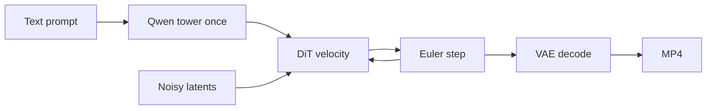

# H3.c Concept Primer

This is the **first document** to read. It teaches the ideas that the other two files assume: tensors, transformers, attention, rotary embeddings, latents, diffusion / flow matching, and the DiT. It does **not** catalog kernels, files, or a future Qwen3.8 runtime.

**Reading order**

1. This primer, until the picture “two networks, one Euler loop” is clear.
2. [Architecture](h3c_architecture_and_theory.md) Part I — how this repository actually runs MiniMax-H3.
3. [Formulas](h3c_formulas_and_concepts.md) — exact equations, tiny numeric sketches, mix-up warnings.
4. Architecture Part II — optional mapping toward a Qwen3.8 Mac runtime. Skip it if you only want to understand h3.c.

**Math preview.** Cursor and GitHub render math with dollar signs: one pair for inline, two on their own lines for display (blank line before and after).

**Source.** Implementation lives under `h3c_repo/`. Filenames below (`h3_dit.c`, `h3_text_encoder.c`, …) are that tree.

---

## Contents

- [1. What this project is](#1-what-this-project-is)
- [2. Tensors and linear layers](#2-tensors-and-linear-layers)
- [3. Tokens and embeddings](#3-tokens-and-embeddings)
- [4. The residual stream](#4-the-residual-stream)
- [5. Attention](#5-attention)
- [6. Rotary position embeddings](#6-rotary-position-embeddings)
- [7. This is not an autoregressive language model](#7-this-is-not-an-autoregressive-language-model)
- [8. Latents, VAEs, and patchify](#8-latents-vaes-and-patchify)
- [9. Diffusion, flow matching, and Euler](#9-diffusion-flow-matching-and-euler)
- [10. DiT, AdaLN-Zero, and the packed sequence](#10-dit-adaln-zero-and-the-packed-sequence)
- [11. Inference engineering](#11-inference-engineering)
- [12. Vocabulary that appears only in Architecture Part II](#12-vocabulary-that-appears-only-in-architecture-part-ii)
- [13. Reading map](#13-reading-map)

---

## 1. What this project is

`h3.c` is a native **inference** engine: it loads already-trained MiniMax-H3 weights and produces a video with synchronized audio on Apple Silicon. The public API is in `h3.h`; generation is `h3_generate()` in `h3.c`. Version string: `0.1.0-dev`.

Give it a text prompt (optionally first/last frames, or ordered image/video/audio references). It writes an MP4. That is the whole product loop.

Two checkpoint modes live under `./MiniMax-H3`:

- **FL2VA** — text-to-video/audio, optionally conditioned on a first and last frame.
- **Ref2VA** — ordered multimodal references (images, clips, audio).

Nothing in this repository *trains* the model. Training objectives for the Diffusion Transformer live in MiniMax/H3 papers, not here.

### The one-sentence mental model

A **language tower** (the first 50 Qwen3-VL layers) reads the prompt **once** and emits a vector per text token. A **Diffusion Transformer (DiT)** then repeatedly looks at noisy video and audio **latents**, predicts how they should move, and an **Euler** integrator takes a step toward a clean clip. A **VAE** decoder turns those latents into RGB frames and PCM audio. FFmpeg muxes H.264 + AAC.



The loop in the middle is **not** “predict the next word.” It is “predict a velocity field, integrate, repeat.”

Architecture: [Part I, §1](h3c_architecture_and_theory.md#1-what-h3c-is). Formulas: [diffusion / Euler](h3c_formulas_and_concepts.md#diffusion-flow-matching-and-euler).

---

## 2. Tensors and linear layers

A **tensor** is a multidimensional array of numbers. In this codebase, almost every neural activation is a 2D table of **rows × channels**:

- one **row** is one token (or one patch, or one audio slice);
- the **width** is the hidden size of that network.

Shapes are written `[T, d]` meaning `T` rows and `d` columns, **row-major** (the last index changes fastest in memory), matching the C layouts.

Concrete H3 widths:

| Network | Typical activation | Width $d$ |
| --- | --- | --- |
| Qwen language tower | `[tokens, 5120]` BF16 | $5120$ |
| DiT | `[seq, 5376]` BF16 | $5376$ |

### A linear layer is a matrix multiply

If $X$ is `[T, K]` (activations) and the weight is stored as $W$ of shape `[N, K]` (“one output channel per row”), the layer is

$$
Y = X W^\top, \qquad Y \in \mathbb{R}^{T \times N}
$$

That is a **GEMM** (general matrix multiply). Formula: [eq-gemm](h3c_formulas_and_concepts.md#eq-gemm).

There is no mystery beyond “every token is independently multiplied by the same matrix.” Tokens do not mix inside a linear layer. Mixing happens in **attention**.

### Why accumulate in FP32

H3 stores many tensors as **bfloat16 (BF16)**: same exponent range as FP32, much coarser mantissa. Adding thousands of products in BF16 would lose the small terms. Kernels therefore accumulate in FP32 and **round at the store**. There is **no FP16 path**. See [bfloat16](h3c_formulas_and_concepts.md#bfloat16) and primer [§11](#11-inference-engineering).

**H3 callout.** Portable GEMMs live in `h3_shaders.metal` (`h3_linear_f32_tiled`, `h3_linear_bf16`). Large production GEMMs go through **MPSGraph** or Metal 4 **TensorOps** (`matmul2d`) on M5.

Architecture: [§9](h3c_architecture_and_theory.md#9-gpu-runtime).

---

## 3. Tokens and embeddings

Text is not numbers. A **tokenizer** cuts a string into a list of integer **token ids** from a fixed vocabulary.

H3 uses **byte-pair encoding (BPE)** from `tokenizer.json`: NFC Unicode normalization, ICU pretokenization, then greedy merges. Vocabulary size of the Qwen tower is $151936$. Pad id is `151643`. There is no unknown token: every byte sequence must encode. Formula notes: [BPE](h3c_formulas_and_concepts.md#byte-pair-encoding).

An **embedding table** $E$ is a matrix `[vocab, d]`. Token id $t$ **selects row** $E[t]$. That is a gather, not a multiply.

$$
h_0[t] = E[\mathrm{id}_t]
$$

[eq-embedding](h3c_formulas_and_concepts.md#eq-embedding).

If the prompt includes images or video, vision features can **overwrite** those embedding rows; that is still “put a vector in each row,” not a different algebra.

**H3 callout.** `h3_tokenizer.m` produces ids on the CPU. `h3_gpu_embedding_bf16` gathers `[T, 5120]` BF16 on the GPU.

Architecture: [§2](h3c_architecture_and_theory.md#2-end-to-end-generating-from-hello) and [§5.1](h3c_architecture_and_theory.md#51-embeddings).

---

## 4. The residual stream

A transformer does not replace the token vectors at each layer. It **adds a delta**:

$$
x \leftarrow x + F(x)
$$

Think of $x$ as a **residual stream**: a running note about each token. Attention and the MLP each write an update into that note. If $F$ is the identity at initialization (or gated to zero), the stream is unchanged — which is why deep stacks can train at all.

[eq-ungated-residual](h3c_formulas_and_concepts.md#eq-ungated-residual).

**Pre-norm** (what both H3 networks use) applies a normalization *before* $F$:

```text
x  -->  RMSNorm  -->  F (attention or MLP)  -->  add back onto x
```

The skip connection $x \to x$ stays well scaled even when $F$ is large. **Post-norm** (norm after the add) is harder at this depth.

The DiT writes a **gated** residual: the delta is multiplied by a learned per-channel gate that depends on noise level and modality. [eq-gated-residual](h3c_formulas_and_concepts.md#eq-gated-residual). Primer [§10](#10-dit-adaln-zero-and-the-packed-sequence).

### RMSNorm vs LayerNorm

**RMSNorm** scales a vector by its root-mean-square, then by a learned gain $w$. It does **not** subtract a mean.

[eq-rmsnorm](h3c_formulas_and_concepts.md#eq-rmsnorm).

**LayerNorm** also centers (subtracts $\mu$) and usually has a bias. Vision in H3 uses LayerNorm; Qwen layers and the DiT use RMSNorm.

Qwen additionally RMS-normalizes **each attention head** of $Q$ and $K$ over the $128$-wide head only (**head RMSNorm**), after the projections and before RoPE.

Stabilizers: Qwen $\varepsilon = 10^{-6}$; DiT / refiner $\varepsilon = 10^{-5}$.

**H3 callout.** `h3_rms_norm_bf16`, `h3_gpu_head_rms_norm_bf16`, `h3_gpu_layer_norm_bf16`. One threadgroup per row for the reduction $\sum x_j^2$.

Architecture: [§5.2](h3c_architecture_and_theory.md#52-rmsnorm-and-head-rmsnorm).

---

## 5. Attention

Attention is the only place in a standard transformer where **tokens mix**.

For one query vector $q$ and a set of key/value pairs $(k_\ell, v_\ell)$:

1. **Score** how well $q$ matches each key: $s_\ell = q \cdot k_\ell / \sqrt{d_{\mathrm{head}}}$.
2. Turn scores into **weights** with softmax (they sum to 1, all $\ge 0$).
3. **Read** a weighted sum of the values: $\sum_\ell \alpha_\ell v_\ell$.

Intuition:

- **Q (query)** — “what am I looking for?”
- **K (key)** — “what is this token advertising?”
- **V (value)** — “what payload do I pass if you attend to me?”

[eq-sdpa](h3c_formulas_and_concepts.md#eq-sdpa). Softmax: [eq-softmax](h3c_formulas_and_concepts.md#eq-softmax).

The $1/\sqrt{d_{\mathrm{head}}}$ **scale** keeps dot-product variance from growing with width. Without it, softmax saturates (one weight $\approx 1$, the rest $\approx 0$). [eq-attention-scale](h3c_formulas_and_concepts.md#eq-attention-scale). H3 uses $d_{\mathrm{head}}=128$, so the scale is $1/\sqrt{128}$.

### Causal vs bidirectional

**Causal (language):** a token at position $t$ may only look at positions $0..t$. Otherwise it would “see the future” during training. H3’s GQA kernel does not add $-\infty$ to a mask matrix; it **shortens the loop** to `key_count = query_row + 1`.

```text
keys -->  0  1  2  3
query 0   *  .  .  .
query 1   *  *  .  .
query 2   *  *  *  .
query 3   *  *  *  *
```

**Bidirectional (DiT):** every packed token may attend to every other. Text, audio, and video patches sit in one sequence and share information freely. There is no causal triangle.

[eq-causal](h3c_formulas_and_concepts.md#eq-causal).

### Multi-head attention

Instead of one $d$-wide attention, the model splits the width into **heads** (H3: head width $128$). Each head can specialize (syntax vs. a visual object vs. a beat). Outputs are concatenated and projected by $W_O$.

### Grouped-query attention (GQA)

Full multi-head attention stores a K and V per query head. **GQA** shares each K/V head across a group of query heads.

H3 Qwen: $64$ query heads, $8$ KV heads, group size $8$. KV tensors are `[T, 8, 128]` instead of `[T, 64, 128]`.

[eq-gqa-index](h3c_formulas_and_concepts.md#eq-gqa-index).

The DiT does **not** use GQA: $56$ heads, $Q=K=V$, full bidirectional SDPA via **MPSGraph**.

**H3 callout.** Qwen: custom kernel `h3_gqa_causal_bf16`. DiT: `h3_gpu_sdpa_bf16` → MPSGraph `scaledDotProductAttentionWithQueryTensor`. Softmax in FP32 even when Q/K/V are BF16.

Architecture: [§5.5](h3c_architecture_and_theory.md#55-causal-gqa), [§6.5](h3c_architecture_and_theory.md#65-bidirectional-sdpa).

---

## 6. Rotary position embeddings

Without position information, attention is a **bag of tokens**: swapping two rows would not change the scores except through content. **RoPE** (Su et al.) encodes position by **rotating** pairs of dimensions of $Q$ and $K$.

Take two consecutive channels $(x_{2i}, x_{2i+1})$ as a 2D vector. At position $p$, rotate by angle $p \cdot \omega_i$:

[eq-rope-rotate](h3c_formulas_and_concepts.md#eq-rope-rotate).

Frequencies $\omega_i$ are a geometric sequence from a base $\theta$ ([eq-rope-freq](h3c_formulas_and_concepts.md#eq-rope-freq)). H3 Qwen uses $\theta = 5\times 10^6$.

**Why rotation encodes relative position.** The dot product of a rotated $q$ at $m$ and a rotated $k$ at $n$ depends on $m-n$, not on the absolute indices alone. Nearby tokens have similar rotation; distant tokens rotate through more of the circle on the slow frequencies.

### Extensions in this repo

**Multimodal RoPE (mRoPE).** Qwen-VL uses **three** position axes (temporal, height, width) stored as `position_ids` of shape `[3, tokens]`. Vision/video tokens get 2D/3D coordinates so spatial neighbors rotate similarly. [eq-mrope](h3c_formulas_and_concepts.md#eq-mrope).

**DiT 3D RoPE.** Video patches live on a $(T,H,W)$ grid. `prepare_rope` in `h3_dit.c` builds tables from axes $(t,\, h\cdot s,\, w\cdot s)$. [eq-rope-3d](h3c_formulas_and_concepts.md#eq-rope-3d).

**Partial rotary.** Only a **prefix** of each head is rotated; the tail stays a content feature. DiT: first $48$ of $128$ dims (`ROPE_HALF=48`). [eq-partial-rotary](h3c_formulas_and_concepts.md#eq-partial-rotary).

**H3 callout.** Qwen: `h3_gpu_rope_text_bf16` with **F32** cos/sin tables, after head RMSNorm. DiT: fused into QKV+RoPE kernels. Text refiner blocks run **without** RoPE.

Architecture: [§5.6](h3c_architecture_and_theory.md#56-text-rope-and-mrope), [§6.6](h3c_architecture_and_theory.md#66-dit-3d-rope).

---

## 7. This is not an autoregressive language model

A ChatGPT-style model **decodes tokens one by one**. After producing “Hello”, it computes logits over the vocabulary, samples “world”, appends it, and repeats. That loop needs:

- a **language-model head** (hidden → vocab logits);
- **token sampling** (temperature, top-$k$, top-$p$);
- a **KV cache** so past keys/values are not recomputed from scratch.

H3’s generate loop has **none of those**.

| | Typical LLM | H3 generate |
| --- | --- | --- |
| Unit of work | next token id | one Euler step on latents |
| Text network | decode many times | Qwen encode **once** |
| Output of the big net | logits over a vocab | **velocity** of video/audio latents |
| Attention over time | causal, growing cache | Qwen: full prompt, discard K/V; DiT: full bidirectional every step |

The Qwen tower *is* a decoder-only transformer (causal GQA, pre-norm, SwiGLU). H3 uses it as a **text encoder**: run layers $0..49$ over the whole prompt, read back `[T, 5120]` BF16, and throw the K/V away. Those embeddings **condition** the DiT. They are not a chat reply.

If you catch yourself looking for `lm_head` or `next_token`, you are reading the wrong kind of engine.

Architecture: [§1](h3c_architecture_and_theory.md#1-what-h3c-is), [§2](h3c_architecture_and_theory.md#2-end-to-end-generating-from-hello). KV cache *theory* (for Part II): primer [§12](#12-vocabulary-that-appears-only-in-architecture-part-ii).

---

## 8. Latents, VAEs, and patchify

Denoising a $512\times 512$ RGB video in pixel space would mean attention over millions of spatial locations. H3 instead works in a **compressed latent**.

A **VAE** (variational autoencoder) is an encoder/decoder pair:

- **encode:** RGB frames or PCM audio → a smaller tensor $z$;
- **decode:** $z$ → pixels or waveform.

At inference H3 uses a **deterministic** conv encoder/decoder, not a sampled posterior. You do not need the ELBO training math to follow the serving path.

### Video

- Spatial compression **16**: a $512\times 512$ frame becomes a $32\times 32$ latent grid.
- **24** latent channels.
- Temporal alignment: frame counts are $5+17n$; latent time is a compressed length (see `h3_host.c`).
- Host layout **`[24, T, H, W]`** F32.

### Audio

- $32$ kHz stereo PCM.
- Latent **`[32, 2, T]`** F32 (32 channels, 2 streams, time).
- Audio latent rate $40$ fps vs video $24$ fps; host code aligns the two.

### Patchify

A transformer wants a **sequence of vectors**, not a 4D grid. **Patchify** cuts the video latent into non-overlapping $2\times 2$ spatial patches and flattens each patch:

$$
\text{tokens} = T \cdot \frac{H}{2} \cdot \frac{W}{2}, \qquad \text{each patch } \in \mathbb{R}^{96}
$$

because $2 \cdot 2 \cdot 24 = 96$. A linear `video_patch_proj` maps $96 \to 5376$. After the velocity head, **unpatchify** restores `[24, T, H, W]`. [eq-patchify](h3c_formulas_and_concepts.md#eq-patchify).

Audio rows are packed similarly (`h3_dit_pack_audio`) and projected to width $5376$.

**H3 callout.** Encoders/decoders: `h3_video_vae.c`, `h3_audio_vae.c` (F32 convs, group-norm+SiLU, Snake activations on the audio path). Patch/pack: `h3_dit.c`. Geometry: `h3_host.c` (canvas multiple of $32$, max $768\times 1344$ pixels).

Architecture: [§7](h3c_architecture_and_theory.md#7-vision-vaes-and-media-io).

---

## 9. Diffusion, flow matching, and Euler

This is the chapter that makes the rest of H3 make sense.

### The picture, without formulas

Start from **pure noise** in latent space (or noise plus encoded reference frames, depending on the mode). Call that tensor $x$. A **noise level** $\sigma$ says how noisy it still is. Large $\sigma$ is almost noise; $\sigma \approx 0$ is a clean latent.

A network $v_\theta(x, \sigma)$ looks at the current $x$ and $\sigma$ and predicts a **velocity**: the direction $x$ should move as $\sigma$ decreases. An integrator applies that velocity for a small $\Delta\sigma$, then repeats with a smaller $\sigma$. After enough steps you decode $x$ with the VAE.

```text
sigma large (noisy)                    sigma ~ 0 (clean)
x  --v_theta-->  x'  --v_theta-->  ...  --v_theta-->  x_clean  --> VAE --> MP4
```

H3’s serving sampler is **Euler** on a **decreasing** schedule $\sigma_0 > \sigma_1 > \cdots \ge 0$. Default **20** steps (`h3.h`). Video and audio can use different $\sigma$ grids (shifts $12$ and $3$ in `h3_host.h`).

### Velocity is not “the next word”

Three common **parameterizations** of a denoiser (training math is **not** in this repo; this is vocabulary):

| Name | Network predicts | Typical use |
| --- | --- | --- |
| Noise / $\varepsilon$ | the noise that was added | classic DDPM-style |
| $x_0$ / data | the clean sample | some image samplers |
| **Velocity** | $\mathrm{d}x/\mathrm{d}\sigma$ along a path from noise to data | **what H3’s DiT heads emit** |

H3 final heads write:

- video velocity `[24, T, H, W]` F32;
- audio velocity `[32, 2, T]` F32.

There is **no vocabulary softmax**. Mixing this up with an LM head is the most common conceptual error in these docs.

### Flow-matching view (high level)

Imagine a straight (or scheduled) path that interpolates between a noise sample and a data sample as $\sigma$ goes from large to small. The true velocity along that path is $\mathrm{d}x/\mathrm{d}\sigma$. A flow-matching / rectified-flow style model **regresses** that velocity. At inference you integrate the learned field.

This repository does **not** contain the training loss. Treat “velocity field + Euler” as a **serving fact**, and the interpolant as **theory** from the papers.

### Euler is a first-order ODE step

Given current $x_\sigma$ and a next noise level $\sigma_{\mathrm{next}} < \sigma$:

$$
x_{\sigma_{\mathrm{next}}} = x_{\sigma} + (\sigma - \sigma_{\mathrm{next}}) \, v_\theta(x_{\sigma}, \sigma)
$$

[eq-euler](h3c_formulas_and_concepts.md#eq-euler).

Host: `h3_euler_velocity_step` in `h3_host.c` — `sample += delta * velocity` with `delta = sigma - sigma_next`. GPU: `h3_euler_bf16` (fused multiply-add, optional velocity reuse).

Tiny sketch: if $\sigma=1$, $\sigma_{\mathrm{next}}=0.8$, and some latent entry has $v=-2$, that entry changes by $(1-0.8)\times(-2)=-0.4$. Do that for every entry of the video and audio latents, then pack and run the DiT again.

### RES

`h3_res_step` is a **rectified exponential solver** for a denoised parameterization. It is implemented, but production serving is velocity Euler. [eq-res-euler](h3c_formulas_and_concepts.md#eq-res-euler).

### `--reuse` is not a learned sampler

`--denoise-reuse` **skips** some DiT forwards and **extrapolates** velocity from the last two evaluations ([eq-velocity-reuse](h3c_formulas_and_concepts.md#eq-velocity-reuse)). It is linear algebra in step index, not a second network.

`--core-reuse` is different: it assumes the **50-block trunk residual** changes slowly and reapplies a cached $\Delta h$ with a cheaper timestep-dependent head.

Architecture: [§2.6](h3c_architecture_and_theory.md#26-each-euler-step), [§6.4](h3c_architecture_and_theory.md#64-final-heads-are-velocities).

---

## 10. DiT, AdaLN-Zero, and the packed sequence

A **Diffusion Transformer (DiT)** is a transformer used as the denoiser $v_\theta$. Same idea as “ViT for images,” but the tokens are **latent patches** (plus text, plus audio), and every block is **modulated by the current noise level**.

H3’s DiT: **50** blocks, width **5376**, **56** heads of **128**, SwiGLU intermediate **14336**, bidirectional full attention. Constants: `h3_dit.c`, `H3_DIT_BLOCKS` in `h3_dit_schedule.h`.

### Why modulate instead of concatenating $\sigma$

The weights must work at every noise level. **AdaLN-Zero** (Peebles & Xie) lets a small MLP of the timestep produce per-channel **shift, scale, and gate**. The same $W_{QKV}$ and MLP matrices then see a $\sigma$-dependent affine of the residual stream.

After RMSNorm:

$$
\tilde{x} = \mathrm{RMSNorm}(x)\odot(1+\mathrm{scale})+\mathrm{shift}
$$

[eq-adaln](h3c_formulas_and_concepts.md#eq-adaln).

Six slots per modality (visual / text / audio): attention shift, scale, gate; MLP shift, scale, gate. “Zero” is a **training** story: gates start near $0$ so each block begins as the identity. At inference the gates are ordinary tensors looked up from a **precomputed schedule** (`h3_dit_schedule_precompute`). The timestep MLP is not rerun inside `run_block`.

H3 also tags each sequence row with a **modality** so text, video, and audio can use different rows of that table (`time_row * 3 + tag` in `h3_dit_schedule.c`).

One DiT block ([eq-dit-block](h3c_formulas_and_concepts.md#eq-dit-block)): AdaLN → QKV+RoPE → SDPA → gated residual → AdaLN → SwiGLU → gated residual. Production fuses gate with the next AdaLN (`h3_gpu_gate_adaln_bf16`).

### Packed sequence (MMDiT-style)

There is **no separate cross-attention module** from the DiT onto a frozen text tensor. Text is projected $5120\to 5376$, run through **two refiner blocks** (full SDPA, **no RoPE**, **no AdaLN**), then **concatenated** with audio and video tokens. Joint self-attention sees everyone.

Emit order in `h3_layout_build` (`h3_host.c`):

```text
TEXT | optional COND / refs | AUDIO | VIDEO
```

Segment kinds: `H3_SEG_TEXT`, `H3_SEG_COND`, `H3_SEG_REF_IMAGE`, `H3_SEG_REF_AUDIO`, `H3_SEG_AUDIO`, `H3_SEG_VIDEO` (`h3_host.h`).

`--token-reduction` averages neighboring **horizontal** video tokens in middle blocks, runs attention on a shorter $S$, then expands the residual back. Quadratic SDPA then sees fewer video tokens. Aggressive settings can ghost limbs (README).

**H3 callout.** `run_block` starts at line 1876 of `h3_dit.c`. Serving loop: `h3_dit_denoise_euler_preview`. Text is refined **once at load**, not every Euler step.

Architecture: [§6](h3c_architecture_and_theory.md#6-the-dit).

---

## 11. Inference engineering

You can read Architecture §§9–12 with these ideas only.

### Unified memory

On Apple Silicon the CPU and GPU share one DRAM. `MTLResourceStorageModeShared` makes `buffer.contents` CPU-visible. There is little PCIe-style “upload.” The scarce resource is **DRAM bandwidth** and cache coherence, not a copy engine.

### Roofline (why int8 exists)

A GEMM’s **arithmetic intensity** is FLOPs per byte moved. For H3’s huge weights (FC1 $5376\to 28672$), **bytes of $W$** dominate. Int8 halves those bytes per multiply-accumulate. Fusion exists to **not write** a $2\times$FFN intermediate back to DRAM. [eq-roofline](h3c_formulas_and_concepts.md#eq-roofline).

### Symmetric int8

Map a vector to `int8` with **one scale** and **no zero-point**, values in $[-127,127]$. Weights: one F32 scale per **output row**, created at DiT load (`h3_gpu_quantize_weight_int8`). Activations: quantized **every forward**; FC2 default uses groups of $1024$. [eq-absmax](h3c_formulas_and_concepts.md#eq-absmax), [eq-int8-dequant](h3c_formulas_and_concepts.md#eq-int8-dequant).

SSD streaming **disables** int8 and keeps BF16 (two-block residency).

### Command buffers and fusion

`h3_gpu_begin` / `continue` / `submit` wrap Metal command buffers. DiT splits 50 blocks across two buffers so CPU encoding can overlap GPU. **Fusion** (gate+AdaLN, SwiGLU in-register, AdaLN+quant) cuts launches and rereads. Diagnostic `H3_DISABLE_*` and `--use-slower-*` restore two-kernel oracles for A/B tests.

### Phase-separated residency

The ~33B DiT, the Qwen encoder, and the VAEs **must not all stay mapped**. `h3_load_dir` inventories headers only; `h3_generate` loads and frees by phase. Interactive cache (`h3_ctx`) can keep embeddings + prepared DiT + decoder across prompts.

Architecture: [§9](h3c_architecture_and_theory.md#9-gpu-runtime)–[§12](h3c_architecture_and_theory.md#12-performance-engineering).

---

## 12. Vocabulary that appears only in Architecture Part II

**None of this is implemented in h3.c.** Architecture Part II discusses a *future* native Qwen3.8-27B runtime. Read this section only so those pages are not opaque.

**KV cache.** Autoregressive decode of token $t+1$ needs $K_{0:t}, V_{0:t}$. Storing them makes each new token attend against the cache instead of recomputing projections from all past hidden states. Size scales with $T$. [eq-kv-cache-size](h3c_formulas_and_concepts.md#eq-kv-cache-size). H3 has no transformer KV cache.

**Language-model head.** $\mathrm{logits} = h W^\top$ over the vocabulary. [eq-lm-head](h3c_formulas_and_concepts.md#eq-lm-head).

**Token sampling.** Softmax with temperature, top-$k$, top-$p$. [eq-temperature](h3c_formulas_and_concepts.md#eq-temperature).

**Gated DeltaNet.** Linear / recurrent attention: a **fixed-size** matrix state $S_t$ instead of a growing KV tensor. Public Qwen3.8-27B uses 48 such layers + 16 softmax Gated Attention layers. [eq-deltanet](h3c_formulas_and_concepts.md#eq-deltanet). Highest-risk Metal work in Part II.

**YaRN.** Stretch RoPE frequencies so a model trained at length $L_{\mathrm{train}}$ can run at $L_{\mathrm{test}} \gg L_{\mathrm{train}}$. Qwen3.8 public spec: native $262144$, YaRN to $1$M.

**Multi-token prediction (MTP).** Extra heads predict $t+1, t+2, \ldots$; can become speculative decode. H3 has no analog.

Architecture: [Part II](h3c_architecture_and_theory.md#part-ii--mapping-toward-qwen38).

---

## 13. Reading map

| Concept | This primer | Formula | Architecture | Primary source |
| --- | --- | --- | --- | --- |
| Product / two networks | [§1](#1-what-this-project-is), [§7](#7-this-is-not-an-autoregressive-language-model) | [Euler](h3c_formulas_and_concepts.md#diffusion-flow-matching-and-euler) | [§1](h3c_architecture_and_theory.md#1-what-h3c-is), [§3.4](h3c_architecture_and_theory.md#34-two-transformers) | `h3_generate` in `h3.c` |
| Tensors / GEMM / BF16 | [§2](#2-tensors-and-linear-layers), [§11](#11-inference-engineering) | [eq-gemm](h3c_formulas_and_concepts.md#eq-gemm), [eq-bf16](h3c_formulas_and_concepts.md#eq-bf16) | [§8.2](h3c_architecture_and_theory.md#82-dtypes-and-layout), [§9](h3c_architecture_and_theory.md#9-gpu-runtime) | `h3_gpu.h`, shaders |
| BPE / embedding | [§3](#3-tokens-and-embeddings) | [eq-embedding](h3c_formulas_and_concepts.md#eq-embedding) | [§2.1](h3c_architecture_and_theory.md#21-text-to-token-ids), [§5.1](h3c_architecture_and_theory.md#51-embeddings) | `h3_tokenizer.m`, `h3_gpu_embedding_bf16` |
| Residual / pre-norm / RMSNorm | [§4](#4-the-residual-stream) | [eq-rmsnorm](h3c_formulas_and_concepts.md#eq-rmsnorm), [eq-ungated-residual](h3c_formulas_and_concepts.md#eq-ungated-residual) | [§5.2](h3c_architecture_and_theory.md#52-rmsnorm-and-head-rmsnorm), [§5.3](h3c_architecture_and_theory.md#53-qwen-layer-exact-order) | `encode_layer` |
| SwiGLU | [§4](#4-the-residual-stream) (MLP as per-token $F$) | [eq-swiglu](h3c_formulas_and_concepts.md#eq-swiglu) | [§5.4](h3c_architecture_and_theory.md#54-swiglu-mlp) | `h3_gpu_silu_mul_bf16` |
| SDPA / softmax / scale | [§5](#5-attention) | [eq-sdpa](h3c_formulas_and_concepts.md#eq-sdpa), [eq-softmax](h3c_formulas_and_concepts.md#eq-softmax) | [§5.5](h3c_architecture_and_theory.md#55-causal-gqa), [§6.5](h3c_architecture_and_theory.md#65-bidirectional-sdpa) | GQA kernel; MPSGraph |
| Causal mask / GQA | [§5](#5-attention) | [eq-causal](h3c_formulas_and_concepts.md#eq-causal), [eq-gqa-index](h3c_formulas_and_concepts.md#eq-gqa-index) | [§5.5](h3c_architecture_and_theory.md#55-causal-gqa) | `h3_gqa_causal_bf16` |
| RoPE / mRoPE / 3D / partial | [§6](#6-rotary-position-embeddings) | [eq-rope-rotate](h3c_formulas_and_concepts.md#eq-rope-rotate) | [§5.6](h3c_architecture_and_theory.md#56-text-rope-and-mrope), [§6.6](h3c_architecture_and_theory.md#66-dit-3d-rope) | `h3_gpu_rope_text_bf16`, `prepare_rope` |
| VAE / patchify | [§8](#8-latents-vaes-and-patchify) | [eq-patchify](h3c_formulas_and_concepts.md#eq-patchify) | [§7](h3c_architecture_and_theory.md#7-vision-vaes-and-media-io), [§8.3](h3c_architecture_and_theory.md#83-important-tensors) | `h3_video_vae.c`, `h3_dit_patchify_video` |
| Euler / flow / velocity | [§9](#9-diffusion-flow-matching-and-euler) | [eq-euler](h3c_formulas_and_concepts.md#eq-euler) | [§2.6](h3c_architecture_and_theory.md#26-each-euler-step), [§6.4](h3c_architecture_and_theory.md#64-final-heads-are-velocities) | `h3_euler_velocity_step`, `h3_euler_bf16` |
| AdaLN-Zero / DiT block | [§10](#10-dit-adaln-zero-and-the-packed-sequence) | [eq-adaln](h3c_formulas_and_concepts.md#eq-adaln), [eq-dit-block](h3c_formulas_and_concepts.md#eq-dit-block) | [§6.2](h3c_architecture_and_theory.md#62-adaln-zero-and-the-schedule), [§6.3](h3c_architecture_and_theory.md#63-run_block) | `run_block`, `h3_dit_schedule.c` |
| Packed sequence | [§10](#10-dit-adaln-zero-and-the-packed-sequence) | — | [§6.1](h3c_architecture_and_theory.md#61-packed-sequence) | `h3_layout_build` |
| Int8 / unified memory | [§11](#11-inference-engineering) | [eq-int8-dequant](h3c_formulas_and_concepts.md#eq-int8-dequant) | [§10](h3c_architecture_and_theory.md#10-quantization), [§11](h3c_architecture_and_theory.md#11-memory-management) | `h3_gpu_quantize_weight_int8` |
| KV cache / DeltaNet / YaRN | [§12](#12-vocabulary-that-appears-only-in-architecture-part-ii) | [eq-kv-cache-size](h3c_formulas_and_concepts.md#eq-kv-cache-size), [eq-deltanet](h3c_formulas_and_concepts.md#eq-deltanet) | [Part II](h3c_architecture_and_theory.md#part-ii--mapping-toward-qwen38) | *not in this repo* |

---

*This file is pedagogical THEORY plus FACT callouts for wiring. It does not modify source.*
